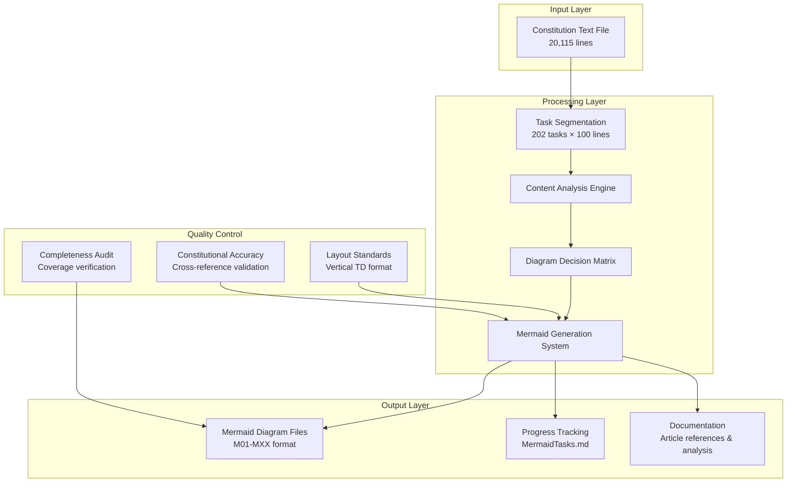

# Design Document

## Overview

This design document outlines the systematic approach for converting the Constitution of India into comprehensive Mermaid diagrams. The system processes 20,115 lines of constitutional text through 202 structured tasks, creating visual representations that enhance understanding of India's constitutional framework.

## Architecture

### High-Level System Design



## Components and Interfaces

### 1. Task Segmentation Component

**Purpose:** Divides constitutional text into manageable analysis chunks

**Interface:**
- **Input:** Constitution text file (20,115 lines)
- **Output:** 202 task definitions with line ranges
- **Logic:** 
  - Tasks 1-201: Lines ((N-1) × 100) + 1 to N × 100
  - Task 202: Lines 20101-20115 (final 15 lines)

### 2. Content Analysis Engine

**Purpose:** Evaluates constitutional content for diagram creation potential

**Decision Matrix:**
- **High Priority:** Structural relationships, key processes, complex hierarchies
- **Medium Priority:** Supporting concepts, detailed procedures, specific provisions  
- **Low Priority:** Repetitive content, minor details, administrative text

**Content Categories:**
- **Structural Elements:** Constitutional hierarchy, government branches, institutional frameworks
- **Process Elements:** Legislative procedures, judicial processes, amendment procedures
- **Conceptual Elements:** Rights frameworks, emergency provisions, constitutional principles

### 3. Mermaid Generation System

**Purpose:** Creates standardized visual diagrams following layout requirements

**Layout Standards:**
- **Direction:** `graph TD` (Top-Down) for vertical flow
- **Subgraphs:** Vertical organization with `direction TD`
- **Connections:** Sequential flow minimizing horizontal spans
- **Styling:** Consistent color schemes with thematic classification

**File Generation:**
- **Naming:** `M[sequential_number]_[topic].md`
- **Structure:** Overview + Mermaid diagram + Article documentation + Significance
- **Storage:** `Mermaid01/` directory

### 4. Progress Tracking System

**Purpose:** Maintains comprehensive project status and completion tracking

**Tracking Elements:**
- **Task Status:** Checkbox format with completion descriptions
- **Progress Counters:** Completed tasks, diagrams created, current focus
- **Coverage Mapping:** Constitutional sections addressed
- **Quality Metrics:** Diagram count and coverage areas

## Data Models

### Task Definition Model
```
Task {
  number: integer (1-202)
  startLine: integer
  endLine: integer
  status: enum [not_started, in_progress, completed]
  description: string
  diagramCreated: boolean
  diagramFile: string (optional)
}
```

### Diagram Model
```
Diagram {
  sequentialNumber: integer (M01, M02, etc.)
  topic: string (lowercase_with_underscores)
  filePath: string
  articlescovered: array[string]
  constitutionalPart: string
  creationTask: integer
  layoutType: enum [TD, TB]
}
```

### Progress Model
```
Progress {
  completedTasks: integer
  totalTasks: integer (202)
  diagramsCreated: integer
  currentFocus: string
  coverageAreas: array[string]
  qualityIssues: array[string]
}
```

## Error Handling

### Content Analysis Errors
- **Missing Content:** Log and continue with next task
- **Ambiguous Structure:** Document uncertainty and create best-effort diagram
- **Duplicate Concepts:** Cross-reference existing diagrams and enhance if needed

### File Generation Errors
- **Naming Conflicts:** Append sequence number to resolve
- **Directory Issues:** Create missing directories automatically
- **Format Errors:** Validate Mermaid syntax before saving

### Progress Tracking Errors
- **Update Failures:** Retry with backup tracking mechanism
- **Counter Inconsistencies:** Recalculate from task status
- **File Corruption:** Maintain backup tracking files

## Testing Strategy

### Unit Testing
- **Task Segmentation:** Verify correct line range calculations
- **Content Analysis:** Test decision matrix with sample constitutional text
- **Diagram Generation:** Validate Mermaid syntax and layout standards
- **Progress Tracking:** Ensure accurate counter updates

### Integration Testing
- **End-to-End Flow:** Process sample tasks through complete pipeline
- **File System Integration:** Test file creation and organization
- **Cross-Reference Validation:** Verify constitutional accuracy

### Quality Assurance
- **Visual Review:** Manual inspection of generated diagrams
- **Constitutional Accuracy:** Legal expert review of content representation
- **Completeness Audit:** Verify all major constitutional areas covered
- **Layout Consistency:** Ensure all diagrams follow vertical TD standards

## Performance Considerations

### Processing Efficiency
- **Batch Processing:** Handle multiple tasks in sequence
- **Memory Management:** Process one task at a time to minimize memory usage
- **File I/O Optimization:** Minimize file reads through efficient line range access

### Scalability
- **Task Parallelization:** Potential for parallel task processing
- **Incremental Updates:** Support for resuming interrupted analysis
- **Storage Optimization:** Efficient file organization and naming

## Security and Compliance

### Data Integrity
- **Source Validation:** Verify constitutional text authenticity
- **Version Control:** Track changes to generated diagrams
- **Backup Strategy:** Maintain copies of all generated content

### Constitutional Compliance
- **Amendment Tracking:** Ensure compliance with latest constitutional amendments
- **Legal Accuracy:** Cross-reference with authoritative constitutional sources
- **Attribution:** Proper citation of constitutional articles and provisions

## Deployment and Maintenance

### File Organization
```
project-root/
├── RAWDATA/
│   └── EnglishCOI202407_extracted_text.txt
├── Mermaid01/
│   ├── M01_constitutional_structure.md
│   ├── M02_fundamental_rights_structure.md
│   └── [additional diagrams]
├── MermaidTasks.md
└── .kiro/
    ├── steering/
    │   └── SOPv1.md
    └── specs/
        └── constitution-mermaid-analysis/
            ├── requirements.md
            ├── design.md
            └── tasks.md
```

### Maintenance Procedures
- **Regular Progress Reviews:** Weekly assessment of completion status
- **Quality Audits:** Periodic review of diagram accuracy and consistency
- **Constitutional Updates:** Process for incorporating new amendments
- **Documentation Updates:** Keep analysis notes and findings current

## Success Metrics

### Quantitative Metrics
- **Task Completion Rate:** 202/202 tasks completed
- **Diagram Coverage:** Comprehensive visual representation of major constitutional concepts
- **Quality Score:** Consistent adherence to layout and accuracy standards

### Qualitative Metrics
- **Educational Value:** Enhanced understanding of constitutional concepts
- **Visual Clarity:** Improved readability through vertical layout standards
- **Constitutional Accuracy:** Legally sound representation of constitutional provisions
- **Systematic Coverage:** No major constitutional areas omitted