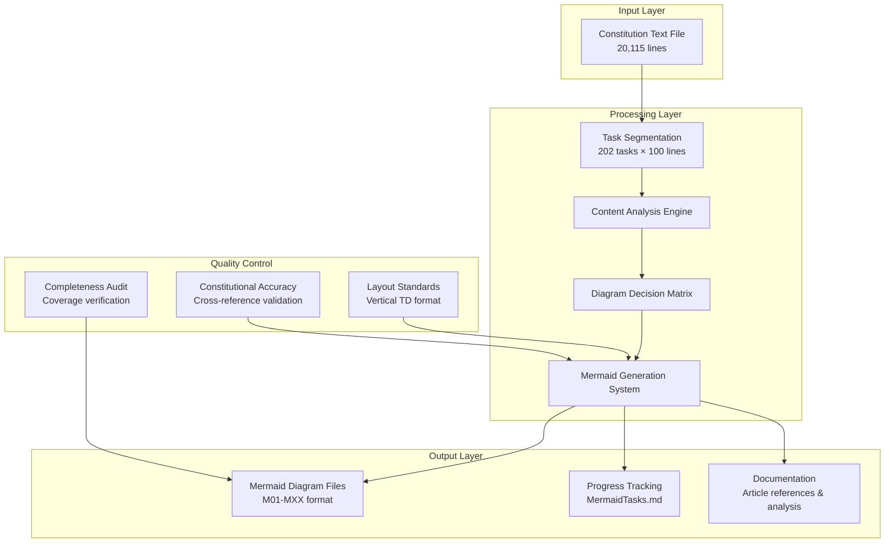

# Design Document

## Overview

This design document outlines the systematic approach for converting the Constitution of India into comprehensive Mermaid diagrams. The system processes 20,115 lines of constitutional text through 202 structured tasks, creating visual representations that enhance understanding of India's constitutional framework.

## Architecture

### High-Level System Design



## Components and Interfaces

### 1. Task Segmentation Component

**Purpose:** Divides constitutional text into manageable analysis chunks

**Interface:**
- **Input:** Constitution text file (20,115 lines)
- **Output:** 202 task definitions with line ranges
- **Logic:** 
  - Tasks 1-201: Lines ((N-1) × 100) + 1 to N × 100
  - Task 202: Lines 20101-20115 (final 15 lines)

### 2. Content Analysis Engine

**Purpose:** Evaluates constitutional content for diagram creation potential

**Decision Matrix:**
- **High Priority:** Structural relationships, key processes, complex hierarchies
- **Medium Priority:** Supporting concepts, detailed procedures, specific provisions  
- **Low Priority:** Repetitive content, minor details, administrative text

**Content Categories:**
- **Structural Elements:** Constitutional hierarchy, government branches, institutional frameworks
- **Process Elements:** Legislative procedures, judicial processes, amendment procedures
- **Conceptual Elements:** Rights frameworks, emergency provisions, constitutional principles

### 3. Mermaid Generation System

**Purpose:** Creates standardized visual diagrams following layout requirements

**Layout Standards:**
- **Direction:** `graph TD` (Top-Down) for vertical flow
- **Subgraphs:** Vertical organization with `direction TD`
- **Connections:** Sequential flow minimizing horizontal spans
- **Styling:** Consistent color schemes with thematic classification

**File Generation:**
- **Naming:** `M[sequential_number]_[topic].md`
- **Structure:** Overview + Mermaid diagram + Article documentation + Significance
- **Storage:** `Mermaid01/` directory

### 4. Progress Tracking System

**Purpose:** Maintains comprehensive project status and completion tracking with mandatory updates

**Tracking Elements:**
- **Task Status:** Checkbox format with completion descriptions and diagram creation status
- **Progress Counters:** Completed tasks, diagrams created, current focus
- **Coverage Mapping:** Constitutional sections addressed with part-by-part tracking
- **Quality Metrics:** Diagram count, coverage areas, and skipped task documentation
- **Issue Documentation:** Reasoning for any skipped tasks or quality concerns

**Critical Requirements:**
- **Mandatory Updates:** Every task completion MUST update MermaidTasks.md
- **Status Format:** Use `[x]` format with brief content description
- **Counter Accuracy:** Real-time tracking of completed tasks and diagrams created
- **File References:** Update diagram file references upon creation

## Data Models

### Task Definition Model
```
Task {
  number: integer (1-202)
  startLine: integer
  endLine: integer
  status: enum [not_started, in_progress, completed]
  description: string
  diagramCreated: boolean
  diagramFile: string (optional)
}
```

### Diagram Model
```
Diagram {
  sequentialNumber: integer (M01, M02, etc.)
  topic: string (lowercase_with_underscores)
  filePath: string
  articlescovered: array[string]
  constitutionalPart: string
  creationTask: integer
  layoutType: enum [TD, TB]
}
```

### Progress Model
```
Progress {
  completedTasks: integer
  totalTasks: integer (202)
  diagramsCreated: integer
  currentFocus: string
  coverageAreas: array[string]
  constitutionalParts: array[string] // Parts I-XXII tracking
  qualityIssues: array[string]
  skippedTasks: array[{taskNumber: integer, reason: string}]
  lastUpdated: timestamp
}
```

### Coverage Validation Model
```
CoverageValidation {
  constitutionalParts: map[string, boolean] // Parts I-XXII completion status
  majorConcepts: array[{concept: string, covered: boolean, diagramFile: string}]
  gapIdentification: array[string] // Missing constitutional concepts
  completenessScore: float // Percentage of major areas covered
  validationStatus: enum [in_progress, complete, gaps_identified]
}
```

## Error Handling

### Content Analysis Errors
- **Missing Content:** Log and continue with next task, document in progress tracking
- **Ambiguous Structure:** Document uncertainty and create best-effort diagram
- **Duplicate Concepts:** Cross-reference existing diagrams and enhance if needed
- **Constitutional Accuracy Issues:** Flag for review and cross-reference validation

### File Generation Errors
- **Naming Conflicts:** Append sequence number to resolve
- **Directory Issues:** Create missing directories automatically
- **Format Errors:** Validate Mermaid syntax before saving
- **Article Reference Errors:** Verify constitutional article numbers and descriptions

### Progress Tracking Errors
- **Update Failures:** Retry with backup tracking mechanism, ensure MermaidTasks.md is always current
- **Counter Inconsistencies:** Recalculate from task status and validate against file system
- **File Corruption:** Maintain backup tracking files
- **Coverage Gaps:** Implement validation checks for constitutional parts I-XXII coverage

### Constitutional Compliance Errors
- **Amendment Compliance:** Verify against 106th Amendment Act, 2023
- **Accuracy Validation:** Cross-reference with authoritative constitutional sources
- **Relationship Verification:** Validate hierarchies and institutional connections

## Testing Strategy

### Unit Testing
- **Task Segmentation:** Verify correct line range calculations
- **Content Analysis:** Test decision matrix with sample constitutional text
- **Diagram Generation:** Validate Mermaid syntax and layout standards
- **Progress Tracking:** Ensure accurate counter updates

### Integration Testing
- **End-to-End Flow:** Process sample tasks through complete pipeline
- **File System Integration:** Test file creation and organization
- **Cross-Reference Validation:** Verify constitutional accuracy

### Quality Assurance
- **Visual Review:** Manual inspection of generated diagrams for readability and clarity
- **Constitutional Accuracy:** Cross-reference validation with original constitutional text
- **Completeness Audit:** Verify all major constitutional parts (I-XXII) are covered
- **Layout Consistency:** Ensure all diagrams follow vertical TD standards with balanced ratios
- **Coverage Validation:** Systematic verification that no critical constitutional provisions are omitted
- **Amendment Compliance:** Ensure all content reflects current constitutional amendments up to 106th Amendment Act, 2023

## Performance Considerations

### Processing Efficiency
- **Batch Processing:** Handle multiple tasks in sequence
- **Memory Management:** Process one task at a time to minimize memory usage
- **File I/O Optimization:** Minimize file reads through efficient line range access

### Scalability
- **Task Parallelization:** Potential for parallel task processing
- **Incremental Updates:** Support for resuming interrupted analysis
- **Storage Optimization:** Efficient file organization and naming

## Coverage Validation and Completeness

### Comprehensive Coverage Strategy
- **Constitutional Parts Tracking:** Systematic monitoring of Parts I through XXII coverage
- **Major Concept Identification:** Catalog of critical constitutional concepts requiring visualization
- **Gap Analysis:** Regular identification of missing or under-represented constitutional areas
- **Completeness Scoring:** Quantitative assessment of constitutional coverage completeness

### Validation Checkpoints
- **Part-by-Part Review:** Ensure each constitutional part has appropriate visual representation
- **Concept Cross-Reference:** Verify all major constitutional concepts are addressed
- **Educational Completeness:** Validate that visual documentation provides comprehensive understanding
- **Critical Provision Audit:** Ensure no essential constitutional provisions are omitted

## Security and Compliance

### Data Integrity
- **Source Validation:** Verify constitutional text authenticity from RAWDATA/EnglishCOI202407_extracted_text.txt
- **Version Control:** Track changes to generated diagrams with proper documentation
- **Backup Strategy:** Maintain copies of all generated content and progress tracking

### Constitutional Compliance
- **Amendment Tracking:** Ensure compliance with 106th Amendment Act, 2023
- **Legal Accuracy:** Cross-reference with authoritative constitutional sources
- **Attribution:** Proper citation of constitutional articles and provisions
- **Hierarchical Accuracy:** Verify correct representation of government institutions and relationships

## Deployment and Maintenance

### File Organization
```
project-root/
├── RAWDATA/
│   └── EnglishCOI202407_extracted_text.txt
├── Mermaid01/
│   ├── M01_constitutional_structure.md
│   ├── M02_fundamental_rights_structure.md
│   └── [additional diagrams]
├── MermaidTasks.md
└── .kiro/
    ├── steering/
    │   └── SOPv1.md
    └── specs/
        └── constitution-mermaid-analysis/
            ├── requirements.md
            ├── design.md
            └── tasks.md
```

### Maintenance Procedures
- **Regular Progress Reviews:** Weekly assessment of completion status
- **Quality Audits:** Periodic review of diagram accuracy and consistency
- **Constitutional Updates:** Process for incorporating new amendments
- **Documentation Updates:** Keep analysis notes and findings current

## Success Metrics

### Quantitative Metrics
- **Task Completion Rate:** 202/202 tasks completed with mandatory progress tracking
- **Diagram Coverage:** Comprehensive visual representation of major constitutional concepts
- **Constitutional Parts Coverage:** All parts I-XXII addressed and documented
- **Quality Score:** Consistent adherence to layout and accuracy standards
- **File Organization:** All diagrams properly named and stored in Mermaid01/ directory

### Qualitative Metrics
- **Educational Value:** Enhanced understanding of constitutional concepts through visual learning
- **Visual Clarity:** Improved readability through vertical TD layout standards with balanced ratios
- **Constitutional Accuracy:** Legally sound representation compliant with 106th Amendment Act, 2023
- **Systematic Coverage:** No major constitutional areas omitted, with gap identification and validation
- **Documentation Quality:** Each diagram includes overview, articles covered, and constitutional significance