# Constitutional Structure Overview - Task 002

## Source
Lines 101-200 from Constitution of India text
Task 002 - Table of Contents Analysis

## Mermaid Diagram

```mermaid
graph LR
    %% Foundation Layer
    A[Constitution of India] --> B[Preamble]
    
    %% Part I: Territory & Union - Horizontal Flow
    B --> C1[Art 1:<br/>Name & Territory]
    C1 --> C2[Art 2:<br/>New States]
    C2 --> C3[Art 3:<br/>State Formation]
    C3 --> C4[Art 4:<br/>Schedule Amendment]
    
    %% Part II: Citizenship - Branching Flow
    C4 --> D1[Art 5:<br/>Citizenship at<br/>Commencement]
    
    D1 --> D2[Art 6:<br/>Pakistan Migrants<br/>Rights]
    D1 --> D3[Art 7:<br/>Migrants to<br/>Pakistan]
    
    D2 --> D4[Art 8:<br/>Indian Origin<br/>Abroad]
    D3 --> D4
    
    D4 --> D5[Art 9:<br/>Foreign Citizenship<br/>Bar]
    D5 --> D6[Art 10:<br/>Rights<br/>Continuance]
    D6 --> D7[Art 11:<br/>Parliamentary<br/>Regulation]
    
    %% Part III: Rights - Vertical Expansion
    D7 --> E1[Art 12-13:<br/>General Provisions]
    E1 --> E2[Art 14-18:<br/>Right to Equality]
    E1 --> E3[Art 19-22:<br/>Right to Freedom]
    
    %% Styling for saga map feel
    classDef foundation fill:#e1f5fe,stroke:#01579b,stroke-width:3px
    classDef territory fill:#e8f5e8,stroke:#2e7d32,stroke-width:2px
    classDef citizenship fill:#fff3e0,stroke:#ef6c00,stroke-width:2px
    classDef rights fill:#fce4ec,stroke:#c2185b,stroke-width:2px
    
    class A,B foundation
    class C1,C2,C3,C4 territory
    class D1,D2,D3,D4,D5,D6,D7 citizenship
    class E1,E2,E3 rights
```

## Analysis Notes

This section provides the foundational structure of the Indian Constitution, showing:

1. **Hierarchical Organization**: The Constitution is systematically organized into Parts
2. **Territorial Framework**: Part I establishes the Union and state formation mechanisms
3. **Citizenship Framework**: Part II defines who are citizens and their rights
4. **Rights Framework**: Part III begins the fundamental rights structure

The diagram shows the logical flow from basic territorial organization to citizenship to fundamental rights, establishing the constitutional hierarchy.

## Key Constitutional Concepts Identified

- **Federal Structure**: Articles 1-4 establish the Union and mechanisms for state creation/modification
- **Citizenship Regime**: Articles 5-11 create comprehensive citizenship framework
- **Rights Architecture**: Articles 12+ establish fundamental rights with clear categorization
- **Systematic Organization**: Clear part-wise division showing constitutional logic

This structure forms the foundation for understanding the entire constitutional framework.