# Fundamental Rights Structure - Task 003

## Source
Lines 201-300 from Constitution of India text
Task 003 - Detailed Fundamental Rights Framework

## Mermaid Diagram

```mermaid
graph TD
    subgraph "Part III: Fundamental Rights"
        direction TD
        
        subgraph "General Framework"
            A1[Art 12: Definition]
            A2[Art 13: Laws Inconsistent with Rights]
        end
        
        subgraph "Right to Equality"
            B1[Art 14: Equality Before Law]
            B2[Art 15: Non-Discrimination]
            B3[Art 16: Employment Equality]
            B4[Art 17: Untouchability Abolition]
            B5[Art 18: Title Abolition]
        end
        
        subgraph "Right to Freedom"
            C1[Art 19: Speech & Expression]
            C2[Art 20: Conviction Protection]
            C3[Art 21: Life & Liberty]
            C4[Art 21A: Education]
            C5[Art 22: Arrest Protection]
        end
        
        subgraph "Right Against Exploitation"
            D1[Art 23: Human Trafficking Ban]
            D2[Art 24: Child Labor Ban]
        end
        
        subgraph "Religious Freedom"
            E1[Art 25: Conscience & Religion]
            E2[Art 26: Religious Affairs]
            E3[Art 27: Religious Tax Freedom]
            E4[Art 28: Educational Institution Freedom]
        end
        
        subgraph "Cultural & Educational Rights"
            F1[Art 29: Minority Interests]
            F2[Art 30: Educational Institutions]
        end
        
        subgraph "Saving Provisions"
            G1[Art 31A: Acquisition Laws]
            G2[Art 31B: Acts Validation]
            G3[Art 31C: Directive Principles]
        end
        
        subgraph "Constitutional Remedies"
            H1[Art 32: Enforcement Remedies]
            H2[Art 33: Armed Forces Modification]
            H3[Art 34: Martial Law Restrictions]
            H4[Art 35: Implementation Laws]
        end
    end
    
    subgraph "Part IV: Directive Principles"
        I1[Art 36: Definition]
        I2[Art 37: Application]
        I3[Art 38: Social Order]
        I4[Art 39: Policy Principles]
        I5[Art 39A: Legal Aid]
    end
    
    A1 --> A2
    A2 --> B1
    B1 --> B2 --> B3 --> B4 --> B5
    B5 --> C1
    C1 --> C2 --> C3 --> C4 --> C5
    C5 --> D1 --> D2
    D2 --> E1
    E1 --> E2 --> E3 --> E4
    E4 --> F1 --> F2
    F2 --> G1
    G1 --> G2 --> G3
    G3 --> H1
    H1 --> H2 --> H3 --> H4
    H4 --> I1
    I1 --> I2 --> I3 --> I4 --> I5
    
    classDef general fill:#e1f5fe
    classDef equality fill:#e8f5e8
    classDef freedom fill:#fff3e0
    classDef exploitation fill:#ffebee
    classDef religion fill:#f3e5f5
    classDef cultural fill:#e3f2fd
    classDef saving fill:#fff8e1
    classDef remedies fill:#fce4ec
    classDef directive fill:#f1f8e9
    
    class A1,A2 general
    class B1,B2,B3,B4,B5 equality
    class C1,C2,C3,C4,C5 freedom
    class D1,D2 exploitation
    class E1,E2,E3,E4 religion
    class F1,F2 cultural
    class G1,G2,G3 saving
    class H1,H2,H3,H4 remedies
    class I1,I2,I3,I4,I5 directive
```

## Analysis Notes

This section reveals the comprehensive architecture of fundamental rights in the Indian Constitution:

### Fundamental Rights Categories (Part III)
1. **Right to Equality**: Anti-discrimination and equal treatment framework
2. **Right to Freedom**: Core civil liberties including speech, life, and liberty
3. **Right against Exploitation**: Protection from human trafficking and child labor
4. **Right to Freedom of Religion**: Religious freedom and secular governance
5. **Cultural and Educational Rights**: Minority protection and educational autonomy
6. **Constitutional Remedies**: Enforcement mechanisms and judicial review

### Key Constitutional Features
- **Systematic Organization**: Rights grouped by thematic categories
- **Enforcement Mechanism**: Article 32 provides constitutional remedies
- **Flexibility**: Parliament can modify rights for armed forces (Art 33)
- **Emergency Provisions**: Martial law restrictions (Art 34)
- **Saving Clauses**: Protection for certain existing laws

### Transition to Directive Principles
- **Part IV Introduction**: Begins directive principles framework
- **Complementary Structure**: Rights (justiciable) vs Principles (non-justiciable)
- **State Policy Guidance**: Framework for governance objectives

## Constitutional Significance

This structure establishes India as a constitutional democracy with:
- **Individual Rights Protection**: Comprehensive civil liberties framework
- **Minority Safeguards**: Special protection for religious and cultural minorities  
- **Judicial Review**: Strong enforcement through constitutional remedies
- **Balanced Governance**: Rights balanced with state policy objectives