# Directive Principles and Fundamental Duties - Task 004

## Source
Lines 301-400 from Constitution of India text
Task 004 - Directive Principles, Fundamental Duties, and Union Executive Structure

## Mermaid Diagram

```mermaid
graph TD
    subgraph "Part IV: Directive Principles"
        direction TD
        
        subgraph "Social & Economic Justice"
            A1[Art 40: Village Panchayats]
            A2[Art 41: Work & Education Rights]
            A3[Art 42: Work Conditions]
            A4[Art 43: Living Wage]
            A5[Art 43A: Worker Participation]
            A6[Art 43B: Cooperatives]
            A7[Art 44: Uniform Civil Code]
            A8[Art 45: Child Education]
            A9[Art 46: SC/ST Welfare]
            A10[Art 47: Public Health]
        end
        
        subgraph "Administrative Principles"
            B1[Art 48: Agriculture]
            B2[Art 48A: Environment]
            B3[Art 49: Monuments]
            B4[Art 50: Judicial Independence]
        end
        
        subgraph "International Relations"
            C1[Art 51: Peace & Security]
        end
    end
    
    subgraph "Part IVA: Fundamental Duties"
        D1[Art 51A: Citizen Duties]
    end
    
    subgraph "Part V: The Union Executive"
        direction TD
        
        subgraph "Presidential Office"
            E1[Art 52: President of India]
            E2[Art 53: Executive Power]
            E3[Art 54: Election Process]
            E4[Art 55: Election Manner]
            E5[Art 56: Term of Office]
            E6[Art 57: Re-election]
            E7[Art 58: Qualifications]
            E8[Art 59: Office Conditions]
            E9[Art 60: Oath]
            E10[Art 61: Impeachment]
        end
        
        subgraph "Vice-Presidential Office"
            F1[Art 62: VP Election Timing]
            F2[Art 63: VP of India]
            F3[Art 64: Ex-officio Chairman]
            F4[Art 65: Acting President]
        end
    end
    
    A1 --> A2 --> A3 --> A4 --> A5
    A5 --> A6 --> A7 --> A8 --> A9 --> A10
    A10 --> B1
    B1 --> B2 --> B3 --> B4
    B4 --> C1
    C1 --> D1
    D1 --> E1
    E1 --> E2 --> E3 --> E4 --> E5
    E5 --> E6 --> E7 --> E8 --> E9 --> E10
    E10 --> F1 --> F2 --> F3 --> F4
    
    classDef social fill:#e8f5e8
    classDef admin fill:#fff3e0
    classDef international fill:#e3f2fd
    classDef duties fill:#fce4ec
    classDef president fill:#e1f5fe
    classDef vp fill:#f1f8e9
    
    class A1,A2,A3,A4,A5,A6,A7,A8,A9,A10 social
    class B1,B2,B3,B4 admin
    class C1 international
    class D1 duties
    class E1,E2,E3,E4,E5,E6,E7,E8,E9,E10 president
    class F1,F2,F3,F4 vp
```

## Analysis Notes

This section reveals three critical components of the constitutional framework:

### Part IV: Directive Principles of State Policy
**Social and Economic Justice Principles:**
- **Local Governance**: Village panchayats (Art 40)
- **Economic Rights**: Work, education, living wage (Arts 41-43)
- **Industrial Democracy**: Worker participation (Art 43A)
- **Cooperative Movement**: Promotion of cooperatives (Art 43B)
- **Social Reform**: Uniform civil code (Art 44)
- **Education**: Early childhood care (Art 45)
- **Social Justice**: SC/ST welfare (Art 46)
- **Public Health**: Nutrition and healthcare (Art 47)

**Administrative and Environmental Principles:**
- **Agriculture**: Rural development focus (Art 48)
- **Environment**: Wildlife and forest protection (Art 48A)
- **Heritage**: Monument protection (Art 49)
- **Judicial Independence**: Separation of powers (Art 50)

**International Relations:**
- **Peace**: International cooperation (Art 51)

### Part IVA: Fundamental Duties
- **Citizen Responsibilities**: Balances fundamental rights with duties (Art 51A)

### Part V: The Union - Executive Structure
**Presidential System Framework:**
- **Head of State**: President as constitutional head
- **Executive Power**: Vested in President but exercised through Council of Ministers
- **Electoral Process**: Indirect election through electoral college
- **Term and Qualifications**: Specific constitutional requirements
- **Accountability**: Impeachment provisions

## Constitutional Significance

This structure establishes:
1. **Welfare State Vision**: Comprehensive directive principles for social justice
2. **Balanced Citizenship**: Rights complemented by duties
3. **Executive Framework**: Presidential system with parliamentary features
4. **Separation of Powers**: Clear distinction between executive and judiciary

The transition from non-justiciable principles to justiciable duties to actual government structure shows the Constitution's comprehensive approach to governance.