# Executive and Parliament Structure - Task 005

## Source
Lines 401-500 from Constitution of India text
Task 005 - Complete Executive Structure and Parliament Framework

## Mermaid Diagram

```mermaid
graph TD
    %% Executive Structure Foundation
    UES[UNION EXECUTIVE STRUCTURE]
    UES --> PresidentialPowers[Presidential Powers]
    
    %% Presidential Powers - Horizontal flow
    subgraph "Presidential Authority"
        direction LR
        PresidentialPowers --> A1[Art 61:<br/>Impeachment] --> A2[Art 62:<br/>Election Timing] --> A3[Art 72:<br/>Pardoning Power] --> A4[Art 73:<br/>Executive Power Extent]
    end
    
    %% Vice-Presidential Framework - Mixed layout
    A4 --> VPFramework[Vice-Presidential Framework]
    subgraph "VP Constitutional Role"
        direction LR
        VPFramework --> B1[Art 63:<br/>VP of India] --> B2[Art 64:<br/>Rajya Sabha Chairman] --> B3[Art 65:<br/>Acting President]
    end
    
    subgraph "VP Electoral Process"
        direction LR
        B3 --> B4[Art 66:<br/>VP Election] --> B5[Art 67:<br/>VP Term] --> B6[Art 68:<br/>VP Election Timing]
    end
    
    subgraph "VP Operations"
        direction LR
        B6 --> B7[Art 69:<br/>VP Oath] --> B8[Art 70:<br/>Presidential Functions] --> B9[Art 71:<br/>Election Matters]
    end
    
    %% Council of Ministers - Compact section
    B9 --> Ministers[Council of Ministers]
    subgraph "Ministerial Framework"
        direction LR
        Ministers --> C1[Art 74:<br/>Aid & Advise President] --> C2[Art 75:<br/>Minister Provisions]
    end
    
    %% Legal and Business Framework
    C2 --> Legal[Legal Officer]
    subgraph "Legal Support"
        Legal --> D1[Art 76:<br/>Attorney-General]
    end
    
    D1 --> Business[Government Business]
    subgraph "Business Operations"
        direction LR
        Business --> E1[Art 77:<br/>Business Conduct] --> E2[Art 78:<br/>PM Duties to President]
    end
    
    %% Parliament Structure
    E2 --> PS[PARLIAMENT STRUCTURE]
    PS --> ParliamentFramework[Constitutional Framework]
    
    subgraph "Parliamentary Foundation"
        direction LR
        ParliamentFramework --> F1[Art 79:<br/>Parliament Constitution] --> F2[Art 80:<br/>Rajya Sabha Composition] --> F3[Art 81:<br/>Lok Sabha Composition]
    end
    
    subgraph "Parliamentary Operations"
        direction LR
        F3 --> F4[Art 82:<br/>Census Readjustment] --> F5[Art 83:<br/>House Duration] --> F6[Art 84:<br/>Membership Qualification]
    end
    
    subgraph "Parliamentary Sessions"
        direction LR
        F6 --> F7[Art 85:<br/>Sessions & Dissolution] --> F8[Art 86:<br/>Presidential Address] --> F9[Art 87:<br/>Special Address] --> F10[Art 88:<br/>Minister Rights]
    end
    
    %% Parliamentary Officers
    F10 --> RajyaOfficers[Rajya Sabha Officers]
    subgraph "Upper House Leadership"
        direction LR
        RajyaOfficers --> G1[Art 89:<br/>Chairman & Deputy] --> G2[Art 90:<br/>Vacation & Resignation] --> G3[Art 91:<br/>Deputy Chairman Duties] --> G4[Art 92:<br/>Removal Proceedings]
    end
    
    G4 --> LokOfficers[Lok Sabha Officers]
    subgraph "Lower House Leadership"
        direction LR
        LokOfficers --> H1[Art 93:<br/>Speaker & Deputy] --> H2[Art 94:<br/>Vacation Provisions] --> H3[Art 95:<br/>Speaker Powers]
    end
    
    %% Executive-Legislative Interface
    H3 --> Interface[Executive-Legislative Interface]
    subgraph "Constitutional Connections"
        Interface --> I1[Presidential Address<br/>to Parliament]
        Interface --> I2[Ministerial<br/>Participation]
        I1 --> I3[VP as Rajya<br/>Sabha Chairman]
        I2 --> I4[PM Reports<br/>to President]
    end
    
    %% Mobile-friendly styling
    classDef partHeader fill:#f3e5f5,stroke:#7b1fa2,stroke-width:3px,font-weight:bold
    classDef sectionHeader fill:#e1f5fe,stroke:#01579b,stroke-width:2px
    classDef president fill:#e1f5fe,stroke:#01579b,stroke-width:2px
    classDef vp fill:#f3e5f5,stroke:#7b1fa2,stroke-width:2px
    classDef ministers fill:#e8f5e8,stroke:#2e7d32,stroke-width:2px
    classDef legal fill:#fff3e0,stroke:#ef6c00,stroke-width:2px
    classDef business fill:#f1f8e9,stroke:#388e3c,stroke-width:2px
    classDef parliament fill:#fce4ec,stroke:#c2185b,stroke-width:2px
    classDef rajya fill:#e3f2fd,stroke:#1565c0,stroke-width:2px
    classDef lok fill:#fff8e1,stroke:#f57f17,stroke-width:2px
    classDef interface fill:#e0f2f1,stroke:#00695c,stroke-width:2px
    
    class UES,PS partHeader
    class PresidentialPowers,VPFramework,Ministers,Legal,Business,ParliamentFramework,RajyaOfficers,LokOfficers,Interface sectionHeader
    class A1,A2,A3,A4 president
    class B1,B2,B3,B4,B5,B6,B7,B8,B9 vp
    class C1,C2 ministers
    class D1 legal
    class E1,E2 business
    class F1,F2,F3,F4,F5,F6,F7,F8,F9,F10 parliament
    class G1,G2,G3,G4 rajya
    class H1,H2,H3 lok
    class I1,I2,I3,I4 interface
```

## Analysis Notes

This section reveals the complete structure of India's executive and the beginning of its legislative framework:

### Executive Structure
**Presidential System:**
- **Head of State**: President with ceremonial and constitutional powers
- **Impeachment**: Constitutional accountability mechanism (Art 61)
- **Pardoning Power**: Executive clemency authority (Art 72)
- **Executive Power**: Extent and scope defined (Art 73)

**Vice-Presidential Role:**
- **Dual Function**: Vice-President and ex officio Chairman of Rajya Sabha
- **Succession**: Acting President during vacancy or absence
- **Electoral Process**: Separate election mechanism

**Council of Ministers:**
- **Advisory Role**: Aid and advise the President (Art 74)
- **Collective Responsibility**: Parliamentary system feature
- **Prime Minister**: Key liaison with President (Art 78)

### Parliamentary Structure
**Bicameral Legislature:**
- **Rajya Sabha (Council of States)**: Upper house with state representation
- **Lok Sabha (House of the People)**: Lower house with direct election
- **Constitutional Framework**: Composition, duration, qualifications

**Parliamentary Officers:**
- **Rajya Sabha**: Chairman (Vice-President) and Deputy Chairman
- **Lok Sabha**: Speaker and Deputy Speaker
- **Presiding Authority**: Constitutional provisions for leadership

### Executive-Legislative Interface
**Constitutional Connections:**
- **Presidential Address**: Joint sessions and special addresses
- **Ministerial Participation**: Ministers' rights in both Houses
- **Vice-President's Role**: Bridge between executive and Rajya Sabha
- **Information Flow**: PM's duty to inform President

## Constitutional Significance

This structure establishes:
1. **Parliamentary Democracy**: Executive accountable to legislature
2. **Bicameral System**: Federal representation through Rajya Sabha
3. **Separation with Coordination**: Distinct but interconnected branches
4. **Constitutional Monarchy Model**: President as constitutional head with real power in Council of Ministers

The framework balances federal representation, democratic accountability, and executive efficiency.