# Parliamentary Procedures and Legislative Process

## Overview
This diagram illustrates the comprehensive parliamentary procedures, legislative processes, and member-related provisions as outlined in Articles 96-117 of the Constitution of India.

## Mermaid Diagram

```mermaid
graph TD
    %% Parliamentary Procedures Foundation
    PP[PARLIAMENTARY PROCEDURES]
    PP --> Leadership[Parliamentary Leadership]
    
    %% Leadership Framework - Horizontal flow
    subgraph "Leadership Structure"
        direction LR
        Leadership --> A1[Art 94:<br/>Speaker Vacation<br/>& Resignation] --> A2[Art 95:<br/>Deputy Speaker<br/>Powers] --> A3[Art 96:<br/>Cannot Preside<br/>Own Removal]
    end
    
    subgraph "Leadership Support"
        direction LR
        A3 --> A4[Art 97:<br/>Salaries &<br/>Allowances] --> A5[Art 98:<br/>Parliament<br/>Secretariat]
    end
    
    %% Business Conduct - Compact section
    A5 --> BusinessConduct[Business Conduct]
    subgraph "Conduct Framework"
        direction LR
        BusinessConduct --> B1[Art 99:<br/>Member Oath/<br/>Affirmation] --> B2[Art 100:<br/>Voting & Quorum]
    end
    
    %% Member Standards - Vertical branching
    B2 --> MemberStandards[Member Standards]
    subgraph "Disqualification Framework"
        MemberStandards --> C1[Art 101: Vacation of Seats]
        MemberStandards --> C2[Art 102: Disqualification Grounds]
        C1 --> C3[Art 103: Disqualification Decisions]
        C2 --> C3
        C3 --> C4[Art 104: Unqualified Participation Penalty]
    end
    
    %% Powers & Privileges
    C4 --> PowersPrivileges[Powers & Privileges]
    subgraph "Member Protection"
        direction LR
        PowersPrivileges --> D1[Art 105:<br/>House & Member<br/>Privileges] --> D2[Art 106:<br/>Member Salaries]
    end
    
    %% Legislative Process - Core procedures
    D2 --> LegislativeProcess[Legislative Process]
    subgraph "Bill Procedures"
        direction LR
        LegislativeProcess --> E1[Art 107:<br/>Bill Introduction<br/>& Passing] --> E2[Art 108:<br/>Joint Sitting] --> E3[Art 109:<br/>Money Bill<br/>Procedure]
    end
    
    subgraph "Bill Completion"
        direction LR
        E3 --> E4[Art 110:<br/>Money Bill<br/>Definition] --> E5[Art 111:<br/>Presidential<br/>Assent]
    end
    
    %% Financial Procedures - Horizontal flow
    E5 --> FinancialProcess[Financial Process]
    subgraph "Budget Framework"
        direction LR
        FinancialProcess --> F1[Art 112:<br/>Annual Financial<br/>Statement] --> F2[Art 113:<br/>Estimates<br/>Procedure] --> F3[Art 114:<br/>Appropriation<br/>Bills]
    end
    
    subgraph "Financial Controls"
        direction LR
        F3 --> F4[Art 115:<br/>Supplementary<br/>Grants] --> F5[Art 116:<br/>Votes of Credit] --> F6[Art 117:<br/>Financial Bill<br/>Provisions]
    end
    
    %% General Procedures
    F6 --> GeneralProcedures[General Procedures]
    subgraph "Operational Rules"
        direction LR
        GeneralProcedures --> G1[Art 118:<br/>Rules of<br/>Procedure] --> G2[Art 119:<br/>Financial Business<br/>Regulation] --> G3[Art 120:<br/>Language in<br/>Parliament]
    end
    
    subgraph "Procedural Limits"
        direction LR
        G3 --> G4[Art 121:<br/>Discussion<br/>Restrictions] --> G5[Art 122:<br/>Court Inquiry<br/>Bar]
    end
    
    %% Presidential Powers
    G5 --> PresidentialPowers[Presidential Powers]
    subgraph "Emergency Legislation"
        PresidentialPowers --> H1[Art 123:<br/>Ordinance Power]
    end
    
    %% Mobile-friendly styling
    classDef partHeader fill:#f3e5f5,stroke:#7b1fa2,stroke-width:3px,font-weight:bold
    classDef sectionHeader fill:#e1f5fe,stroke:#01579b,stroke-width:2px
    classDef leadership fill:#e1f5fe,stroke:#01579b,stroke-width:2px
    classDef business fill:#f3e5f5,stroke:#7b1fa2,stroke-width:2px
    classDef disqualification fill:#fff3e0,stroke:#ef6c00,stroke-width:2px
    classDef powers fill:#e8f5e8,stroke:#2e7d32,stroke-width:2px
    classDef legislative fill:#fce4ec,stroke:#c2185b,stroke-width:2px
    classDef financial fill:#fff8e1,stroke:#f57f17,stroke-width:2px
    classDef general fill:#f1f8e9,stroke:#388e3c,stroke-width:2px
    classDef presidential fill:#e0f2f1,stroke:#00695c,stroke-width:2px
    
    class PP partHeader
    class Leadership,BusinessConduct,MemberStandards,PowersPrivileges,LegislativeProcess,FinancialProcess,GeneralProcedures,PresidentialPowers sectionHeader
    class A1,A2,A3,A4,A5 leadership
    class B1,B2 business
    class C1,C2,C3,C4 disqualification
    class D1,D2 powers
    class E1,E2,E3,E4,E5 legislative
    class F1,F2,F3,F4,F5,F6 financial
    class G1,G2,G3,G4,G5 general
    class H1 presidential
```

## Key Constitutional Articles Covered

### Parliamentary Leadership (Articles 94-98)
- **Article 94**: Vacation and resignation of Speaker and Deputy Speaker
- **Article 95**: Power of Deputy Speaker to perform Speaker's duties
- **Article 96**: Speaker cannot preside during own removal proceedings
- **Article 97**: Salaries and allowances of presiding officers
- **Article 98**: Parliament Secretariat

### Conduct of Business (Articles 99-100)
- **Article 99**: Oath or affirmation by members
- **Article 100**: Voting procedures, quorum, and power to act despite vacancies

### Member Disqualifications (Articles 101-104)
- **Article 101**: Vacation of seats
- **Article 102**: Grounds for disqualification
- **Article 103**: Decision process for disqualification questions
- **Article 104**: Penalties for unqualified participation

### Powers and Privileges (Articles 105-106)
- **Article 105**: Powers, privileges, and immunities of Parliament and members
- **Article 106**: Salaries and allowances of members

### Legislative Procedure (Articles 107-111)
- **Article 107**: Provisions for introduction and passing of Bills
- **Article 108**: Joint sitting procedures for deadlocked Bills
- **Article 109**: Special procedure for Money Bills
- **Article 110**: Definition of Money Bills
- **Article 111**: Presidential assent to Bills

### Financial Procedures (Articles 112-117)
- **Article 112**: Annual Financial Statement (Budget)
- **Article 113**: Procedure for estimates in Parliament
- **Article 114**: Appropriation Bills
- **Article 115**: Supplementary, additional, or excess grants
- **Article 116**: Votes of credit and exceptional grants
- **Article 117**: Special provisions for financial Bills

## Process Flow Summary

1. **Member Qualification**: Members take oath → Qualified to participate
2. **Legislative Process**: Bill introduction → House procedures → Joint sitting (if needed) → Presidential assent
3. **Financial Process**: Budget presentation → Parliamentary approval → Appropriation
4. **Oversight**: Powers and privileges ensure effective functioning
5. **Support**: Parliamentary secretariat provides administrative backbone

## Significance
This framework establishes the operational mechanics of India's parliamentary democracy, ensuring:
- Proper conduct of legislative business
- Financial accountability and control
- Member qualification and conduct standards
- Institutional privileges and protections
- Systematic law-making processes