# Supreme Court Structure and Judicial System

## Overview
This diagram illustrates the structure, powers, and functioning of India's Supreme Court and related judicial provisions as outlined in Articles 124-147 of the Constitution of India.

## Mermaid Diagram

```mermaid
graph TD
    subgraph "Supreme Court Establishment"
        direction TD
        A1[Art 124: SC Constitution]
        A2[Art 129: Court of Record]
        A3[Art 130: Seat of SC]
        A4[Art 146: Officers & Expenses]
        A5[Art 147: Interpretation]
    end

    subgraph "Judicial Appointments"
        direction TD
        B1[Art 124A: NJAC]
        B2[Art 124B: Commission Functions]
        B3[Art 124C: Parliamentary Powers]
        B4[Art 125: Judge Salaries]
        B5[Art 126: Acting Chief Justice]
        B6[Art 127: Ad Hoc Judges]
        B7[Art 128: Retired Judge Attendance]
    end

    subgraph "Supreme Court Jurisdiction"
        direction TD
        C1[Art 131: Original Jurisdiction]
        C2[Art 132: Constitutional Appeals]
        C3[Art 133: Civil Appeals]
        C4[Art 134: Criminal Appeals]
        C5[Art 134A: Appeal Certificate]
        C6[Art 135: Federal Court Powers]
        C7[Art 136: Special Leave]
        C8[Art 137: Review Powers]
        C9[Art 138: Jurisdiction Enlargement]
    end

    subgraph "Writ Powers & Enforcement"
        direction TD
        D1[Art 139: Writ Powers]
        D2[Art 139A: Case Transfer]
        D3[Art 140: Ancillary Powers]
        D4[Art 141: Binding Precedent]
        D5[Art 142: Decree Enforcement]
    end

    subgraph "Advisory & Administrative"
        direction TD
        E1[Art 143: Presidential Consultation]
        E2[Art 144: Authorities Aid SC]
        E3[Art 145: Rules of Court]
    end

    subgraph "Comptroller & Auditor-General"
        direction TD
        F1[Art 148: CAG Appointment]
        F2[Art 149: CAG Duties & Powers]
        F3[Art 150: Accounts Form]
        F4[Art 151: Audit Reports]
    end

    A1 --> A2 --> A3 --> A4 --> A5
    A5 --> B1
    B1 --> B2 --> B3 --> B4 --> B5 --> B6 --> B7
    B7 --> C1
    C1 --> C2 --> C3 --> C4 --> C5 --> C6 --> C7 --> C8 --> C9
    C9 --> D1
    D1 --> D2 --> D3 --> D4 --> D5
    D5 --> E1 --> E2 --> E3
    E3 --> F1 --> F2 --> F3 --> F4

    classDef establishment fill:#e3f2fd
    classDef appointments fill:#f3e5f5
    classDef jurisdiction fill:#fff3e0
    classDef powers fill:#fce4ec
    classDef advisory fill:#f1f8e9
    classDef audit fill:#e0f2f1

    class A1,A2,A3,A4,A5 establishment
    class B1,B2,B3,B4,B5,B6,B7 appointments
    class C1,C2,C3,C4,C5,C6,C7,C8,C9 jurisdiction
    class D1,D2,D3,D4,D5 powers
    class E1,E2,E3 advisory
    class F1,F2,F3,F4 audit
```

## Key Constitutional Articles Covered

### Supreme Court Establishment (Articles 124-130)
- **Article 124**: Establishment and constitution of Supreme Court
- **Article 124A**: National Judicial Appointments Commission
- **Article 124B**: Functions of the Commission
- **Article 124C**: Power of Parliament to make laws
- **Article 125**: Salaries and conditions of Judges
- **Article 126**: Appointment of acting Chief Justice
- **Article 127**: Appointment of ad hoc Judges
- **Article 128**: Attendance of retired Judges
- **Article 129**: Supreme Court as court of record
- **Article 130**: Seat of Supreme Court

### Supreme Court Jurisdiction (Articles 131-140)
- **Article 131**: Original jurisdiction
- **Article 132**: Appellate jurisdiction (constitutional cases)
- **Article 133**: Appellate jurisdiction (civil matters)
- **Article 134**: Appellate jurisdiction (criminal matters)
- **Article 134A**: Certificate for appeal
- **Article 135**: Federal Court jurisdiction transfer
- **Article 136**: Special leave to appeal
- **Article 137**: Review of judgments
- **Article 138**: Enlargement of jurisdiction
- **Article 139**: Writ powers
- **Article 139A**: Transfer of cases
- **Article 140**: Ancillary powers

### Supreme Court Operations (Articles 141-147)
- **Article 141**: Law declared by Supreme Court binding
- **Article 142**: Enforcement powers and discovery orders
- **Article 143**: Presidential consultation power
- **Article 144**: Civil and judicial authorities to aid Supreme Court
- **Article 145**: Rules of Court
- **Article 146**: Officers, servants, and expenses
- **Article 147**: Interpretation

### Comptroller and Auditor-General (Articles 148-151)
- **Article 148**: CAG appointment and independence
- **Article 149**: Duties and powers of CAG
- **Article 150**: Form of accounts (Union and States)
- **Article 151**: Audit reports to Parliament and State Legislatures

## Judicial Hierarchy and Flow

1. **Appointment Process**: NJAC → Chief Justice → Other Judges
2. **Jurisdictional Flow**: Original → Appellate → Special Leave → Review
3. **Power Exercise**: Constitutional interpretation → Binding precedent → Enforcement
4. **Administrative Support**: Rules → Officers → Civil authorities aid
5. **Financial Oversight**: CAG audit → Reports → Legislative scrutiny

## Significance
This framework establishes:
- **Judicial Independence**: Through secure tenure and salary protection
- **Constitutional Supremacy**: Through judicial review powers
- **Federal Arbitration**: Through original jurisdiction in inter-governmental disputes
- **Legal Uniformity**: Through binding precedent system
- **Financial Accountability**: Through independent audit mechanism
- **Access to Justice**: Through special leave and writ jurisdictions