# State Government Structure

## Overview
This diagram illustrates the structure and organization of State Governments as outlined in Part VI of the Constitution of India, covering Articles 152-170.

## Mermaid Diagram

```mermaid
graph TD
    %% State Government Foundation
    SG[PART VI: THE STATES]
    SG --> GeneralDef[General Definition]
    
    %% General Provisions
    subgraph "Constitutional Definition"
        GeneralDef --> A1[Art 152: Definition]
    end
    
    %% State Executive Structure
    A1 --> StateExecutive[State Executive Structure]
    StateExecutive --> GovernorOffice[Governor's Office]
    
    %% Governor Framework - Mixed layout
    subgraph "Governor Constitutional Role"
        direction LR
        GovernorOffice --> B1[Art 153:<br/>Governors of States] --> B2[Art 154:<br/>Executive Power<br/>of State] --> B3[Art 155:<br/>Governor<br/>Appointment]
    end
    
    subgraph "Governor Terms & Conditions"
        direction LR
        B3 --> B4[Art 156:<br/>Term of Office] --> B5[Art 157:<br/>Qualifications] --> B6[Art 158:<br/>Office Conditions]
    end
    
    subgraph "Governor Operations"
        direction LR
        B6 --> B7[Art 159:<br/>Oath/Affirmation] --> B8[Art 160:<br/>Contingency<br/>Functions]
    end
    
    subgraph "Governor Powers"
        direction LR
        B8 --> B9[Art 161:<br/>Pardoning Power] --> B10[Art 162:<br/>Executive Power<br/>Extent]
    end
    
    %% Council of Ministers
    B10 --> Ministers[Council of Ministers]
    subgraph "Ministerial Framework"
        direction LR
        Ministers --> C1[Art 163:<br/>Aid & Advise<br/>Governor] --> C2[Art 164:<br/>Minister<br/>Provisions]
    end
    
    %% Legal Officer
    C2 --> LegalOfficer[State Legal Officer]
    subgraph "Legal Support"
        LegalOfficer --> D1[Art 165:<br/>State Advocate-General]
    end
    
    %% Government Business
    D1 --> BusinessOperations[Government Business]
    subgraph "Administrative Operations"
        direction LR
        BusinessOperations --> E1[Art 166:<br/>Business Conduct] --> E2[Art 167:<br/>CM Duties<br/>to Governor]
    end
    
    %% State Legislature Framework
    E2 --> StateLegislature[State Legislature Framework]
    subgraph "Legislative Structure"
        direction LR
        StateLegislature --> F1[Art 168:<br/>Legislature<br/>Constitution] --> F2[Art 169:<br/>Legislative Council<br/>Creation/Abolition] --> F3[Art 170:<br/>Assembly<br/>Composition]
    end
    
    %% Mobile-friendly styling
    classDef partHeader fill:#f3e5f5,stroke:#7b1fa2,stroke-width:3px,font-weight:bold
    classDef sectionHeader fill:#e1f5fe,stroke:#01579b,stroke-width:2px
    classDef general fill:#e1f5fe,stroke:#01579b,stroke-width:2px
    classDef governor fill:#f3e5f5,stroke:#7b1fa2,stroke-width:2px
    classDef ministers fill:#e8f5e8,stroke:#2e7d32,stroke-width:2px
    classDef legal fill:#fff3e0,stroke:#ef6c00,stroke-width:2px
    classDef business fill:#f1f8e9,stroke:#388e3c,stroke-width:2px
    classDef legislature fill:#fce4ec,stroke:#c2185b,stroke-width:2px
    
    class SG partHeader
    class GeneralDef,StateExecutive,GovernorOffice,Ministers,LegalOfficer,BusinessOperations,StateLegislature sectionHeader
    class A1 general
    class B1,B2,B3,B4,B5,B6,B7,B8,B9,B10 governor
    class C1,C2 ministers
    class D1 legal
    class E1,E2 business
    class F1,F2,F3 legislature
```

## Key Constitutional Articles Covered

### General Provisions (Article 152)
- **Article 152**: Definition of "State" for constitutional purposes

### State Executive - Governor (Articles 153-162)
- **Article 153**: Governors of States - constitutional head
- **Article 154**: Executive power of State vested in Governor
- **Article 155**: Appointment of Governor by President
- **Article 156**: Term of office (5 years, pleasure of President)
- **Article 157**: Qualifications for appointment as Governor
- **Article 158**: Conditions of Governor's office (salary, privileges)
- **Article 159**: Oath or affirmation by the Governor
- **Article 160**: Discharge of functions in contingencies
- **Article 161**: Power to grant pardons, suspend, remit sentences
- **Article 162**: Extent of executive power of State

### Council of Ministers (Articles 163-164)
- **Article 163**: Council of Ministers to aid and advise Governor
- **Article 164**: Other provisions regarding Ministers (appointment, tenure, collective responsibility)

### State Legal Officer (Article 165)
- **Article 165**: Advocate-General for the State (appointment, duties, privileges)

### Government Business Conduct (Articles 166-167)
- **Article 166**: Conduct of business of State Government
- **Article 167**: Chief Minister's duties regarding information to Governor

### State Legislature Framework (Articles 168-170)
- **Article 168**: Constitution of Legislatures in States (unicameral/bicameral)
- **Article 169**: Abolition or creation of Legislative Councils
- **Article 170**: Composition of Legislative Assemblies

## State Government Structure Summary

1. **Constitutional Head**: Governor appointed by President
2. **Real Executive**: Council of Ministers led by Chief Minister
3. **Legal Advisor**: Advocate-General for legal matters
4. **Legislative Body**: State Legislature (Assembly + Council where applicable)
5. **Federal Integration**: Governor as link between Center and State

## Parallel with Union Structure
This state structure mirrors the Union government:
- **Governor ↔ President**: Constitutional heads
- **Chief Minister ↔ Prime Minister**: Real executive heads
- **State Council ↔ Union Council**: Ministerial bodies
- **Advocate-General ↔ Attorney-General**: Legal officers
- **State Legislature ↔ Parliament**: Legislative bodies

## Significance
This framework establishes:
- **Federal Structure**: Autonomous state governments within Union
- **Parliamentary System**: Responsible government at state level
- **Constitutional Integration**: Governor as federal representative
- **Democratic Governance**: Elected assemblies and responsible ministers
- **Legal Framework**: State-level legal representation and advice