# State Legislature Structure and Procedures

## Overview
This diagram illustrates the structure, composition, and procedures of State Legislatures as outlined in Articles 171-195 of the Constitution of India.

## Mermaid Diagram

```mermaid
graph TD
    subgraph "State Legislature Composition"
        direction TD
        A1[Art 171: Legislative Council Composition]
        A2[Art 172: Legislature Duration]
        A3[Art 173: Membership Qualification]
        A4[Art 174: Sessions & Dissolution]
        A5[Art 175: Governor Address Rights]
        A6[Art 176: Special Governor Address]
        A7[Art 177: Minister & AG Rights]
    end
    
    subgraph "Legislative Assembly Officers"
        direction TD
        B1[Art 178: Speaker & Deputy Speaker]
        B2[Art 179: Vacation & Resignation]
        B3[Art 180: Deputy Speaker Powers]
        B4[Art 181: Removal Proceedings Bar]
    end
    
    subgraph "Legislative Council Officers"
        direction TD
        C1[Art 182: Chairman & Deputy Chairman]
        C2[Art 183: Vacation & Resignation]
        C3[Art 184: Deputy Chairman Powers]
        C4[Art 185: Removal Proceedings Bar]
    end
    
    subgraph "Officer Compensation & Support"
        direction TD
        D1[Art 186: Salaries & Allowances]
        D2[Art 187: Legislature Secretariat]
    end
    
    subgraph "Business Conduct"
        direction TD
        E1[Art 188: Member Oath/Affirmation]
        E2[Art 189: Voting & Quorum]
    end
    
    subgraph "Member Disqualifications"
        direction TD
        F1[Art 190: Seat Vacation]
        F2[Art 191: Disqualification Grounds]
        F3[Art 192: Disqualification Decisions]
        F4[Art 193: Unqualified Participation Penalty]
    end
    
    subgraph "Powers & Privileges"
        direction TD
        G1[Art 194: House & Member Privileges]
        G2[Art 195: Member Salaries & Allowances]
    end
    
    subgraph "Legislative Procedure Framework"
        direction TD
        H1[Bill Introduction & Passing]
        H2[Committee System]
        H3[Question Hour & Discussions]
        H4[Financial Business]
    end

    A1 --> A2 --> A3 --> A4 --> A5 --> A6 --> A7
    A7 --> B1
    B1 --> B2 --> B3 --> B4
    B4 --> C1
    C1 --> C2 --> C3 --> C4
    C4 --> D1 --> D2
    D2 --> E1 --> E2
    E2 --> F1 --> F2 --> F3 --> F4
    F4 --> G1 --> G2
    G2 --> H1 --> H2 --> H3 --> H4

    classDef composition fill:#e1f5fe
    classDef assembly fill:#f3e5f5
    classDef council fill:#e8f5e8
    classDef support fill:#fff3e0
    classDef business fill:#f1f8e9
    classDef disqualification fill:#fce4ec
    classDef privileges fill:#fff8e1
    classDef procedure fill:#e0f2f1

    class A1,A2,A3,A4,A5,A6,A7 composition
    class B1,B2,B3,B4 assembly
    class C1,C2,C3,C4 council
    class D1,D2 support
    class E1,E2 business
    class F1,F2,F3,F4 disqualification
    class G1,G2 privileges
    class H1,H2,H3,H4 procedure
```

## Key Constitutional Articles Covered

### State Legislature Composition (Articles 171-177)
- **Article 171**: Composition of Legislative Councils (where they exist)
- **Article 172**: Duration of State Legislatures (5 years for Assembly, 6 years for Council)
- **Article 173**: Qualification for membership of State Legislature
- **Article 174**: Sessions, prorogation, and dissolution powers of Governor
- **Article 175**: Governor's right to address and send messages to Houses
- **Article 176**: Special address by Governor (equivalent to President's address)
- **Article 177**: Rights of Ministers and Advocate-General in Houses

### Legislative Assembly Officers (Articles 178-181)
- **Article 178**: Speaker and Deputy Speaker of Legislative Assembly
- **Article 179**: Vacation, resignation, and removal procedures
- **Article 180**: Deputy Speaker's powers when Speaker absent
- **Article 181**: Speaker/Deputy Speaker cannot preside during own removal

### Legislative Council Officers (Articles 182-185)
- **Article 182**: Chairman and Deputy Chairman of Legislative Council
- **Article 183**: Vacation, resignation, and removal procedures
- **Article 184**: Deputy Chairman's powers when Chairman absent
- **Article 185**: Chairman/Deputy Chairman cannot preside during own removal

### Officer Support (Articles 186-187)
- **Article 186**: Salaries and allowances of presiding officers
- **Article 187**: Secretariat of State Legislature

### Business Conduct (Articles 188-189)
- **Article 188**: Oath or affirmation by members before participation
- **Article 189**: Voting procedures, quorum requirements, power to act despite vacancies

### Member Disqualifications (Articles 190-193)
- **Article 190**: Vacation of seats (resignation, disqualification, etc.)
- **Article 191**: Grounds for disqualification from membership
- **Article 192**: Decision process on disqualification questions
- **Article 193**: Penalty for sitting/voting without qualification

### Powers & Privileges (Articles 194-195)
- **Article 194**: Powers, privileges, and immunities of Houses and members
- **Article 195**: Salaries and allowances of members

## State Legislature Structure Summary

### Bicameral States (with Legislative Council):
1. **Legislative Assembly** (Vidhan Sabha) - Lower House
2. **Legislative Council** (Vidhan Parishad) - Upper House

### Unicameral States (Assembly only):
1. **Legislative Assembly** (Vidhan Sabha) - Single House

### Key Features:
- **Democratic Representation**: Elected assemblies with qualified members
- **Presiding Officers**: Speaker/Chairman with constitutional protection
- **Governor's Role**: Constitutional head with address and dissolution powers
- **Member Privileges**: Protection for effective legislative functioning
- **Accountability**: Disqualification provisions for maintaining standards

## Parallel with Parliament
State Legislature structure mirrors Parliament:
- **Assembly ↔ Lok Sabha**: Directly elected lower houses
- **Council ↔ Rajya Sabha**: Indirectly elected upper houses
- **Speaker ↔ Lok Sabha Speaker**: Presiding officers with similar powers
- **Chairman ↔ Rajya Sabha Chairman**: Upper house leadership
- **Governor ↔ President**: Constitutional heads with similar legislative roles

## Significance
This framework ensures:
- **Federal Democracy**: Autonomous legislative bodies in each state
- **Responsible Government**: Ministers accountable to legislature
- **Constitutional Governance**: Structured procedures and protections
- **Representative Democracy**: Qualified membership with electoral accountability
- **Institutional Independence**: Protected presiding officers and secretariat support