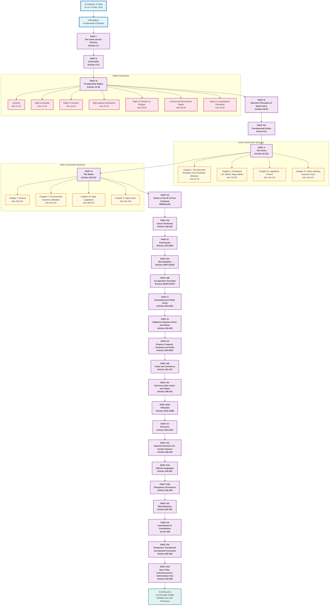

# Constitutional Overview Structure

## Overview
This diagram provides a comprehensive overview of the Constitution of India's structure based on the Contents analysis from lines 1-1000. It shows the major parts and their hierarchical organization.

## Key Articles Covered
- Complete constitutional framework from Contents section
- All major Parts (I through XXII)
- Key chapters and article ranges

## Constitutional Significance
This overview demonstrates the systematic organization of India's Constitution, showing how different aspects of governance, rights, and state structure are logically arranged.

## Mermaid Diagram

## Analysis Notes

### Constitutional Structure Insights
1. **Systematic Organization**: The Constitution follows a logical progression from foundational principles (Preamble) through territorial organization, citizenship, rights, and governance structures.

2. **Rights-Centric Approach**: Fundamental Rights (Part III) are positioned early, emphasizing their importance in the constitutional framework.

3. **Federal Structure**: Clear separation between Union (Part V) and State (Part VI) governance structures.

4. **Comprehensive Coverage**: The Constitution addresses all aspects of governance from local (Panchayats) to national level.

5. **Amendment Flexibility**: Part XX provides the mechanism for constitutional evolution.

### Key Observations from Lines 1-1000
- Lines 1-1000 primarily contain administrative content and the detailed Contents section
- The actual constitutional text begins around line 2161 with the Preamble
- The Contents section provides a complete roadmap of constitutional organization
- 395 articles organized across 22 parts plus 12 schedules
- Systematic progression from principles to implementation

This overview serves as the foundation for understanding how subsequent detailed diagrams will fit into the broader constitutional framework.