# Local Governance: Panchayats and Municipalities Structure

## Overview
This diagram visualizes the comprehensive local governance framework established by Parts IX and IXA of the Constitution of India, covering both rural (Panchayats) and urban (Municipalities) local self-government institutions, along with Union Territory administration.

## Key Articles Covered
- **Part VIII (Art 239-242)**: Union Territories administration
- **Part IX (Art 243-243O)**: Panchayats (rural local governance)
- **Part IXA (Art 243P-243ZE)**: Municipalities (urban local governance)

## Constitutional Significance
These provisions establish the foundation for grassroots democracy in India, creating a three-tier system of governance that brings administration closer to the people through elected local bodies with defined powers, functions, and financial resources.

```mermaid
graph TD
    Constitution[Constitution of India]
    Constitution --> PartVIII[PART VIII: Union Territories<br/>Art 239-242]
    Constitution --> PartIX[PART IX: The Panchayats<br/>Art 243-243O]
    Constitution --> PartIXA[PART IXA: The Municipalities<br/>Art 243P-243ZE]
    
    subgraph "Union Territory Administration"
        PartVIII --> UT1[Art 239: Administration by President<br/>through Administrator]
        PartVIII --> UT2[Art 239AA: Special Provisions<br/>for Delhi NCT]
        PartVIII --> UT3[Art 240: Presidential Regulations<br/>for certain UTs]
        PartVIII --> UT4[Art 241: High Courts<br/>for Union Territories]
        
        UT2 --> Delhi1[Lieutenant Governor]
        UT2 --> Delhi2[Legislative Assembly]
        UT2 --> Delhi3[Council of Ministers]
        Delhi1 --> Delhi4[President's Decision<br/>in case of differences]
    end
    
    subgraph "Rural Local Governance - Panchayats"
        PartIX --> P1[Art 243: Definitions<br/>Gram Sabha, Panchayat]
        PartIX --> P2[Art 243B: Three-tier Structure<br/>Village, Intermediate, District]
        PartIX --> P3[Art 243C: Composition<br/>Direct Election]
        PartIX --> P4[Art 243D: Reservations<br/>SC/ST/Women]
        
        P2 --> Village[Village Level<br/>Gram Panchayat]
        P2 --> Intermediate[Intermediate Level<br/>Panchayat Samiti]
        P2 --> District[District Level<br/>Zilla Panchayat]
        
        Village --> VillageFunc[Functions:<br/>Economic Development<br/>Social Justice<br/>11th Schedule]
        Intermediate --> IntermediateFunc[Coordination<br/>between Village & District]
        District --> DistrictFunc[District Planning<br/>Resource Allocation]
    end
    
    subgraph "Urban Local Governance - Municipalities"
        PartIXA --> M1[Art 243Q: Three Types<br/>Based on Population]
        PartIXA --> M2[Art 243R: Composition<br/>Direct Election from Wards]
        PartIXA --> M3[Art 243S: Ward Committees<br/>for large cities]
        PartIXA --> M4[Art 243T: Reservations<br/>SC/ST/Women]
        
        M1 --> NP[Nagar Panchayat<br/>Transitional Areas]
        M1 --> MC[Municipal Council<br/>Smaller Urban Areas]
        M1 --> Corp[Municipal Corporation<br/>Larger Urban Areas]
        
        NP --> NPFunc[Basic Urban Services<br/>12th Schedule Functions]
        MC --> MCFunc[Municipal Services<br/>Urban Planning]
        Corp --> CorpFunc[Comprehensive<br/>Urban Governance]
    end
    
    subgraph "Common Features & Support Systems"
        CommonFeatures[Common to Both Systems]
        CommonFeatures --> CF1[Art 243E/243U: 5-year Term<br/>Elections before expiry]
        CommonFeatures --> CF2[Art 243F/243V: Disqualifications<br/>Age 21+ for membership]
        CommonFeatures --> CF3[Art 243G/243W: Powers & Functions<br/>Economic Development]
        CommonFeatures --> CF4[Art 243H/243X: Taxation Powers<br/>State grants]
        
        SupportSystems[Support Systems]
        SupportSystems --> SS1[Art 243I/243Y: State Finance<br/>Commission every 5 years]
        SupportSystems --> SS2[Art 243J/243Z: Audit<br/>of Accounts]
        SupportSystems --> SS3[Art 243K/243ZA: State Election<br/>Commission]
        SupportSystems --> SS4[Art 243ZD: District Planning<br/>Committee]
        SupportSystems --> SS5[Art 243ZE: Metropolitan Planning<br/>Committee]
    end
    
    subgraph "Planning & Coordination"
        Planning[Integrated Planning Structure]
        Planning --> DP[District Planning Committee<br/>Art 243ZD]
        Planning --> MP[Metropolitan Planning Committee<br/>Art 243ZE]
        
        DP --> DPComp[4/5 members from<br/>Panchayats & Municipalities]
        DP --> DPFunc[Consolidate plans<br/>Spatial planning<br/>Resource sharing]
        
        MP --> MPComp[Metropolitan area<br/>coordination]
        MP --> MPFunc[Draft development plan<br/>for metro area]
    end
    
    %% Connections between systems
    Village --> DP
    Intermediate --> DP
    District --> DP
    NP --> DP
    MC --> DP
    Corp --> MP
    
    %% Styling
    classDef foundation fill:#e1f5fe,stroke:#01579b,stroke-width:3px
    classDef territory fill:#e8f5e8,stroke:#2e7d32,stroke-width:2px
    classDef panchayat fill:#fff3e0,stroke:#ef6c00,stroke-width:2px
    classDef municipality fill:#fce4ec,stroke:#c2185b,stroke-width:2px
    classDef support fill:#e0f2f1,stroke:#00695c,stroke-width:2px
    classDef planning fill:#fff8e1,stroke:#f57f17,stroke-width:2px
    
    class Constitution,PartVIII,PartIX,PartIXA foundation
    class UT1,UT2,UT3,UT4,Delhi1,Delhi2,Delhi3,Delhi4 territory
    class P1,P2,P3,P4,Village,Intermediate,District,VillageFunc,IntermediateFunc,DistrictFunc panchayat
    class M1,M2,M3,M4,NP,MC,Corp,NPFunc,MCFunc,CorpFunc municipality
    class CommonFeatures,CF1,CF2,CF3,CF4,SupportSystems,SS1,SS2,SS3,SS4,SS5 support
    class Planning,DP,MP,DPComp,DPFunc,MPComp,MPFunc planning
```

