# Local Governance: Panchayats and Municipalities

## Overview
This diagram visualizes the constitutional framework for local governance in India, including the Panchayati Raj system (rural local governance) and Municipal system (urban local governance) as established by the 73rd and 74th Constitutional Amendments.

## Key Articles Covered
- **Articles 239-242**: Union Territory administration and governance
- **Part IX (Articles 243-243O)**: The Panchayats - Rural local governance
- **Part IXA (Articles 243P onwards)**: The Municipalities - Urban local governance

## Constitutional Significance
These provisions establish the third tier of governance in India, ensuring democratic participation at the grassroots level and decentralization of power to local communities.

```mermaid
graph TD
    subgraph "Union Territory Governance (Articles 239-242)"
        UT[Union Territories]
        UT --> Admin[Administrator<br/>Art 239: Central appointment]
        UT --> Ordinance[Ordinance Power<br/>Art 239A: During legislature recess]
        UT --> Regulations[Presidential Regulations<br/>Art 240: For certain UTs]
        UT --> UTHC[High Courts<br/>Art 241: For Union territories]
    end
    
    subgraph "Panchayati Raj System (Part IX)"
        Panchayats[PANCHAYATS<br/>Art 243: Definitions]
        
        subgraph "Panchayat Structure"
            Panchayats --> GS[Gram Sabha<br/>Art 243A: Village assembly]
            Panchayats --> Constitution[Constitution<br/>Art 243B: Three-tier system]
            Panchayats --> Composition[Composition<br/>Art 243C: Members & chairpersons]
        end
        
        subgraph "Panchayat Membership"
            Constitution --> Reservation[Reservation<br/>Art 243D: SC/ST/Women]
            Constitution --> Duration[Duration<br/>Art 243E: 5-year term]
            Constitution --> Disqualification[Disqualifications<br/>Art 243F: Membership criteria]
        end
        
        subgraph "Panchayat Powers & Functions"
            Panchayats --> Powers[Powers & Responsibilities<br/>Art 243G: Devolved functions]
            Panchayats --> Taxation[Taxation Powers<br/>Art 243H: Revenue generation]
            Panchayats --> Finance[Finance Commission<br/>Art 243I: Financial review]
            Panchayats --> Audit[Audit<br/>Art 243J: Account auditing]
        end
        
        subgraph "Panchayat Elections & Legal Framework"
            Panchayats --> Elections[Elections<br/>Art 243K: Electoral process]
            Panchayats --> UTApplication[UT Application<br/>Art 243L: Extension to UTs]
            Panchayats --> Exclusions[Exclusions<br/>Art 243M: Certain areas exempt]
            Panchayats --> Continuance[Existing Laws<br/>Art 243N: Transition provisions]
            Panchayats --> CourtBar[Court Interference<br/>Art 243O: Electoral matters bar]
        end
    end
    
    subgraph "Municipal System (Part IXA)"
        Municipalities[MUNICIPALITIES<br/>Art 243P: Definitions]
        Municipalities --> MuniConstitution[Constitution<br/>Art 243Q: Urban local bodies]
        Municipalities --> MuniComposition[Composition<br/>Art 243R: Members structure]
    end
    
    %% Three-tier Panchayat System Detail
    subgraph "Three-Tier Panchayat Structure"
        Village[Village Level<br/>Gram Panchayat]
        Block[Block Level<br/>Panchayat Samiti]
        District[District Level<br/>Zilla Panchayat]
        
        Village --> Block
        Block --> District
    end
    
    Constitution --> Village
    
    %% Connections
    UT --> Panchayats
    Panchayats --> Municipalities
    
    classDef territory fill:#e8f5e8,stroke:#388e3c,stroke-width:2px
    classDef panchayat fill:#e3f2fd,stroke:#1976d2,stroke-width:2px
    classDef municipal fill:#fff3e0,stroke:#f57c00,stroke-width:2px
    classDef structure fill:#fce4ec,stroke:#c2185b,stroke-width:2px
    classDef power fill:#f3e5f5,stroke:#7b1fa2,stroke-width:2px
    
    class UT,Admin,Ordinance,Regulations,UTHC territory
    class Panchayats,GS,Constitution,Composition,Reservation,Duration,Disqualification panchayat
    class Powers,Taxation,Finance,Audit,Elections,UTApplication,Exclusions,Continuance,CourtBar power
    class Municipalities,MuniConstitution,MuniComposition municipal
    class Village,Block,District structure
```

## Detailed Analysis

### Union Territory Administration
- **Administrator**: Central government appointee for UT administration
- **Ordinance Power**: Emergency legislation during legislature recess
- **Presidential Regulations**: Direct central control for certain UTs
- **High Courts**: Judicial administration for Union Territories

### Panchayati Raj System (73rd Amendment)
The three-tier rural local governance system:

#### Structure & Composition
- **Gram Sabha**: Village assembly as foundation of democracy
- **Three-Tier System**: Village, Block, and District levels
- **Composition**: Elected representatives with reserved seats

#### Democratic Features
- **Reservations**: Mandatory seats for SC/ST and women (33%)
- **Fixed Tenure**: 5-year term with regular elections
- **Disqualifications**: Clear criteria for membership eligibility

#### Powers & Functions
- **Devolved Powers**: 29 subjects transferred to Panchayats
- **Financial Powers**: Taxation and revenue generation authority
- **Finance Commission**: Regular financial review mechanism
- **Audit System**: Mandatory account auditing

#### Electoral & Legal Framework
- **Regular Elections**: Constitutional mandate for timely elections
- **UT Extension**: Applicable to Union Territories
- **Area Exclusions**: Certain tribal and hill areas exempt
- **Judicial Non-interference**: Courts barred from electoral matters

### Municipal System (74th Amendment)
Urban local governance structure:
- **Constitutional Status**: Urban local bodies as institutions of self-government
- **Structured Composition**: Elected representatives for urban areas
- **Parallel Framework**: Similar to Panchayats but for urban governance

## Constitutional Impact
This framework ensures:
1. **Democratic Decentralization**: Power distribution to grassroots level
2. **Social Justice**: Mandatory representation for marginalized groups
3. **Local Autonomy**: Self-governance in local matters
4. **Institutional Continuity**: Regular elections and fixed tenure
5. **Financial Independence**: Revenue generation and audit mechanisms