# Municipal, Cooperative and Tribal Area Governance

## Overview
This diagram visualizes the constitutional framework for municipal governance (urban local bodies), cooperative societies governance, and special provisions for scheduled and tribal areas as established by various constitutional amendments.

## Key Articles Covered
- **Part IXA (Articles 243S-243ZG)**: Municipal governance framework
- **Part IXB (Articles 243ZH-243ZT)**: Co-operative societies governance (97th Amendment)
- **Part X (Articles 244-244A)**: Scheduled and Tribal Areas administration

## Constitutional Significance
These provisions establish comprehensive governance frameworks for urban areas, cooperative institutions, and special protection for tribal communities, ensuring inclusive democratic participation across all sectors of society.

```mermaid
graph TD
    subgraph "Municipal Governance (Part IXA - Articles 243S-243ZG)"
        Municipalities[MUNICIPALITIES]
        
        subgraph "Municipal Structure & Composition"
            Municipalities --> Wards[Ward Committees<br/>Art 243S: Local representation]
            Municipalities --> MReservation[Reservations<br/>Art 243T: SC/ST/Women seats]
            Municipalities --> MDuration[Duration<br/>Art 243U: 5-year term]
            Municipalities --> MDisqualification[Disqualifications<br/>Art 243V: Membership criteria]
        end
        
        subgraph "Municipal Powers & Functions"
            Municipalities --> MPowers[Powers & Responsibilities<br/>Art 243W: Urban functions]
            Municipalities --> MTaxation[Taxation & Funds<br/>Art 243X: Revenue powers]
            Municipalities --> MFinance[Finance Commission<br/>Art 243Y: Financial review]
            Municipalities --> MAudit[Audit<br/>Art 243Z: Account auditing]
        end
        
        subgraph "Municipal Elections & Planning"
            Municipalities --> MElections[Elections<br/>Art 243ZA: Electoral process]
            Municipalities --> MUT[UT Application<br/>Art 243ZB: Union territories]
            Municipalities --> MExclusions[Area Exclusions<br/>Art 243ZC: Certain areas exempt]
            Municipalities --> DPC[District Planning<br/>Art 243ZD: District committees]
            Municipalities --> MPC[Metropolitan Planning<br/>Art 243ZE: Metro committees]
            Municipalities --> MContinuance[Existing Laws<br/>Art 243ZF: Transition]
            Municipalities --> MCourtBar[Court Bar<br/>Art 243ZG: Electoral matters]
        end
    end
    
    subgraph "Co-operative Societies (Part IXB - Articles 243ZH-243ZT)"
        Cooperatives[CO-OPERATIVE SOCIETIES<br/>Art 243ZH: Definitions]
        
        subgraph "Cooperative Structure"
            Cooperatives --> Incorporation[Incorporation<br/>Art 243ZI: Legal entity status]
            Cooperatives --> Board[Board Composition<br/>Art 243ZJ: Members & term]
            Cooperatives --> CElections[Board Elections<br/>Art 243ZK: Democratic process]
        end
        
        subgraph "Cooperative Management"
            Cooperatives --> Supersession[Supersession<br/>Art 243ZL: Board suspension]
            Cooperatives --> CAudit[Audit<br/>Art 243ZM: Account auditing]
            Cooperatives --> Meetings[General Meetings<br/>Art 243ZN: Member participation]
            Cooperatives --> Information[Information Rights<br/>Art 243ZO: Member access]
        end
        
        subgraph "Cooperative Compliance"
            Cooperatives --> Returns[Returns<br/>Art 243ZP: Reporting requirements]
            Cooperatives --> Penalties[Offences & Penalties<br/>Art 243ZQ: Legal framework]
            Cooperatives --> MultiState[Multi-State Societies<br/>Art 243ZR: Special provisions]
            Cooperatives --> CUT[UT Application<br/>Art 243ZS: Union territories]
            Cooperatives --> CContinuance[Existing Laws<br/>Art 243ZT: Transition]
        end
    end
    
    subgraph "Scheduled & Tribal Areas (Part X - Articles 244-244A)"
        TribalAreas[SCHEDULED & TRIBAL AREAS]
        TribalAreas --> Administration[Administration<br/>Art 244: Special provisions]
        TribalAreas --> AssamState[Autonomous State<br/>Art 244A: Assam tribal areas]
        
        subgraph "Tribal Governance Features"
            Administration --> SpecialLaws[Special Laws<br/>Customary practices]
            Administration --> Protection[Land Protection<br/>Tribal rights]
            Administration --> SelfGov[Self-Governance<br/>Traditional institutions]
            AssamState --> LocalLeg[Local Legislature<br/>Autonomous governance]
            AssamState --> CouncilMin[Council of Ministers<br/>Executive authority]
        end
    end
    
    %% Planning Integration
    subgraph "Integrated Planning System"
        DPC --> IntegratedPlan[Integrated Development<br/>Rural-Urban coordination]
        MPC --> IntegratedPlan
        IntegratedPlan --> StateLevel[State Level Planning<br/>Comprehensive development]
    end
    
    %% Connections
    Municipalities --> Cooperatives
    Cooperatives --> TribalAreas
    DPC --> MPC
    
    classDef municipal fill:#e3f2fd,stroke:#1976d2,stroke-width:2px
    classDef cooperative fill:#e8f5e8,stroke:#388e3c,stroke-width:2px
    classDef tribal fill:#fff3e0,stroke:#f57c00,stroke-width:2px
    classDef planning fill:#fce4ec,stroke:#c2185b,stroke-width:2px
    classDef power fill:#f3e5f5,stroke:#7b1fa2,stroke-width:2px
    
    class Municipalities,Wards,MReservation,MDuration,MDisqualification,MPowers,MTaxation,MFinance,MAudit municipal
    class MElections,MUT,MExclusions,MContinuance,MCourtBar municipal
    class Cooperatives,Incorporation,Board,CElections,Supersession,CAudit,Meetings,Information cooperative
    class Returns,Penalties,MultiState,CUT,CContinuance cooperative
    class TribalAreas,Administration,AssamState,SpecialLaws,Protection,SelfGov,LocalLeg,CouncilMin tribal
    class DPC,MPC,IntegratedPlan,StateLevel planning
```

## Detailed Analysis

### Municipal Governance Framework (74th Amendment)

#### Structure & Democratic Features
- **Ward Committees**: Grassroots representation within municipalities
- **Reservations**: 33% seats for women, proportional for SC/ST
- **Fixed Tenure**: 5-year term with regular elections
- **Clear Eligibility**: Defined disqualification criteria

#### Powers & Functions
- **Urban Functions**: 18 subjects including water supply, public health, urban planning
- **Financial Powers**: Property tax, user charges, and other revenue sources
- **Finance Commission**: State-level body for financial devolution
- **Audit Mechanism**: Mandatory account auditing

#### Planning & Coordination
- **District Planning Committee**: Rural-urban coordination
- **Metropolitan Planning Committee**: Large urban area planning
- **Integrated Development**: Coordinated planning approach

### Co-operative Societies Framework (97th Amendment)

#### Democratic Structure
- **Incorporation**: Automatic registration as legal entities
- **Board Elections**: Democratic election of management boards
- **Fixed Terms**: Limited tenure for board members

#### Governance & Accountability
- **Professional Management**: Protection from arbitrary supersession
- **Audit Requirements**: Mandatory annual auditing
- **Member Rights**: Information access and participation in general meetings
- **Legal Framework**: Clear penalties for violations

#### Special Provisions
- **Multi-State Societies**: Special provisions for inter-state cooperatives
- **UT Application**: Extension to Union Territories
- **Transition**: Protection of existing cooperative laws

### Scheduled & Tribal Areas (Fifth & Sixth Schedules)

#### Special Administrative Framework
- **Customary Laws**: Recognition of traditional legal systems
- **Land Protection**: Safeguards against alienation of tribal land
- **Self-Governance**: Traditional institutions and practices
- **Autonomous Regions**: Special status for certain tribal areas

#### Assam Tribal Areas
- **Autonomous State**: Special constitutional status
- **Local Legislature**: Self-governing legislative body
- **Executive Authority**: Council of Ministers for autonomous governance

## Constitutional Impact
This comprehensive framework ensures:
1. **Urban Democracy**: Effective local governance in cities and towns
2. **Cooperative Autonomy**: Democratic and professional management of cooperatives
3. **Tribal Protection**: Special safeguards for indigenous communities
4. **Integrated Planning**: Coordinated development across rural-urban divide
5. **Inclusive Governance**: Representation for all sections of society
6. **Institutional Continuity**: Regular elections and fixed tenure across all levels