# Union-State Relations and Federal Structure

## Overview
This diagram visualizes the constitutional framework governing relations between the Union and States, including legislative distribution, administrative coordination, and financial arrangements that form the backbone of India's federal structure.

## Key Articles Covered
- **Part XI Chapter I (Articles 245-255)**: Legislative Relations and Distribution of Powers
- **Part XI Chapter II (Articles 256-263)**: Administrative Relations and Coordination
- **Part XII Chapter I (Articles 264-274)**: Finance, Revenue Distribution, and Fiscal Federalism

## Constitutional Significance
These provisions establish India's unique federal structure with a strong center, defining how legislative, administrative, and financial powers are distributed and coordinated between the Union and State governments.

```mermaid
graph TD
    subgraph "Legislative Relations (Articles 245-255)"
        LegislativeRel[LEGISLATIVE RELATIONS]
        
        subgraph "Distribution of Legislative Powers"
            LegislativeRel --> Extent[Extent of Laws<br/>Art 245: Territorial jurisdiction]
            LegislativeRel --> SubjectMatter[Subject Matter<br/>Art 246: Union, State, Concurrent Lists]
            LegislativeRel --> GST[GST Provisions<br/>Art 246A: Goods & Services Tax]
            LegislativeRel --> Courts[Additional Courts<br/>Art 247: Parliament's power]
            LegislativeRel --> Residuary[Residuary Powers<br/>Art 248: Union's residual authority]
        end
        
        subgraph "Emergency & Special Legislative Powers"
            LegislativeRel --> NationalInterest[National Interest<br/>Art 249: State list legislation]
            LegislativeRel --> Emergency[Emergency Powers<br/>Art 250: State list during emergency]
            LegislativeRel --> Inconsistency1[Inconsistency<br/>Art 251: Emergency laws vs State laws]
            LegislativeRel --> Consent[Consent Legislation<br/>Art 252: Multi-state laws]
            LegislativeRel --> International[International Agreements<br/>Art 253: Treaty implementation]
            LegislativeRel --> Inconsistency2[General Inconsistency<br/>Art 254: Union vs State laws]
            LegislativeRel --> Procedure[Procedural Requirements<br/>Art 255: Recommendations & sanctions]
        end
    end
    
    subgraph "Administrative Relations (Articles 256-263)"
        AdminRel[ADMINISTRATIVE RELATIONS]
        
        subgraph "Union-State Administrative Coordination"
            AdminRel --> Obligation[State Obligations<br/>Art 256: Compliance with Union laws]
            AdminRel --> Control[Union Control<br/>Art 257: Over state administration]
            AdminRel --> PowerConfer[Power Conferment<br/>Art 258: Union powers to States]
            AdminRel --> StateEntrust[State Entrustment<br/>Art 258A: State functions to Union]
        end
        
        subgraph "Inter-State & External Relations"
            AdminRel --> Jurisdiction[External Jurisdiction<br/>Art 260: Outside India]
            AdminRel --> PublicActs[Public Acts<br/>Art 261: Records & proceedings]
            AdminRel --> WaterDisputes[Water Disputes<br/>Art 262: Inter-state rivers]
            AdminRel --> Adjudication[Water Adjudication<br/>Art 263: Dispute resolution]
            AdminRel --> InterStateCouncil[Inter-State Council<br/>Art 263: Coordination mechanism]
        end
    end
    
    subgraph "Financial Relations (Articles 264-274)"
        FinanceRel[FINANCIAL RELATIONS]
        
        subgraph "General Financial Principles"
            FinanceRel --> Interpretation[Interpretation<br/>Art 264: Financial terms]
            FinanceRel --> TaxAuthority[Tax Authority<br/>Art 265: No tax without law]
            FinanceRel --> ConsolidatedFund[Consolidated Funds<br/>Art 266: Union & State funds]
            FinanceRel --> ContingencyFund[Contingency Fund<br/>Art 267: Emergency expenses]
        end
        
        subgraph "Revenue Distribution System"
            FinanceRel --> UnionDuties[Union Duties<br/>Art 268: Collected by States]
            FinanceRel --> RevenueDistribution[Revenue Distribution<br/>Art 269-271: Tax sharing]
            FinanceRel --> FinanceCommission[Finance Commission<br/>Art 280: Revenue allocation]
        end
    end
    
    %% Three Lists System Detail
    subgraph "Three Lists System (Seventh Schedule)"
        UnionList[Union List<br/>97 subjects<br/>Defense, Foreign Affairs, etc.]
        StateList[State List<br/>66 subjects<br/>Police, Agriculture, etc.]
        ConcurrentList[Concurrent List<br/>47 subjects<br/>Education, Forests, etc.]
        
        UnionList --> Parliament[Parliament<br/>Exclusive jurisdiction]
        StateList --> StateLeg[State Legislature<br/>Exclusive jurisdiction]
        ConcurrentList --> Both[Both Parliament & State<br/>Concurrent jurisdiction]
    end
    
    SubjectMatter --> UnionList
    SubjectMatter --> StateList
    SubjectMatter --> ConcurrentList
    
    %% Federal Structure Principles
    subgraph "Federal Structure Principles"
        StrongCenter[Strong Center<br/>Residuary powers, Emergency provisions]
        StateAutonomy[State Autonomy<br/>Exclusive state subjects]
        Cooperation[Cooperative Federalism<br/>Concurrent list, Inter-state council]
        
        StrongCenter --> Cooperation
        StateAutonomy --> Cooperation
    end
    
    Residuary --> StrongCenter
    Consent --> Cooperation
    InterStateCouncil --> Cooperation
    
    %% Connections
    LegislativeRel --> AdminRel
    AdminRel --> FinanceRel
    
    classDef legislative fill:#e3f2fd,stroke:#1976d2,stroke-width:2px
    classDef administrative fill:#e8f5e8,stroke:#388e3c,stroke-width:2px
    classDef financial fill:#fff3e0,stroke:#f57c00,stroke-width:2px
    classDef federal fill:#fce4ec,stroke:#c2185b,stroke-width:2px
    classDef lists fill:#f3e5f5,stroke:#7b1fa2,stroke-width:2px
    
    class LegislativeRel,Extent,SubjectMatter,GST,Courts,Residuary,NationalInterest,Emergency,Inconsistency1,Consent,International,Inconsistency2,Procedure legislative
    class AdminRel,Obligation,Control,PowerConfer,StateEntrust,Jurisdiction,PublicActs,WaterDisputes,Adjudication,InterStateCouncil administrative
    class FinanceRel,Interpretation,TaxAuthority,ConsolidatedFund,ContingencyFund,UnionDuties,RevenueDistribution,FinanceCommission financial
    class StrongCenter,StateAutonomy,Cooperation federal
    class UnionList,StateList,ConcurrentList,Parliament,StateLeg,Both lists
```

## Detailed Analysis

### Legislative Relations Framework

#### Distribution of Legislative Powers
- **Territorial Extent**: Parliament can legislate for whole/part of India; State legislatures for their territory
- **Subject Matter Distribution**: Three Lists system defining exclusive and concurrent jurisdictions
- **GST Framework**: Special constitutional provision for unified tax system
- **Residuary Powers**: All unlisted subjects belong to Union Parliament

#### Emergency and Special Powers
- **National Interest**: Parliament can legislate on State subjects when Rajya Sabha declares national interest
- **Emergency Provisions**: Union can legislate on State subjects during national emergency
- **Consent Legislation**: States can request Parliament to legislate on State subjects
- **International Treaties**: Parliament can implement international agreements affecting State subjects

#### Conflict Resolution
- **Inconsistency Doctrine**: Union law prevails over State law in case of conflict
- **Emergency Law Supremacy**: Special provisions during emergency situations
- **Procedural Safeguards**: Requirements for recommendations and sanctions

### Administrative Relations Framework

#### Union-State Coordination
- **State Compliance**: States must comply with Union laws and directions
- **Union Control**: Center can issue directions to States for law implementation
- **Power Delegation**: Union can delegate powers to States and vice versa
- **Functional Cooperation**: Mutual entrustment of administrative functions

#### Inter-State and External Relations
- **External Jurisdiction**: Union's authority over territories outside India
- **Public Acts Recognition**: Full faith and credit to public acts across States
- **Water Disputes**: Special mechanism for inter-state river disputes
- **Inter-State Council**: Constitutional body for Union-State coordination

### Financial Relations Framework

#### Financial Principles
- **Tax Authority**: No tax without legislative authority
- **Consolidated Funds**: Separate funds for Union and each State
- **Contingency Funds**: Emergency financial provisions
- **Financial Accountability**: Constitutional framework for public finance

#### Revenue Distribution
- **Tax Collection**: Some Union taxes collected by States
- **Revenue Sharing**: Constitutional mechanism for tax distribution
- **Finance Commission**: Constitutional body for revenue allocation every five years
- **Fiscal Federalism**: Balance between Union and State financial autonomy

### Three Lists System (Seventh Schedule)

#### Union List (97 subjects)
- Defense, foreign affairs, atomic energy, railways, airways, posts and telegraphs
- Inter-state trade and commerce, banking, insurance, stock exchanges
- Union taxes, customs, income tax, corporation tax

#### State List (66 subjects)  
- Police, public order, agriculture, animal husbandry, fisheries
- State taxes, land revenue, stamp duties, entertainment tax
- Local government, public health, education (except higher education)

#### Concurrent List (47 subjects)
- Education, forests, wildlife protection, marriage and divorce
- Criminal law and procedure, civil procedure, evidence
- Economic and social planning, trade unions, social security

## Federal Structure Characteristics

### Strong Center Features
- **Residuary Powers**: All unlisted subjects with Union
- **Emergency Provisions**: Extensive powers during emergencies
- **Financial Dominance**: Major tax powers with Union
- **Administrative Control**: Directions to States in national interest

### State Autonomy Features
- **Exclusive Jurisdiction**: 66 subjects in State List
- **Financial Powers**: State taxes and borrowing powers
- **Administrative Independence**: In State subjects
- **Constitutional Protection**: Cannot be abolished unilaterally

### Cooperative Federalism Features
- **Concurrent List**: Shared legislative jurisdiction
- **Inter-State Council**: Coordination mechanism
- **Consent Legislation**: Voluntary cooperation
- **Administrative Cooperation**: Mutual delegation of functions

## Constitutional Impact
This framework ensures:
1. **Unity with Diversity**: Strong center with state autonomy
2. **Flexible Federalism**: Adaptation to changing circumstances
3. **Conflict Resolution**: Clear mechanisms for disputes
4. **Cooperative Governance**: Institutional mechanisms for coordination
5. **Financial Balance**: Equitable distribution of resources
6. **Administrative Efficiency**: Clear division of responsibilities