# Trade, Commerce and Civil Services Framework

## Overview
This diagram visualizes the constitutional framework for trade and commerce within India, property rights, and the civil services structure that supports governance at Union and State levels.

## Key Articles Covered
- **Chapter III (Articles 294-300A)**: Property, Contracts, Rights, Liabilities and Suits
- **Part XIII (Articles 301-307)**: Trade, Commerce and Intercourse within India
- **Part XIV Chapter I (Articles 308-312A)**: Services under Union and States

## Constitutional Significance
These provisions establish India as a common economic market, protect property rights, ensure free trade across state boundaries, and create a professional civil service system for effective governance.

```mermaid
graph TD
    subgraph "Property, Contracts & Rights (Articles 294-300A)"
        PropertyRights[PROPERTY & CONTRACTS]
        
        subgraph "Property Succession & Rights"
            PropertyRights --> Succession1[Property Succession<br/>Art 294: Certain cases]
            PropertyRights --> Succession2[Property Succession<br/>Art 295: Other cases]
            PropertyRights --> Escheat[Escheat & Lapse<br/>Art 296: Bona vacantia]
            PropertyRights --> TerritorialWaters[Territorial Waters<br/>Art 297: Union ownership]
            PropertyRights --> RightToProperty[Right to Property<br/>Art 300A: Due process protection]
        end
        
        subgraph "Government Commercial Activities"
            PropertyRights --> Trade[Government Trade<br/>Art 298: Power to carry on trade]
            PropertyRights --> Contracts[Government Contracts<br/>Art 299: Contract procedures]
            PropertyRights --> Suits[Legal Proceedings<br/>Art 300: Government suits]
        end
    end
    
    subgraph "Trade & Commerce Framework (Articles 301-307)"
        TradeCommerce[TRADE & COMMERCE]
        
        subgraph "Freedom of Trade"
            TradeCommerce --> Freedom[Freedom of Trade<br/>Art 301: Throughout India]
            TradeCommerce --> ParliamentRestrictions[Parliament Restrictions<br/>Art 302: Public interest limitations]
            TradeCommerce --> LegislativePowers[Legislative Restrictions<br/>Art 303: Union & State limitations]
            TradeCommerce --> InterState[Inter-State Trade<br/>Art 304: State restrictions]
        end
        
        subgraph "Trade Regulation & Exceptions"
            TradeCommerce --> ExistingLaws[Existing Laws<br/>Art 305: State monopolies]
            TradeCommerce --> Authority[Regulatory Authority<br/>Art 307: Implementation body]
        end
    end
    
    subgraph "Civil Services Framework (Articles 308-312A)"
        CivilServices[CIVIL SERVICES]
        
        subgraph "Service Structure & Recruitment"
            CivilServices --> Interpretation[Interpretation<br/>Art 308: Service definitions]
            CivilServices --> Recruitment[Recruitment<br/>Art 309: Conditions of service]
            CivilServices --> Tenure[Tenure<br/>Art 310: Office tenure]
            CivilServices --> Dismissal[Dismissal Procedures<br/>Art 311: Due process protection]
        end
        
        subgraph "All-India Services"
            CivilServices --> AllIndiaServices[All-India Services<br/>Art 312: IAS, IPS, IFS]
            CivilServices --> ServiceConditions[Service Conditions<br/>Art 312A: Parliamentary powers]
        end
    end
    
    %% Trade Freedom Principles
    subgraph "Trade Freedom Principles"
        CommonMarket[Common Economic Market<br/>India as single market]
        FreeMovement[Free Movement<br/>Goods, services, capital]
        StateRestrictions[Limited State Powers<br/>Public interest only]
        
        Freedom --> CommonMarket
        CommonMarket --> FreeMovement
        ParliamentRestrictions --> StateRestrictions
        InterState --> StateRestrictions
    end
    
    %% Civil Service Categories
    subgraph "Service Categories"
        UnionServices[Union Services<br/>Central government]
        StateServices[State Services<br/>State government]
        AllIndiaServicesDetail[All-India Services<br/>Joint Union-State cadre]
        
        UnionServices --> AllIndiaServicesDetail
        StateServices --> AllIndiaServicesDetail
    end
    
    AllIndiaServices --> UnionServices
    AllIndiaServices --> StateServices
    AllIndiaServices --> AllIndiaServicesDetail
    
    %% Service Protection Features
    subgraph "Service Protection Features"
        SecurityTenure[Security of Tenure<br/>Protection from arbitrary removal]
        DueProcess[Due Process<br/>Inquiry before dismissal]
        UniformConditions[Uniform Conditions<br/>All-India services]
        
        Tenure --> SecurityTenure
        Dismissal --> DueProcess
        ServiceConditions --> UniformConditions
    end
    
    %% Economic Integration
    subgraph "Economic Integration Mechanisms"
        SingleMarket[Single National Market<br/>No internal trade barriers]
        UniformTaxation[Uniform Taxation<br/>GST implementation]
        FreeCompetition[Free Competition<br/>Anti-monopoly provisions]
        
        CommonMarket --> SingleMarket
        SingleMarket --> UniformTaxation
        ExistingLaws --> FreeCompetition
    end
    
    %% Connections
    PropertyRights --> TradeCommerce
    TradeCommerce --> CivilServices
    
    classDef property fill:#e3f2fd,stroke:#1976d2,stroke-width:2px
    classDef trade fill:#e8f5e8,stroke:#388e3c,stroke-width:2px
    classDef services fill:#fff3e0,stroke:#f57c00,stroke-width:2px
    classDef principles fill:#fce4ec,stroke:#c2185b,stroke-width:2px
    classDef protection fill:#f3e5f5,stroke:#7b1fa2,stroke-width:2px
    
    class PropertyRights,Succession1,Succession2,Escheat,TerritorialWaters,RightToProperty,Trade,Contracts,Suits property
    class TradeCommerce,Freedom,ParliamentRestrictions,LegislativePowers,InterState,ExistingLaws,Authority trade
    class CivilServices,Interpretation,Recruitment,Tenure,Dismissal,AllIndiaServices,ServiceConditions services
    class CommonMarket,FreeMovement,StateRestrictions,SingleMarket,UniformTaxation,FreeCompetition principles
    class SecurityTenure,DueProcess,UniformConditions,UnionServices,StateServices,AllIndiaServicesDetail protection
```

## Detailed Analysis

### Property, Contracts and Rights Framework

#### Property Succession and Ownership
- **Government Property**: Systematic transfer of assets from British India to Union and States
- **Escheat and Lapse**: Property without heirs goes to appropriate government
- **Territorial Waters**: All maritime resources vest in Union government
- **Right to Property**: Constitutional protection against arbitrary deprivation (Article 300A)

#### Government Commercial Activities
- **Trade Powers**: Government can engage in commercial activities
- **Contract Procedures**: Specific requirements for government contracts
- **Legal Proceedings**: Government can sue and be sued like any legal person

### Trade and Commerce Framework

#### Freedom of Trade Principles
- **Nationwide Freedom**: Trade, commerce and intercourse free throughout India
- **Single Economic Market**: India constituted as common economic space
- **Limited Restrictions**: Only Parliament can impose restrictions in public interest
- **State Limitations**: States cannot discriminate against other states

#### Regulatory Framework
- **Public Interest**: Restrictions only for compelling public interest
- **State Monopolies**: Existing state monopolies protected but limited
- **Implementation Authority**: Designated bodies to ensure compliance
- **Anti-Discrimination**: No preference to own state in trade matters

### Civil Services Framework

#### Service Structure
- **Three Categories**: Union Services, State Services, and All-India Services
- **Recruitment**: Merit-based selection through competitive examinations
- **Conditions of Service**: Uniform rules for recruitment and service conditions
- **Professional Standards**: Maintenance of high standards of integrity and competence

#### Service Protection
- **Security of Tenure**: Protection from arbitrary dismissal
- **Due Process**: Inquiry required before dismissal, removal or reduction in rank
- **Appeal Rights**: Right to appeal against disciplinary actions
- **Pension Rights**: Secure retirement benefits

#### All-India Services
- **Joint Cadre**: Officers serve both Union and State governments
- **Uniform Standards**: Common recruitment and training standards
- **Career Mobility**: Inter-state and inter-cadre transfers
- **National Perspective**: Broad outlook beyond state boundaries

## Economic Integration Features

### Common Market Characteristics
- **Free Movement**: Goods, services, and persons move freely across states
- **No Internal Barriers**: States cannot impose trade barriers against other states
- **Uniform Taxation**: GST creates single tax structure
- **Competition Policy**: Prevention of monopolistic practices

### Trade Regulation Balance
- **Central Authority**: Parliament has overriding power in trade matters
- **State Interests**: States can regulate for local public interest
- **Judicial Review**: Courts ensure constitutional compliance
- **Administrative Coordination**: Regulatory authorities ensure smooth implementation

## Civil Service Excellence

### Merit-Based System
- **Competitive Selection**: Open competition for recruitment
- **Professional Training**: Systematic training and development
- **Performance Evaluation**: Regular assessment and career progression
- **Ethical Standards**: High standards of conduct and integrity

### Service Integration
- **All-India Services**: Bridge between Union and State administration
- **Policy Continuity**: Professional expertise ensures policy implementation
- **Administrative Efficiency**: Trained personnel for effective governance
- **National Unity**: Common service ethos across the country

## Constitutional Impact
This framework ensures:
1. **Economic Unity**: India as single economic market without internal barriers
2. **Property Security**: Constitutional protection for property rights
3. **Professional Administration**: Merit-based civil service for effective governance
4. **Trade Freedom**: Free movement of goods, services and persons across states
5. **Regulatory Balance**: Central authority with state flexibility for local needs
6. **Service Excellence**: High standards of public administration through professional services