# Constitutional Institutions: PSCs, Tribunals and Elections

## Overview
This diagram visualizes key constitutional institutions that ensure merit-based governance, independent adjudication, and democratic elections - the Public Service Commissions, Tribunals system, and Election Commission framework.

## Key Articles Covered
- **Chapter II (Articles 315-323)**: Public Service Commissions for Union and States
- **Part XIVA (Articles 323A-323B)**: Administrative and other Tribunals
- **Part XV (Articles 324-329A)**: Elections and Election Commission

## Constitutional Significance
These institutions form the backbone of India's democratic and administrative system, ensuring merit-based recruitment, independent dispute resolution, and free and fair elections that sustain constitutional democracy.

```mermaid
graph TD
    subgraph "Public Service Commissions (Articles 315-323)"
        PSC[PUBLIC SERVICE COMMISSIONS]
        
        subgraph "PSC Structure & Composition"
            PSC --> UPSC[Union PSC<br/>Art 315: For Union services]
            PSC --> StatePSC[State PSCs<br/>Art 315: For State services]
            PSC --> Appointment[Appointment<br/>Art 316: President/Governor appoints]
            PSC --> Term[Term of Office<br/>Art 316: 6 years or 65 years]
            PSC --> Removal[Removal<br/>Art 317: Supreme Court inquiry]
        end
        
        subgraph "PSC Powers & Functions"
            PSC --> Regulations[Service Regulations<br/>Art 318: Conditions of service]
            PSC --> PostRestrictions[Post-Retirement<br/>Art 319: Office restrictions]
            PSC --> Functions[Core Functions<br/>Art 320: Recruitment, promotion]
            PSC --> ExtendedFunctions[Extended Functions<br/>Art 321: Additional duties]
            PSC --> Expenses[Expenses<br/>Art 322: Charged on funds]
            PSC --> Reports[Annual Reports<br/>Art 323: To President/Governor]
        end
    end
    
    subgraph "Tribunals System (Articles 323A-323B)"
        Tribunals[TRIBUNALS SYSTEM]
        
        subgraph "Administrative Tribunals"
            Tribunals --> AdminTribunals[Administrative Tribunals<br/>Art 323A: Service matters]
            AdminTribunals --> CAT[Central Admin Tribunal<br/>Union service disputes]
            AdminTribunals --> SAT[State Admin Tribunals<br/>State service disputes]
            AdminTribunals --> Jurisdiction[Exclusive Jurisdiction<br/>Service matters]
        end
        
        subgraph "Other Tribunals"
            Tribunals --> OtherTribunals[Other Tribunals<br/>Art 323B: Specified matters]
            OtherTribunals --> TaxTribunals[Tax Tribunals<br/>Revenue matters]
            OtherTribunals --> LandTribunals[Land Tribunals<br/>Land acquisition]
            OtherTribunals --> EnvironmentTribunals[Environment Tribunals<br/>Environmental disputes]
            OtherTribunals --> ConsumerTribunals[Consumer Tribunals<br/>Consumer disputes]
        end
    end
    
    subgraph "Election System (Articles 324-329A)"
        Elections[ELECTION SYSTEM]
        
        subgraph "Election Commission Structure"
            Elections --> EC[Election Commission<br/>Art 324: Constitutional body]
            Elections --> CEC[Chief Election Commissioner<br/>Independent authority]
            Elections --> ECs[Election Commissioners<br/>Supporting members]
            Elections --> Superintendence[Superintendence<br/>Direction & control of elections]
        end
        
        subgraph "Electoral Principles"
            Elections --> NoDiscrimination[No Discrimination<br/>Art 325: Religion, race, caste, sex]
            Elections --> AdultSuffrage[Adult Suffrage<br/>Art 326: Universal franchise]
            Elections --> ParliamentPower[Parliament Powers<br/>Art 327: Election laws]
            Elections --> StatePower[State Powers<br/>Art 328: State election laws]
            Elections --> CourtBar[Court Interference<br/>Art 329: Electoral disputes bar]
        end
    end
    
    %% PSC Functions Detail
    subgraph "PSC Core Functions"
        Recruitment[Recruitment<br/>Competitive examinations]
        Promotion[Promotions<br/>Merit-based advancement]
        Disciplinary[Disciplinary Matters<br/>Service conduct]
        Advisory[Advisory Role<br/>Service rules consultation]
        
        Functions --> Recruitment
        Functions --> Promotion
        Functions --> Disciplinary
        Functions --> Advisory
    end
    
    %% Tribunal Advantages
    subgraph "Tribunal System Benefits"
        Specialization[Specialization<br/>Expert knowledge]
        Speed[Speedy Justice<br/>Faster resolution]
        Accessibility[Accessibility<br/>Simplified procedures]
        Expertise[Technical Expertise<br/>Subject matter experts]
        
        AdminTribunals --> Specialization
        OtherTribunals --> Speed
        Jurisdiction --> Accessibility
        TaxTribunals --> Expertise
    end
    
    %% Election Commission Powers
    subgraph "Election Commission Powers"
        ModelCode[Model Code of Conduct<br/>Campaign regulation]
        Delimitation[Delimitation<br/>Constituency boundaries]
        VoterRegistration[Voter Registration<br/>Electoral rolls]
        ElectionSchedule[Election Schedule<br/>Timing and phases]
        ResultDeclaration[Result Declaration<br/>Official outcomes]
        
        Superintendence --> ModelCode
        Superintendence --> Delimitation
        Superintendence --> VoterRegistration
        Superintendence --> ElectionSchedule
        Superintendence --> ResultDeclaration
    end
    
    %% Democratic Principles
    subgraph "Democratic Electoral Principles"
        FreeElections[Free Elections<br/>No coercion or influence]
        FairElections[Fair Elections<br/>Equal opportunity]
        PeriodicElections[Periodic Elections<br/>Regular mandate renewal]
        SecretBallot[Secret Ballot<br/>Voter privacy]
        
        AdultSuffrage --> FreeElections
        NoDiscrimination --> FairElections
        ParliamentPower --> PeriodicElections
        EC --> SecretBallot
    end
    
    %% Institutional Independence
    subgraph "Institutional Independence"
        PSCIndependence[PSC Independence<br/>Constitutional protection]
        TribunalIndependence[Tribunal Independence<br/>Judicial character]
        ECIndependence[EC Independence<br/>Constitutional autonomy]
        
        Removal --> PSCIndependence
        Jurisdiction --> TribunalIndependence
        CEC --> ECIndependence
    end
    
    %% Connections
    PSC --> Tribunals
    Tribunals --> Elections
    
    classDef psc fill:#e3f2fd,stroke:#1976d2,stroke-width:2px
    classDef tribunal fill:#e8f5e8,stroke:#388e3c,stroke-width:2px
    classDef election fill:#fff3e0,stroke:#f57c00,stroke-width:2px
    classDef function fill:#fce4ec,stroke:#c2185b,stroke-width:2px
    classDef principle fill:#f3e5f5,stroke:#7b1fa2,stroke-width:2px
    
    class PSC,UPSC,StatePSC,Appointment,Term,Removal,Regulations,PostRestrictions,Functions,ExtendedFunctions,Expenses,Reports psc
    class Tribunals,AdminTribunals,CAT,SAT,Jurisdiction,OtherTribunals,TaxTribunals,LandTribunals,EnvironmentTribunals,ConsumerTribunals tribunal
    class Elections,EC,CEC,ECs,Superintendence,NoDiscrimination,AdultSuffrage,ParliamentPower,StatePower,CourtBar election
    class Recruitment,Promotion,Disciplinary,Advisory,Specialization,Speed,Accessibility,Expertise function
    class ModelCode,Delimitation,VoterRegistration,ElectionSchedule,ResultDeclaration,FreeElections,FairElections,PeriodicElections,SecretBallot principle
    class PSCIndependence,TribunalIndependence,ECIndependence principle
```

## Detailed Analysis

### Public Service Commissions Framework

#### Constitutional Structure
- **Union PSC (UPSC)**: Conducts examinations for All-India Services and Union services
- **State PSCs**: Conduct examinations for State services and subordinate services
- **Constitutional Status**: Independent constitutional bodies with guaranteed tenure
- **Appointment Process**: President appoints UPSC members, Governors appoint State PSC members

#### Independence and Security
- **Fixed Tenure**: 6 years or until 65 years of age, whichever is earlier
- **Removal Protection**: Can only be removed by President on Supreme Court inquiry
- **Financial Security**: Salaries and expenses charged on Consolidated Fund
- **Post-Retirement Restrictions**: Cannot hold office under government after retirement

#### Core Functions
- **Recruitment**: Conduct competitive examinations for civil services
- **Promotions**: Advise on promotion policies and procedures
- **Disciplinary Matters**: Consultation on major disciplinary actions
- **Advisory Role**: Provide advice on service rules and conditions
- **Annual Reports**: Submit reports on functioning to President/Governor

### Tribunals System Framework

#### Administrative Tribunals (Article 323A)
- **Central Administrative Tribunal (CAT)**: Handles Union service matters
- **State Administrative Tribunals**: Handle State service matters
- **Exclusive Jurisdiction**: Replace traditional courts for service disputes
- **Specialized Expertise**: Members with administrative and judicial experience

#### Other Tribunals (Article 323B)
- **Tax Tribunals**: Income Tax Appellate Tribunal, Customs Tribunal
- **Land Tribunals**: Land acquisition and revenue matters
- **Environment Tribunals**: Environmental protection and pollution control
- **Consumer Tribunals**: Consumer protection and disputes

#### Tribunal Advantages
- **Specialization**: Expert knowledge in specific subject areas
- **Speed**: Faster resolution compared to regular courts
- **Accessibility**: Simplified procedures and reduced formality
- **Cost-Effective**: Lower costs for litigants
- **Technical Expertise**: Members with relevant professional background

### Election System Framework

#### Election Commission Structure
- **Constitutional Body**: Independent institution under Article 324
- **Chief Election Commissioner**: Head with security of tenure like Supreme Court judge
- **Election Commissioners**: Additional members to assist CEC
- **Superintendence**: Complete control over election process

#### Electoral Principles
- **Universal Adult Suffrage**: All citizens above 18 can vote
- **No Discrimination**: Equal voting rights regardless of religion, race, caste, or sex
- **Secret Ballot**: Privacy and freedom of choice in voting
- **Periodic Elections**: Regular renewal of democratic mandate
- **Free and Fair Elections**: Independent conduct without influence

#### Election Commission Powers
- **Model Code of Conduct**: Regulate campaign activities and government announcements
- **Delimitation**: Determine constituency boundaries through Delimitation Commission
- **Voter Registration**: Maintain accurate electoral rolls
- **Election Schedule**: Decide timing and phases of elections
- **Result Declaration**: Official announcement of election outcomes

## Institutional Independence Features

### Public Service Commission Independence
- **Constitutional Protection**: Cannot be abolished or undermined by ordinary legislation
- **Financial Autonomy**: Expenses charged on Consolidated Fund, not subject to vote
- **Tenure Security**: Fixed term with protection from arbitrary removal
- **Functional Independence**: Freedom to conduct examinations and make recommendations

### Tribunal Independence
- **Judicial Character**: Function like courts with judicial procedures
- **Expert Composition**: Members with relevant professional expertise
- **Exclusive Jurisdiction**: Cannot be bypassed by regular courts in specified matters
- **Statutory Protection**: Established by specific laws with defined powers

### Election Commission Independence
- **Constitutional Status**: Direct constitutional creation, not statutory body
- **Security of Tenure**: CEC has same protection as Supreme Court judge
- **Financial Independence**: Budget directly charged on Consolidated Fund
- **Operational Autonomy**: Complete control over election process without government interference

## Democratic Governance Impact

### Merit-Based Administration
- **Competitive Selection**: Open competition ensures merit-based recruitment
- **Professional Standards**: High standards of competence and integrity
- **Career Security**: Protection from political interference in service matters
- **Continuous Improvement**: Regular review and updating of recruitment processes

### Accessible Justice
- **Specialized Forums**: Expert tribunals for specific types of disputes
- **Reduced Litigation**: Faster resolution reduces court backlog
- **Professional Adjudication**: Technical expertise in decision-making
- **Cost-Effective Resolution**: Lower costs compared to regular court litigation

### Democratic Legitimacy
- **Free Elections**: Independent conduct ensures genuine democratic choice
- **Equal Participation**: Universal suffrage with no discrimination
- **Regular Mandate**: Periodic elections ensure accountability
- **Transparent Process**: Open and transparent electoral procedures

## Constitutional Impact
This institutional framework ensures:
1. **Merit-Based Governance**: Professional civil service through competitive selection
2. **Independent Adjudication**: Specialized tribunals for efficient dispute resolution
3. **Democratic Legitimacy**: Free and fair elections sustaining constitutional democracy
4. **Institutional Integrity**: Independent bodies protected from political interference
5. **Accessible Justice**: Specialized forums for different types of disputes
6. **Professional Excellence**: High standards in public administration and electoral management