# Emergency Provisions and Miscellaneous Constitutional Matters

## Overview
This diagram visualizes the constitutional framework for emergency powers, linguistic minority protection, and miscellaneous provisions that provide extraordinary powers during crises while maintaining constitutional safeguards and protecting fundamental rights.

## Key Articles Covered
- **Chapter IV (Articles 350-351)**: Special language directives and linguistic minority protection
- **Part XVIII (Articles 352-360)**: Emergency Provisions - National, State, and Financial emergencies
- **Part XIX (Articles 361-367)**: Miscellaneous provisions including definitions and special protections

## Constitutional Significance
These provisions balance the need for strong crisis management powers with constitutional safeguards, ensuring that emergency powers cannot be misused while protecting linguistic minorities and defining key constitutional terms.

```mermaid
graph TD
    subgraph "Language Directives (Articles 350-351)"
        LanguageDirectives[LANGUAGE DIRECTIVES]
        
        subgraph "Linguistic Minority Protection"
            LanguageDirectives --> Grievances[Grievance Language<br/>Art 350: Any language for complaints]
            LanguageDirectives --> MotherTongue[Mother Tongue Education<br/>Art 350A: Primary stage instruction]
            LanguageDirectives --> SpecialOfficer[Special Officer<br/>Art 350B: Linguistic minorities protection]
            LanguageDirectives --> HindiDevelopment[Hindi Development<br/>Art 351: Directive for growth]
        end
    end
    
    subgraph "Emergency Provisions (Articles 352-360)"
        EmergencyProvisions[EMERGENCY PROVISIONS]
        
        subgraph "National Emergency (Article 352)"
            EmergencyProvisions --> NationalEmergency[National Emergency<br/>Art 352: War, external aggression, armed rebellion]
            NationalEmergency --> EmergencyEffect[Emergency Effects<br/>Art 353: Union powers expansion]
            NationalEmergency --> RevenueDistribution[Revenue Distribution<br/>Art 354: Modified during emergency]
            NationalEmergency --> UnionDuty[Union Protection Duty<br/>Art 355: Against aggression & disturbance]
        end
        
        subgraph "State Emergency (President's Rule)"
            EmergencyProvisions --> StateEmergency[State Emergency<br/>Art 356: Constitutional machinery failure]
            StateEmergency --> LegislativePowers[Legislative Powers<br/>Art 357: Parliament for state subjects]
            StateEmergency --> FRSuspension[Fundamental Rights<br/>Art 358: Article 19 suspension]
            StateEmergency --> PartIIISuspension[Part III Suspension<br/>Art 359: Other FR suspension]
        end
        
        subgraph "Financial Emergency"
            EmergencyProvisions --> FinancialEmergency[Financial Emergency<br/>Art 360: Financial stability threat]
        end
    end
    
    subgraph "Miscellaneous Provisions (Articles 361-367)"
        Miscellaneous[MISCELLANEOUS PROVISIONS]
        
        subgraph "Constitutional Protections"
            Miscellaneous --> PresidentProtection[President Protection<br/>Art 361: Immunity from courts]
            Miscellaneous --> PublicationProtection[Publication Protection<br/>Art 361A: Parliamentary proceedings]
            Miscellaneous --> PoliticalDisqualification[Political Disqualification<br/>Art 361B: Remunerative posts]
        end
        
        subgraph "Special Provisions"
            Miscellaneous --> TreatyBar[Treaty Disputes<br/>Art 363: Court interference bar]
            Miscellaneous --> PrivyPurse[Privy Purse Abolition<br/>Art 363A: Ruler privileges ended]
            Miscellaneous --> MajorPorts[Major Ports<br/>Art 364: Special provisions]
            Miscellaneous --> UnionDirections[Union Directions<br/>Art 365: Compliance failure effects]
            Miscellaneous --> Definitions[Definitions<br/>Art 366: Constitutional terms]
        end
    end
    
    %% Emergency Types Detail
    subgraph "Three Types of Emergency"
        Type1[National Emergency<br/>External aggression, war, armed rebellion]
        Type2[State Emergency<br/>Constitutional machinery failure]
        Type3[Financial Emergency<br/>Financial stability threat]
        
        NationalEmergency --> Type1
        StateEmergency --> Type2
        FinancialEmergency --> Type3
    end
    
    %% Emergency Safeguards
    subgraph "Emergency Safeguards"
        ParliamentApproval[Parliament Approval<br/>Within 2 months]
        PeriodicReview[Periodic Review<br/>Every 6 months]
        JudicialReview[Judicial Review<br/>Court scrutiny possible]
        FRProtection[FR Protection<br/>Life & liberty cannot be suspended]
        
        NationalEmergency --> ParliamentApproval
        StateEmergency --> PeriodicReview
        Type1 --> JudicialReview
        PartIIISuspension --> FRProtection
    end
    
    %% Emergency Powers
    subgraph "Emergency Powers"
        UnionExpansion[Union Power Expansion<br/>Over state subjects]
        ExecutiveControl[Executive Control<br/>Direct central administration]
        LegislativeOverride[Legislative Override<br/>Parliament for state matters]
        FinancialControl[Financial Control<br/>Salary and allowance cuts]
        
        EmergencyEffect --> UnionExpansion
        StateEmergency --> ExecutiveControl
        LegislativePowers --> LegislativeOverride
        FinancialEmergency --> FinancialControl
    end
    
    %% Linguistic Rights Protection
    subgraph "Linguistic Rights Protection"
        ComplaintRights[Complaint Rights<br/>Any language accepted]
        EducationRights[Education Rights<br/>Mother tongue instruction]
        MinorityOfficer[Minority Officer<br/>Dedicated protection mechanism]
        LanguagePromotion[Language Promotion<br/>Hindi development with diversity]
        
        Grievances --> ComplaintRights
        MotherTongue --> EducationRights
        SpecialOfficer --> MinorityOfficer
        HindiDevelopment --> LanguagePromotion
    end
    
    %% Constitutional Immunity
    subgraph "Constitutional Immunity & Protection"
        ExecutiveImmunity[Executive Immunity<br/>President/Governor protection]
        LegislativePrivilege[Legislative Privilege<br/>Parliamentary proceedings]
        JudicialLimitation[Judicial Limitation<br/>Treaty dispute bar]
        DefinitionalClarity[Definitional Clarity<br/>Constitutional terms]
        
        PresidentProtection --> ExecutiveImmunity
        PublicationProtection --> LegislativePrivilege
        TreatyBar --> JudicialLimitation
        Definitions --> DefinitionalClarity
    end
    
    %% Emergency Checks and Balances
    subgraph "Emergency Checks and Balances"
        LegislativeCheck[Legislative Check<br/>Parliament approval required]
        JudicialCheck[Judicial Check<br/>Court review of proclamation]
        TemporalCheck[Temporal Check<br/>Time-bound emergency]
        ConstitutionalCheck[Constitutional Check<br/>Basic structure protection]
        
        ParliamentApproval --> LegislativeCheck
        JudicialReview --> JudicialCheck
        PeriodicReview --> TemporalCheck
        FRProtection --> ConstitutionalCheck
    end
    
    %% Connections
    LanguageDirectives --> EmergencyProvisions
    EmergencyProvisions --> Miscellaneous
    
    classDef language fill:#e3f2fd,stroke:#1976d2,stroke-width:2px
    classDef emergency fill:#ffebee,stroke:#d32f2f,stroke-width:3px
    classDef miscellaneous fill:#e8f5e8,stroke:#388e3c,stroke-width:2px
    classDef safeguard fill:#fff3e0,stroke:#f57c00,stroke-width:2px
    classDef power fill:#f3e5f5,stroke:#7b1fa2,stroke-width:2px
    
    class LanguageDirectives,Grievances,MotherTongue,SpecialOfficer,HindiDevelopment language
    class EmergencyProvisions,NationalEmergency,EmergencyEffect,RevenueDistribution,UnionDuty,StateEmergency,LegislativePowers,FRSuspension,PartIIISuspension,FinancialEmergency emergency
    class Type1,Type2,Type3 emergency
    class Miscellaneous,PresidentProtection,PublicationProtection,PoliticalDisqualification,TreatyBar,PrivyPurse,MajorPorts,UnionDirections,Definitions miscellaneous
    class ParliamentApproval,PeriodicReview,JudicialReview,FRProtection,LegislativeCheck,JudicialCheck,TemporalCheck,ConstitutionalCheck safeguard
    class UnionExpansion,ExecutiveControl,LegislativeOverride,FinancialControl power
    class ComplaintRights,EducationRights,MinorityOfficer,LanguagePromotion,ExecutiveImmunity,LegislativePrivilege,JudicialLimitation,DefinitionalClarity miscellaneous
```

## Detailed Analysis

### Language Directives Framework

#### Linguistic Minority Protection
- **Grievance Language**: Citizens can submit complaints to authorities in any language
- **Mother Tongue Education**: Facilities for primary education in mother tongue for linguistic minorities
- **Special Officer**: Constitutional appointment to safeguard linguistic minority interests
- **Balanced Development**: Hindi development while protecting linguistic diversity

#### Implementation Mechanisms
- **State Responsibility**: States must provide adequate facilities for linguistic minorities
- **Central Oversight**: Special Officer reports to President on minority protection
- **Educational Policy**: Integration of mother tongue instruction in educational system
- **Cultural Preservation**: Protection of linguistic and cultural heritage

### Emergency Provisions Framework

#### National Emergency (Article 352)
- **Grounds**: War, external aggression, or armed rebellion
- **Proclamation**: President proclaims on advice of Council of Ministers
- **Parliamentary Approval**: Must be approved by both Houses within 2 months
- **Duration**: Continues until revoked, with periodic parliamentary review

#### State Emergency - President's Rule (Article 356)
- **Constitutional Failure**: When state government cannot function according to Constitution
- **Central Administration**: President assumes state executive powers
- **Legislative Powers**: Parliament can legislate for the state
- **Time Limit**: Initially 6 months, extendable up to 3 years maximum

#### Financial Emergency (Article 360)
- **Financial Stability**: When financial stability or credit of India is threatened
- **Central Control**: Union can control state finances and expenditure
- **Salary Reduction**: Can reduce salaries of government servants including judges
- **Rare Application**: Never been proclaimed in India's history

### Emergency Safeguards and Limitations

#### Parliamentary Safeguards
- **Approval Requirement**: Both Houses must approve emergency proclamation
- **Periodic Review**: Emergency must be reviewed every 6 months
- **Revocation Power**: Parliament can revoke emergency by resolution
- **Special Majority**: Certain emergency extensions require special majority

#### Judicial Safeguards
- **Judicial Review**: Courts can examine validity of emergency proclamation
- **Fundamental Rights**: Right to life and personal liberty cannot be suspended
- **Proportionality**: Emergency powers must be proportionate to the threat
- **Basic Structure**: Emergency cannot alter basic structure of Constitution

#### Constitutional Limitations
- **Time Bounds**: Emergencies cannot continue indefinitely
- **Specific Grounds**: Only specified grounds can justify emergency
- **Federal Balance**: Emergency powers temporary, federalism restored after emergency
- **Democratic Restoration**: Regular elections and democratic governance must resume

### Miscellaneous Provisions Framework

#### Constitutional Protections
- **Presidential Immunity**: President immune from court proceedings during tenure
- **Legislative Privilege**: Protection for parliamentary and assembly proceedings
- **Publication Protection**: Immunity for reporting legislative proceedings
- **Political Disqualification**: Restrictions on holding remunerative political posts

#### Special Constitutional Arrangements
- **Treaty Disputes**: Courts cannot interfere in certain treaty-related disputes
- **Privy Purse Abolition**: Former rulers' privileges and payments abolished
- **Major Ports**: Special provisions for major ports and aerodromes
- **Union Directions**: Consequences of states failing to comply with Union directions

#### Definitional Framework
- **Constitutional Terms**: Precise definitions of key constitutional concepts
- **Legal Clarity**: Clear meaning of terms used throughout Constitution
- **Interpretive Guidance**: Framework for constitutional interpretation
- **Uniform Understanding**: Consistent application across the country

## Emergency Powers Analysis

### Expansion of Union Powers
- **Legislative Expansion**: Parliament can legislate on state subjects
- **Executive Control**: Central government controls state administration
- **Financial Control**: Union controls state finances and expenditure
- **Administrative Integration**: Unified command and control structure

### Fundamental Rights Impact
- **Article 19 Suspension**: Freedom of speech, assembly, movement can be suspended
- **Other Rights**: President can suspend enforcement of other fundamental rights
- **Life and Liberty**: Articles 20 and 21 cannot be suspended
- **Judicial Protection**: Courts retain power to protect non-suspended rights

### Federal Structure Impact
- **Temporary Centralization**: Federal structure becomes unitary during emergency
- **State Autonomy**: State powers temporarily transferred to Union
- **Constitutional Restoration**: Federal structure restored after emergency ends
- **Institutional Continuity**: Constitutional institutions continue to function

## Checks and Balances System

### Legislative Checks
- **Parliamentary Approval**: Both Houses must approve emergency
- **Periodic Review**: Regular parliamentary oversight and renewal
- **Revocation Power**: Parliament can end emergency at any time
- **Opposition Role**: Parliamentary opposition can challenge emergency

### Judicial Checks
- **Proclamation Review**: Courts can examine validity of emergency proclamation
- **Fundamental Rights**: Judicial protection of non-suspended rights
- **Proportionality Test**: Courts can assess proportionality of emergency measures
- **Constitutional Limits**: Judicial enforcement of constitutional boundaries

### Executive Accountability
- **Council of Ministers**: Emergency proclaimed on advice of Council of Ministers
- **Presidential Discretion**: Limited discretion in emergency proclamation
- **Administrative Review**: Regular review of emergency administration
- **Democratic Responsibility**: Ultimate accountability to Parliament and people

## Constitutional Impact

### Crisis Management
- **National Security**: Effective response to external threats and internal disturbances
- **Constitutional Continuity**: Maintenance of constitutional order during crises
- **Unified Response**: Coordinated national response to emergencies
- **Quick Decision-Making**: Streamlined decision-making during crises

### Democratic Safeguards
- **Temporary Nature**: Emergency powers are temporary and reviewable
- **Parliamentary Control**: Legislative oversight of emergency powers
- **Judicial Review**: Court scrutiny of emergency measures
- **Constitutional Limits**: Fundamental constitutional principles remain protected

### Federal Balance
- **Crisis Centralization**: Temporary centralization for effective crisis management
- **Federal Restoration**: Return to federal structure after emergency
- **State Cooperation**: Framework for Union-State cooperation during emergencies
- **Institutional Resilience**: Constitutional institutions adapt to crisis situations

This framework ensures:
1. **Effective Crisis Management**: Strong powers to handle national emergencies
2. **Constitutional Safeguards**: Protection against misuse of emergency powers
3. **Democratic Oversight**: Parliamentary and judicial control over emergency measures
4. **Linguistic Protection**: Safeguards for linguistic minorities and cultural diversity
5. **Institutional Continuity**: Constitutional institutions function during emergencies
6. **Balanced Federalism**: Temporary centralization with federal restoration after crisis