# Citizenship and Fundamental Rights Structure

## Overview
This diagram visualizes the comprehensive structure of citizenship provisions (Part II) and fundamental rights (Part III) of the Constitution of India, showing the systematic framework for acquiring citizenship and the complete catalog of fundamental rights guaranteed to citizens.

## Key Articles Covered
- **Part II (Articles 5-11)**: Complete citizenship framework including acquisition, migration provisions, and parliamentary powers
- **Part III (Articles 12-35)**: Comprehensive fundamental rights structure including equality, freedom, religion, culture, and constitutional remedies

## Constitutional Significance
This structure represents the foundational relationship between citizenship and rights in India's constitutional framework, establishing who can be a citizen and what fundamental protections they receive.

```mermaid
graph TD
    Constitution[Constitution of India]
    Constitution --> PartII[PART II: CITIZENSHIP<br/>Articles 5-11]
    Constitution --> PartIII[PART III: FUNDAMENTAL RIGHTS<br/>Articles 12-35]
    
    subgraph "Citizenship Framework"
        PartII --> CitizenshipBase[Art 5: Citizenship at<br/>Commencement]
        CitizenshipBase --> MigrationRights[Art 6: Rights of Migrants<br/>from Pakistan]
        CitizenshipBase --> MigrationRestrictions[Art 7: Restrictions on<br/>Migrants to Pakistan]
        CitizenshipBase --> OverseasCitizens[Art 8: Indian Origin<br/>Residing Outside]
        
        MigrationRights --> CitizenshipLoss[Art 9: Foreign Citizenship<br/>Disqualification]
        MigrationRestrictions --> CitizenshipLoss
        OverseasCitizens --> CitizenshipLoss
        
        CitizenshipLoss --> CitizenshipContinuance[Art 10: Continuance of<br/>Citizenship Rights]
        CitizenshipContinuance --> ParliamentPower[Art 11: Parliament to<br/>Regulate Citizenship]
    end
    
    subgraph "Fundamental Rights Structure"
        PartIII --> GeneralProvisions[Art 12-13: General<br/>Provisions & Definitions]
        
        GeneralProvisions --> RightEquality[RIGHT TO EQUALITY<br/>Articles 14-18]
        GeneralProvisions --> RightFreedom[RIGHT TO FREEDOM<br/>Articles 19-22]
        GeneralProvisions --> RightExploitation[RIGHT AGAINST<br/>EXPLOITATION<br/>Articles 23-24]
        GeneralProvisions --> RightReligion[RIGHT TO FREEDOM<br/>OF RELIGION<br/>Articles 25-28]
        GeneralProvisions --> CulturalRights[CULTURAL AND<br/>EDUCATIONAL RIGHTS<br/>Articles 29-30]
        GeneralProvisions --> ConstitutionalRemedies[RIGHT TO CONSTITUTIONAL<br/>REMEDIES<br/>Articles 32-35]
    end
    
    subgraph "Right to Equality Details"
        RightEquality --> EqualityLaw[Art 14: Equality<br/>Before Law]
        RightEquality --> NonDiscrimination[Art 15: Prohibition of<br/>Discrimination]
        RightEquality --> EqualOpportunity[Art 16: Equality in<br/>Public Employment]
        RightEquality --> UntouchabilityAbolition[Art 17: Abolition of<br/>Untouchability]
        RightEquality --> TitleAbolition[Art 18: Abolition<br/>of Titles]
    end
    
    subgraph "Right to Freedom Details"
        RightFreedom --> SpeechFreedom[Art 19: Freedom of Speech,<br/>Assembly, Movement, etc.]
        RightFreedom --> CriminalProtection[Art 20: Protection from<br/>Ex-post-facto Laws]
        RightFreedom --> LifeLiberty[Art 21: Protection of<br/>Life and Liberty]
        RightFreedom --> EducationRight[Art 21A: Right to<br/>Education]
        RightFreedom --> ArrestProtection[Art 22: Protection Against<br/>Arrest and Detention]
    end
    
    subgraph "Religious Freedom Details"
        RightReligion --> ConscienceFreedom[Art 25: Freedom of<br/>Conscience and Religion]
        RightReligion --> ReligiousManagement[Art 26: Freedom to<br/>Manage Religious Affairs]
        RightReligion --> TaxFreedom[Art 27: Freedom from<br/>Religious Taxes]
        RightReligion --> InstructionFreedom[Art 28: Freedom from<br/>Religious Instruction]
    end
    
    subgraph "Constitutional Remedies Details"
        ConstitutionalRemedies --> SupremeCourtPower[Art 32: Supreme Court<br/>Writ Jurisdiction]
        ConstitutionalRemedies --> ForceModification[Art 33: Modification for<br/>Armed Forces]
        ConstitutionalRemedies --> MartialLawRestriction[Art 34: Martial Law<br/>Restrictions]
        ConstitutionalRemedies --> LegislativePower[Art 35: Legislative<br/>Implementation Power]
    end
    
    %% Cross-connections showing relationships
    ParliamentPower --> GeneralProvisions
    EqualityLaw --> NonDiscrimination
    NonDiscrimination --> EqualOpportunity
    SpeechFreedom --> LifeLiberty
    LifeLiberty --> EducationRight
    
    classDef citizenship fill:#fff3e0,stroke:#ef6c00,stroke-width:2px
    classDef rights fill:#fce4ec,stroke:#c2185b,stroke-width:2px
    classDef equality fill:#e8f5e8,stroke:#2e7d32,stroke-width:2px
    classDef freedom fill:#e3f2fd,stroke:#1976d2,stroke-width:2px
    classDef religion fill:#f3e5f5,stroke:#7b1fa2,stroke-width:2px
    classDef remedies fill:#fff8e1,stroke:#f57f17,stroke-width:2px
    classDef foundation fill:#e1f5fe,stroke:#01579b,stroke-width:3px
    
    class Constitution foundation
    class PartII,CitizenshipBase,MigrationRights,MigrationRestrictions,OverseasCitizens,CitizenshipLoss,CitizenshipContinuance,ParliamentPower citizenship
    class PartIII,GeneralProvisions rights
    class RightEquality,EqualityLaw,NonDiscrimination,EqualOpportunity,UntouchabilityAbolition,TitleAbolition equality
    class RightFreedom,SpeechFreedom,CriminalProtection,LifeLiberty,EducationRight,ArrestProtection freedom
    class RightReligion,ConscienceFreedom,ReligiousManagement,TaxFreedom,InstructionFreedom religion
    class ConstitutionalRemedies,SupremeCourtPower,ForceModification,MartialLawRestriction,LegislativePower remedies
    class RightExploitation,CulturalRights rights
```

## Analysis Notes

### Citizenship Framework (Part II)
- **Comprehensive Coverage**: Articles 5-11 establish complete citizenship acquisition framework
- **Historical Context**: Addresses partition-era migration between India and Pakistan
- **Parliamentary Authority**: Article 11 grants Parliament broad powers to regulate citizenship
- **Multiple Pathways**: Birth, descent, residence, and registration-based citizenship

### Fundamental Rights Structure (Part III)
- **Six Major Categories**: Equality, Freedom, Exploitation, Religion, Culture, and Constitutional Remedies
- **Hierarchical Organization**: General provisions (12-13) followed by specific right categories
- **Enforcement Mechanism**: Article 32 provides Supreme Court jurisdiction for rights enforcement
- **Balanced Framework**: Rights with reasonable restrictions and state obligations

### Key Constitutional Relationships
- **Citizenship-Rights Link**: Part II establishes who gets rights, Part III defines what rights they get
- **Enforcement Structure**: Constitutional remedies (Articles 32-35) provide implementation framework
- **Amendment Provisions**: Multiple amendments show evolution of rights framework
- **Judicial Review**: Supreme Court's role in protecting and interpreting fundamental rights

### Modern Relevance
- **Right to Education**: Article 21A added by 86th Amendment (2002)
- **Economic Reservations**: Articles 15(6) and 16(6) added by 103rd Amendment (2019)
- **Cooperative Societies**: Article 19(1)(c) amended by 97th Amendment (2011)
- **Continuing Evolution**: Framework allows for constitutional development while maintaining core principles