# Parliamentary Procedures and Supreme Court Structure

## Overview
This diagram visualizes the comprehensive parliamentary legislative procedures and Supreme Court structure as outlined in Part V of the Constitution of India, covering Articles 99-143. It shows the systematic flow of legislative processes, financial procedures, and the judicial hierarchy.

## Constitutional Significance
- **Parliamentary Conduct**: Articles 99-106 establish member conduct, voting procedures, and privileges
- **Legislative Process**: Articles 107-111 define bill passage, joint sittings, and presidential assent
- **Financial Procedures**: Articles 112-119 outline budget processes, money bills, and financial controls
- **Supreme Court Structure**: Articles 124-143 establish the apex court's composition, jurisdiction, and powers

## Key Articles Covered
- **Articles 99-106**: Parliamentary membership, conduct, and privileges
- **Articles 107-111**: Legislative procedures and presidential assent
- **Articles 112-119**: Financial procedures and budget processes
- **Articles 120-123**: Parliamentary language, restrictions, and ordinance powers
- **Articles 124-143**: Supreme Court establishment, jurisdiction, and powers

```mermaid
graph TD
    Constitution[Constitution of India<br/>Part V: The Union]
    Constitution --> Parliament[Parliament Structure]
    Constitution --> SupremeCourt[Supreme Court]
    
    subgraph "Parliamentary Procedures"
        Parliament --> Conduct[Member Conduct<br/>Art 99-106]
        Parliament --> Legislative[Legislative Process<br/>Art 107-111]
        Parliament --> Financial[Financial Procedures<br/>Art 112-119]
        Parliament --> General[General Procedures<br/>Art 120-123]
        
        subgraph "Member Conduct & Privileges"
            Conduct --> Oath[Oath/Affirmation<br/>Art 99]
            Conduct --> Voting[Voting Procedures<br/>Art 100]
            Conduct --> Disqualification[Disqualifications<br/>Art 101-104]
            Conduct --> Privileges[Powers & Privileges<br/>Art 105-106]
        end
        
        subgraph "Legislative Process Flow"
            Legislative --> BillIntro[Bill Introduction<br/>Art 107]
            BillIntro --> JointSitting[Joint Sitting<br/>Art 108]
            BillIntro --> MoneyBill[Money Bills<br/>Art 109-110]
            JointSitting --> PresAssent[Presidential Assent<br/>Art 111]
            MoneyBill --> PresAssent
        end
        
        subgraph "Financial Procedures"
            Financial --> Budget[Annual Budget<br/>Art 112]
            Budget --> Estimates[Budget Estimates<br/>Art 113]
            Estimates --> Appropriation[Appropriation Bills<br/>Art 114]
            Appropriation --> Supplementary[Supplementary Grants<br/>Art 115-116]
            Supplementary --> FinancialBills[Financial Bills<br/>Art 117]
        end
        
        subgraph "General Parliamentary Rules"
            General --> ProcRules[Procedure Rules<br/>Art 118-119]
            General --> Language[Parliamentary Language<br/>Art 120]
            General --> Restrictions[Discussion Restrictions<br/>Art 121-122]
            General --> Ordinances[Presidential Ordinances<br/>Art 123]
        end
    end
    
    subgraph "Supreme Court Structure"
        SupremeCourt --> Establishment[Court Establishment<br/>Art 124-130]
        SupremeCourt --> Jurisdiction[Court Jurisdiction<br/>Art 131-140]
        SupremeCourt --> Powers[Court Powers<br/>Art 141-143]
        
        subgraph "Court Constitution"
            Establishment --> Composition[Court Composition<br/>Art 124]
            Establishment --> NJAC[Judicial Appointments<br/>Art 124A-124C]
            Establishment --> Salaries[Judge Salaries<br/>Art 125]
            Establishment --> Appointments[Acting/Ad hoc Judges<br/>Art 126-128]
            Establishment --> CourtRecord[Court of Record<br/>Art 129-130]
        end
        
        subgraph "Jurisdictional Powers"
            Jurisdiction --> Original[Original Jurisdiction<br/>Art 131]
            Jurisdiction --> Appellate[Appellate Jurisdiction<br/>Art 132-134]
            Jurisdiction --> Certificate[Appeal Certificates<br/>Art 134A]
            Jurisdiction --> SpecialLeave[Special Leave<br/>Art 136]
            Jurisdiction --> Review[Review Powers<br/>Art 137]
            Jurisdiction --> Transfer[Case Transfer<br/>Art 139A]
        end
        
        subgraph "Supreme Court Powers"
            Powers --> Writs[Writ Jurisdiction<br/>Art 139]
            Powers --> Ancillary[Ancillary Powers<br/>Art 140]
            Powers --> Binding[Binding Precedent<br/>Art 141]
            Powers --> Enforcement[Decree Enforcement<br/>Art 142]
            Powers --> Advisory[Advisory Jurisdiction<br/>Art 143]
        end
    end
    
    %% Cross-connections
    PresAssent --> SupremeCourt
    Ordinances --> SupremeCourt
    
    classDef foundation fill:#e1f5fe,stroke:#01579b,stroke-width:3px
    classDef parliamentary fill:#f3e5f5,stroke:#7b1fa2,stroke-width:2px
    classDef judicial fill:#e8f5e8,stroke:#2e7d32,stroke-width:2px
    classDef process fill:#fff3e0,stroke:#ef6c00,stroke-width:2px
    classDef powers fill:#fce4ec,stroke:#c2185b,stroke-width:2px
    
    class Constitution foundation
    class Parliament,Conduct,Legislative,Financial,General parliamentary
    class SupremeCourt,Establishment,Jurisdiction,Powers judicial
    class BillIntro,JointSitting,MoneyBill,PresAssent,Budget,Estimates process
    class Privileges,Original,Appellate,Writs,Binding powers
```

## Constitutional Framework Analysis

### Parliamentary Legislative Process
1. **Bill Introduction**: Either House can introduce bills (except Money Bills)
2. **Passage Requirements**: Both Houses must agree for bill passage
3. **Joint Sitting Mechanism**: Resolves deadlocks between Houses
4. **Money Bill Procedure**: Special process for financial legislation
5. **Presidential Role**: Assent or return for reconsideration

### Financial Control Mechanisms
1. **Annual Budget**: Presidential presentation of financial statement
2. **Parliamentary Approval**: House of People controls expenditure
3. **Charged vs Voted**: Different treatment for different expenditures
4. **Supplementary Provisions**: Additional financial requirements
5. **Financial Bill Restrictions**: Presidential recommendation required

### Supreme Court Structure
1. **Composition**: Chief Justice plus other judges (currently 33)
2. **Appointment Process**: Through National Judicial Appointments Commission
3. **Tenure**: Until age 65 with removal only through impeachment
4. **Multiple Jurisdictions**: Original, appellate, and advisory
5. **Binding Authority**: Decisions binding on all courts

### Key Constitutional Principles
- **Separation of Powers**: Clear division between legislative and judicial functions
- **Financial Accountability**: Parliamentary control over public finances
- **Judicial Independence**: Protected tenure and appointment process
- **Federal Dispute Resolution**: Supreme Court's original jurisdiction
- **Constitutional Supremacy**: Court's role in constitutional interpretation