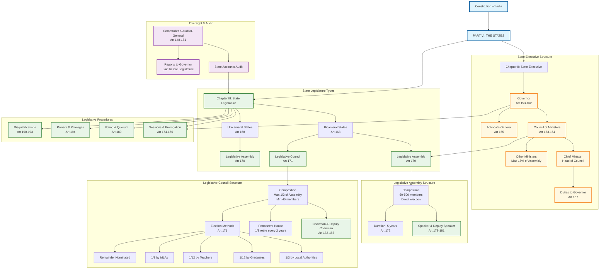

# State Government and Legislature Structure

## Overview
This diagram visualizes the comprehensive structure of State Government and Legislature as outlined in Part VI of the Constitution of India, showing the relationships between the Governor, Council of Ministers, and the bicameral/unicameral legislature systems.

## Constitutional Significance
This section establishes the framework for state-level governance, defining the executive and legislative structures that mirror the Union government while maintaining state autonomy within the federal system.

## Key Articles Covered
- **Articles 153-167**: State Executive (Governor, Ministers, Advocate-General)
- **Articles 168-212**: State Legislature (Composition, Officers, Procedures)
- **Articles 148-151**: Comptroller and Auditor-General (oversight function)

## Constitutional Framework Analysis

### State Executive Authority
- **Governor**: Constitutional head appointed by President (Art 155)
- **Council of Ministers**: Real executive power with Chief Minister as head
- **Collective Responsibility**: Ministers collectively responsible to Legislative Assembly
- **Size Limitation**: Maximum 15% of Assembly strength, minimum 12 ministers

### Legislative Structure Variations
- **Bicameral States**: Currently 6 states with both Assembly and Council
- **Unicameral States**: Majority of states with only Legislative Assembly
- **Flexibility**: Parliament can create/abolish Legislative Councils on state request

### Democratic Accountability
- **Assembly**: Directly elected, 5-year term, subject to dissolution
- **Council**: Indirectly elected/nominated, permanent house with staggered retirement
- **Oversight**: CAG audit reports ensure financial accountability

### Federal Integration
- **Governor's Role**: Link between Union and State governments
- **Constitutional Compliance**: State actions subject to constitutional limitations
- **Audit Oversight**: Central CAG ensures uniform audit standards

This structure ensures democratic governance at state level while maintaining federal unity and constitutional supremacy.