# Constitutional Institutions and Elections Framework

## Overview
This diagram visualizes the constitutional framework for key institutions including Tribunals, Election Commission, National Commissions, and Official Language provisions as established in Parts XIVA-XVII of the Constitution of India.

## Mermaid Diagram

```mermaid
graph TD
    Constitution[Constitution of India] --> PartXIVA[PART XIVA: TRIBUNALS]
    Constitution --> PartXV[PART XV: ELECTIONS]
    Constitution --> PartXVI[PART XVI: SPECIAL PROVISIONS]
    Constitution --> PartXVII[PART XVII: OFFICIAL LANGUAGE]
    
    subgraph "Tribunals Framework"
        PartXIVA --> AdminTrib[Art 323A: Administrative Tribunals]
        PartXIVA --> OtherTrib[Art 323B: Tribunals for Other Matters]
        
        AdminTrib --> ATJurisdiction[Recruitment & Service Conditions]
        AdminTrib --> ATStructure[Union & State Tribunals]
        AdminTrib --> ATPowers[Civil Court Powers]
        
        OtherTrib --> OTMatters[Tax, Labour, Land Reforms<br/>Elections, Food Distribution]
        OtherTrib --> OTHierarchy[Hierarchy of Tribunals]
        OtherTrib --> OTExclusion[Exclude Court Jurisdiction]
    end
    
    subgraph "Election Commission Structure"
        PartXV --> ElectionComm[Art 324: Election Commission]
        PartXV --> ElectoralRoll[Art 325: General Electoral Roll]
        PartXV --> AdultSuffrage[Art 326: Adult Suffrage]
        PartXV --> ParliamentPower[Art 327: Parliament Powers]
        PartXV --> StatePower[Art 328: State Powers]
        PartXV --> CourtBar[Art 329: Bar to Court Interference]
        
        ElectionComm --> CEC[Chief Election Commissioner]
        ElectionComm --> OtherEC[Other Election Commissioners]
        ElectionComm --> RegionalComm[Regional Commissioners]
        
        CEC --> CECTenure[Supreme Court Judge<br/>Protection]
        OtherEC --> ECRemoval[CEC Recommendation<br/>for Removal]
    end
    
    subgraph "Reservation System"
        PartXVI --> SCSTReserv[Art 330-332: SC/ST Reservations]
        PartXVI --> WomenReserv[Art 330A-332A: Women Reservations]
        PartXVI --> AngloIndian[Art 331-333: Anglo-Indian Representation]
        PartXVI --> ReservPeriod[Art 334-334A: Time Limits]
        
        SCSTReserv --> LokSabha[Lok Sabha Seats]
        SCSTReserv --> StateAssembly[State Assembly Seats]
        SCSTReserv --> PopulationBasis[Population Proportion Basis]
        
        WomenReserv --> OneThirdReserv[One-Third Reservation]
        WomenReserv --> DelimitationBasis[Post-Delimitation Implementation]
        WomenReserv --> RotationSystem[Rotation of Reserved Seats]
    end
    
    subgraph "National Commissions"
        PartXVI --> NCSC[Art 338: National Commission<br/>for Scheduled Castes]
        PartXVI --> NCST[Art 338A: National Commission<br/>for Scheduled Tribes]
        PartXVI --> NCBC[Art 338B: National Commission<br/>for Backward Classes]
        
        NCSC --> SCFunctions[Monitor Safeguards<br/>Investigate Complaints<br/>Annual Reports]
        NCST --> STFunctions[Monitor Safeguards<br/>Investigate Complaints<br/>Annual Reports]
        NCBC --> BCFunctions[Monitor Safeguards<br/>Investigate Complaints<br/>Annual Reports]
        
        SCFunctions --> CivilCourtPowers[Civil Court Powers<br/>Summon Witnesses<br/>Examine Documents]
        STFunctions --> CivilCourtPowers
        BCFunctions --> CivilCourtPowers
    end
    
    subgraph "Official Language Framework"
        PartXVII --> OfficialLang[Art 343: Hindi as Official Language]
        PartXVII --> LangCommission[Art 344: Language Commission]
        
        OfficialLang --> HindiDevanagari[Hindi in Devanagari Script]
        OfficialLang --> EnglishTransition[15-Year English Continuation]
        OfficialLang --> ParliamentPowers[Parliament Powers for Extension]
        
        LangCommission --> FiveYearReview[5-Year Review Cycle]
        LangCommission --> ProgressiveUse[Progressive Hindi Use]
        LangCommission --> EnglishRestrictions[English Use Restrictions]
    end
    
    classDef foundation fill:#e1f5fe,stroke:#01579b,stroke-width:3px
    classDef tribunals fill:#e8f5e8,stroke:#2e7d32,stroke-width:2px
    classDef elections fill:#fff3e0,stroke:#ef6c00,stroke-width:2px
    classDef reservations fill:#fce4ec,stroke:#c2185b,stroke-width:2px
    classDef commissions fill:#e0f2f1,stroke:#00695c,stroke-width:2px
    classDef language fill:#fff8e1,stroke:#f57f17,stroke-width:2px
    
    class Constitution foundation
    class PartXIVA,AdminTrib,OtherTrib,ATJurisdiction,ATStructure,ATPowers,OTMatters,OTHierarchy,OTExclusion tribunals
    class PartXV,ElectionComm,ElectoralRoll,AdultSuffrage,ParliamentPower,StatePower,CourtBar,CEC,OtherEC,RegionalComm,CECTenure,ECRemoval elections
    class PartXVI,SCSTReserv,WomenReserv,AngloIndian,ReservPeriod,LokSabha,StateAssembly,PopulationBasis,OneThirdReserv,DelimitationBasis,RotationSystem reservations
    class NCSC,NCST,NCBC,SCFunctions,STFunctions,BCFunctions,CivilCourtPowers commissions
    class PartXVII,OfficialLang,LangCommission,HindiDevanagari,EnglishTransition,ParliamentPowers,FiveYearReview,ProgressiveUse,EnglishRestrictions language
```

## Key Articles Covered

### Part XIVA - Tribunals
- **Article 323A**: Administrative tribunals for service matters
- **Article 323B**: Tribunals for various other matters (tax, labour, elections, etc.)

### Part XV - Elections  
- **Article 324**: Election Commission structure and powers
- **Article 325**: General electoral roll principle
- **Article 326**: Adult suffrage (18+ years)
- **Article 327-328**: Parliament and State powers over elections
- **Article 329**: Bar to court interference in electoral matters

### Part XVI - Special Provisions
- **Articles 330-332**: SC/ST reservations in Parliament and State Assemblies
- **Articles 330A-332A**: Women reservations (106th Amendment, 2023)
- **Articles 331-333**: Anglo-Indian community representation
- **Articles 334-334A**: Time limits and implementation of reservations
- **Articles 338-338B**: National Commissions for SC, ST, and Backward Classes
- **Articles 341-342A**: Definition and specification of SC, ST, and OBC

### Part XVII - Official Language
- **Article 343**: Hindi as official language with 15-year English transition
- **Article 344**: Language Commission for periodic review

## Constitutional Significance

This framework establishes:

1. **Institutional Independence**: Election Commission with constitutional protection
2. **Alternative Dispute Resolution**: Tribunal system to reduce court burden
3. **Social Justice**: Comprehensive reservation system for marginalized communities
4. **Monitoring Mechanisms**: National Commissions with investigative powers
5. **Linguistic Unity**: Balanced approach to official language transition
6. **Democratic Participation**: Universal adult suffrage and fair representation

The 106th Amendment (2023) introducing women's reservations represents a major milestone in constitutional evolution toward gender equality in political representation.