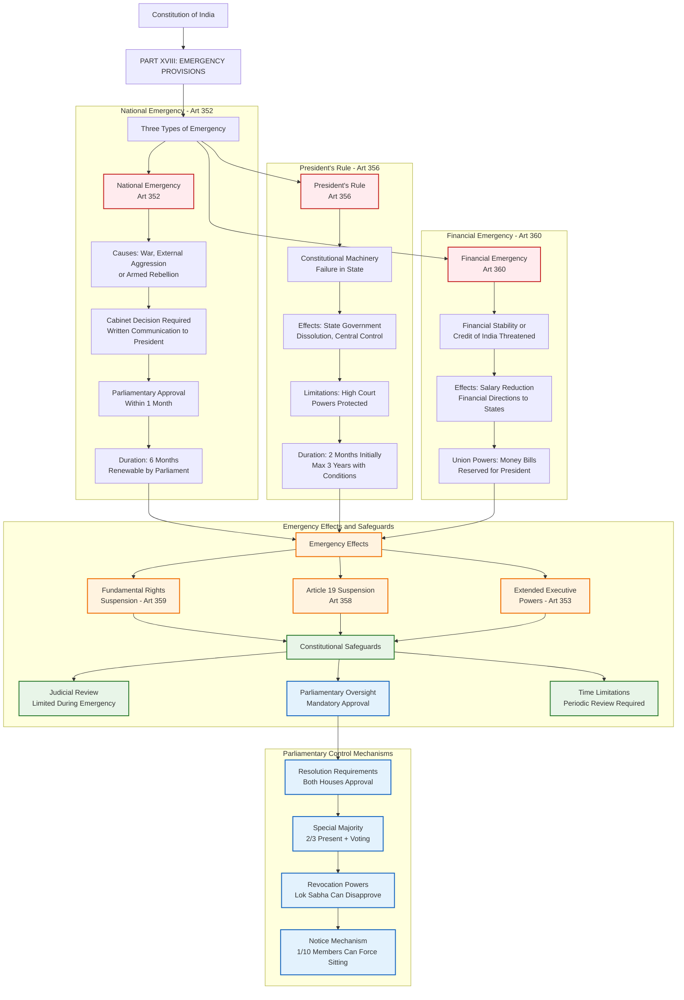

# Emergency Provisions Structure - Constitution of India

## Overview
This diagram illustrates the comprehensive framework of Emergency Provisions under Part XVIII of the Constitution of India, covering National Emergency, President's Rule, and Financial Emergency with their respective procedures, effects, and safeguards.

## Constitutional Significance
Emergency provisions represent extraordinary powers granted to the Union government during crisis situations, with built-in parliamentary oversight and judicial safeguards to prevent misuse while ensuring effective governance during emergencies.

## Key Articles Covered
- **Article 352**: Proclamation of Emergency (National Emergency)
- **Article 353**: Effect of Proclamation of Emergency
- **Article 354**: Distribution of revenues during Emergency
- **Article 355**: Duty of Union to protect States
- **Article 356**: President's Rule (Constitutional Emergency)
- **Article 357**: Legislative powers under President's Rule
- **Article 358**: Suspension of Article 19 during Emergency
- **Article 359**: Suspension of Fundamental Rights during Emergency
- **Article 360**: Financial Emergency

## Constitutional Analysis

### Emergency Types and Triggers
1. **National Emergency (Article 352)**: Triggered by war, external aggression, or armed rebellion
2. **President's Rule (Article 356)**: Invoked when constitutional machinery fails in a state
3. **Financial Emergency (Article 360)**: Declared when financial stability or credit is threatened

### Key Safeguards
- **Parliamentary Approval**: All emergencies require legislative oversight
- **Time Limitations**: Built-in expiry dates with renewal requirements
- **Judicial Protection**: High Court powers cannot be suspended
- **Special Majorities**: Enhanced voting requirements for approval

### Constitutional Balance
The emergency provisions balance the need for effective crisis management with democratic safeguards, ensuring that extraordinary powers remain temporary and subject to legislative control.