# Special State Provisions Structure

## Overview
This diagram illustrates the special constitutional provisions for various states in India, including temporary provisions, special responsibilities of governors, and unique administrative arrangements as covered in Part XXI of the Constitution.

## Key Articles Covered
- Article 370: Temporary provisions with respect to Jammu and Kashmir
- Article 371: Special provisions for Maharashtra and Gujarat
- Article 371A: Special provisions for Nagaland
- Article 371B: Special provisions for Assam
- Article 371C: Special provisions for Manipur
- Article 371D: Special provisions for Andhra Pradesh and Telangana
- Article 371E: Central University in Andhra Pradesh
- Article 371F: Special provisions for Sikkim
- Article 371G: Special provisions for Mizoram
- Article 371H: Special provisions for Arunachal Pradesh
- Article 371I: Special provisions for Goa
- Article 371J: Special provisions for Karnataka
- Articles 372-377: Continuance of existing laws and transitional provisions

## Constitutional Significance
These provisions recognize the diverse cultural, social, and administrative needs of different states, providing flexibility within the constitutional framework to accommodate regional specificities while maintaining national unity.

```mermaid
graph TD
    Constitution[Constitution of India] --> PartXXI[PART XXI: Temporary, Transitional<br/>and Special Provisions]
    
    PartXXI --> StateProvisions[Special State Provisions<br/>Articles 370-371J]
    PartXXI --> TransitionalLaws[Transitional Provisions<br/>Articles 372-377]
    
    subgraph "Special State Provisions"
        StateProvisions --> NorthEast[North-Eastern States]
        StateProvisions --> Southern[Southern States]
        StateProvisions --> Western[Western States]
        StateProvisions --> Northern[Northern States]
        
        NorthEast --> Nagaland[Art 371A: Nagaland<br/>• Customary law protection<br/>• Land ownership rights<br/>• Governor's special responsibility]
        NorthEast --> Assam[Art 371B: Assam<br/>• Tribal areas committee<br/>• Legislative assembly provisions]
        NorthEast --> Manipur[Art 371C: Manipur<br/>• Hill areas committee<br/>• Governor's special responsibility]
        NorthEast --> Mizoram[Art 371G: Mizoram<br/>• Religious practices protection<br/>• Customary law preservation]
        NorthEast --> Arunachal[Art 371H: Arunachal Pradesh<br/>• Law and order responsibility<br/>• Governor's discretionary powers]
        
        Southern --> AndhraTelangana[Art 371D: Andhra Pradesh<br/>& Telangana<br/>• Equitable opportunities<br/>• Administrative tribunal]
        Southern --> Karnataka[Art 371J: Karnataka<br/>• Hyderabad-Karnataka region<br/>• Development board provisions]
        
        Western --> Maharashtra[Art 371: Maharashtra<br/>& Gujarat<br/>• Regional development boards<br/>• Equitable fund allocation]
        Western --> Goa[Art 371I: Goa<br/>• Legislative assembly composition]
        
        Northern --> Sikkim[Art 371F: Sikkim<br/>• Legislative assembly provisions<br/>• Governor's special responsibility<br/>• Property and asset transfer]
        Northern --> JammuKashmir[Art 370: Jammu & Kashmir<br/>• Temporary provisions<br/>• Limited parliamentary powers<br/>• Special constitutional status]
    end
    
    subgraph "Transitional Provisions"
        TransitionalLaws --> ExistingLaws[Art 372: Continuance of<br/>Existing Laws]
        TransitionalLaws --> Adaptation[Art 372A: Presidential<br/>Power to Adapt Laws]
        TransitionalLaws --> PreventiveDetention[Art 373: Preventive<br/>Detention Orders]
        TransitionalLaws --> FederalCourt[Art 374: Federal Court<br/>Transition to Supreme Court]
        TransitionalLaws --> Courts[Art 375: Continuation of<br/>Courts and Officers]
        TransitionalLaws --> HighCourts[Art 376: High Court<br/>Judges Transition]
        TransitionalLaws --> CAG[Art 377: Comptroller and<br/>Auditor-General Provisions]
    end
    
    subgraph "Common Features"
        StateProvisions --> GovernorRole[Governor's Special<br/>Responsibilities]
        StateProvisions --> CulturalProtection[Cultural and<br/>Religious Protection]
        StateProvisions --> LandRights[Land and Resource<br/>Rights Protection]
        StateProvisions --> TribalRights[Tribal Areas<br/>Special Provisions]
        
        GovernorRole --> LawOrder[Law and Order<br/>Discretionary Powers]
        GovernorRole --> Development[Regional Development<br/>and Fund Allocation]
        
        CulturalProtection --> CustomaryLaw[Customary Law<br/>Preservation]
        CulturalProtection --> Religious[Religious Practices<br/>Protection]
        
        LandRights --> Ownership[Land Ownership<br/>Transfer Rights]
        LandRights --> Resources[Natural Resources<br/>Control]
        
        TribalRights --> Committees[Tribal Area<br/>Committees]
        TribalRights --> Representation[Special Legislative<br/>Representation]
    end
    
    classDef foundation fill:#e1f5fe,stroke:#01579b,stroke-width:3px
    classDef partHeader fill:#f3e5f5,stroke:#7b1fa2,stroke-width:2px,font-weight:bold
    classDef stateProvision fill:#e8f5e8,stroke:#2e7d32,stroke-width:2px
    classDef transitional fill:#fff3e0,stroke:#ef6c00,stroke-width:2px
    classDef features fill:#fce4ec,stroke:#c2185b,stroke-width:2px
    classDef regional fill:#e0f2f1,stroke:#00695c,stroke-width:2px
    
    class Constitution,PartXXI foundation
    class StateProvisions,TransitionalLaws partHeader
    class Nagaland,Assam,Manipur,Mizoram,Arunachal,AndhraTelangana,Karnataka,Maharashtra,Goa,Sikkim,JammuKashmir stateProvision
    class ExistingLaws,Adaptation,PreventiveDetention,FederalCourt,Courts,HighCourts,CAG transitional
    class GovernorRole,CulturalProtection,LandRights,TribalRights features
    class NorthEast,Southern,Western,Northern,LawOrder,Development,CustomaryLaw,Religious,Ownership,Resources,Committees,Representation regional
```

