# Indian States and Union Territories Structure

## Overview
This diagram visualizes the current federal structure of India as defined in the First Schedule of the Constitution, showing all 28 states and 8 union territories as reorganized through various constitutional amendments up to 2019.

## Constitutional Significance
- **First Schedule**: Defines the territorial composition of the Indian Union
- **Federal Structure**: Shows the dual structure of States and Union Territories
- **Historical Evolution**: Reflects major reorganizations including recent changes like Telangana (2014) and J&K reorganization (2019)
- **Administrative Framework**: Establishes the territorial basis for governance

## Key Articles Covered
- **Article 1**: Name and territory of the Union
- **Article 4**: Laws made under articles 2 and 3 to provide for amendment of First and Fourth Schedules
- **First Schedule**: Complete list of States and Union Territories with territorial descriptions

```mermaid
graph TD
    Constitution[Constitution of India<br/>First Schedule]
    Constitution --> Federal[Federal Structure]
    
    Federal --> States[STATES<br/>28 States]
    Federal --> UTs[UNION TERRITORIES<br/>8 Union Territories]
    
    subgraph "Major States (Selected)"
        States --> S1[Andhra Pradesh<br/>Art 1, First Schedule]
        States --> S2[Assam<br/>Art 1, First Schedule]
        States --> S3[Bihar<br/>Art 1, First Schedule]
        States --> S4[Gujarat<br/>Art 1, First Schedule]
        States --> S5[Kerala<br/>Art 1, First Schedule]
        States --> S6[Madhya Pradesh<br/>Art 1, First Schedule]
        States --> S7[Tamil Nadu<br/>Art 1, First Schedule]
        States --> S8[Maharashtra<br/>Art 1, First Schedule]
        States --> S9[Karnataka<br/>Art 1, First Schedule]
        States --> S10[Uttar Pradesh<br/>Art 1, First Schedule]
        States --> S11[West Bengal<br/>Art 1, First Schedule]
        States --> S12[Punjab<br/>Art 1, First Schedule]
        States --> S13[Rajasthan<br/>Art 1, First Schedule]
        States --> S14[Odisha<br/>Art 1, First Schedule]
    end
    
    subgraph "Recent State Additions"
        States --> Recent1[Telangana<br/>2014 - AP Reorganization]
        States --> Recent2[Chhattisgarh<br/>2000 - MP Reorganization]
        States --> Recent3[Uttarakhand<br/>2000 - UP Reorganization]
        States --> Recent4[Jharkhand<br/>2000 - Bihar Reorganization]
    end
    
    subgraph "Union Territories"
        UTs --> UT1[Delhi<br/>National Capital Territory]
        UTs --> UT2[Andaman & Nicobar Islands<br/>Art 1, First Schedule]
        UTs --> UT3[Lakshadweep<br/>Art 1, First Schedule]
        UTs --> UT4[Dadra & Nagar Haveli<br/>and Daman & Diu<br/>Merged 2019]
        UTs --> UT5[Puducherry<br/>Art 1, First Schedule]
        UTs --> UT6[Chandigarh<br/>Art 1, First Schedule]
        UTs --> UT7[Jammu & Kashmir<br/>Reorganized 2019]
        UTs --> UT8[Ladakh<br/>Created 2019]
    end
    
    subgraph "Constitutional Framework"
        Federal --> Powers[Distribution of Powers]
        Powers --> StatePowers[State Powers<br/>State List - VII Schedule]
        Powers --> UnionPowers[Union Powers<br/>Union List - VII Schedule]
        Powers --> ConcurrentPowers[Concurrent Powers<br/>Concurrent List - VII Schedule]
    end
    
    subgraph "Administrative Structure"
        States --> StateGov[State Governments<br/>Part VI - Arts 152-237]
        UTs --> UTAdmin[UT Administration<br/>Part VIII - Arts 239-241]
        StateGov --> Governor[Governor<br/>Arts 153-162]
        StateGov --> CM[Chief Minister<br/>Arts 163-164]
        StateGov --> StateLeg[State Legislature<br/>Arts 168-212]
        UTAdmin --> LtGov[Lt. Governor/Administrator<br/>Art 239]
    end
    
    classDef foundation fill:#e1f5fe,stroke:#01579b,stroke-width:3px
    classDef states fill:#e8f5e8,stroke:#2e7d32,stroke-width:2px
    classDef unionterritories fill:#fff3e0,stroke:#ef6c00,stroke-width:2px
    classDef recent fill:#f3e5f5,stroke:#7b1fa2,stroke-width:2px
    classDef powers fill:#e0f2f1,stroke:#00695c,stroke-width:2px
    classDef admin fill:#fff8e1,stroke:#f57f17,stroke-width:2px
    
    class Constitution,Federal foundation
    class States,S1,S2,S3,S4,S5,S6,S7,S8,S9,S10,S11,S12,S13,S14 states
    class UTs,UT1,UT2,UT3,UT4,UT5,UT6,UT7,UT8 unionterritories
    class Recent1,Recent2,Recent3,Recent4 recent
    class Powers,StatePowers,UnionPowers,ConcurrentPowers powers
    class StateGov,UTAdmin,Governor,CM,StateLeg,LtGov admin
```

## Constitutional Evolution
- **Original States (1950)**: 14 states in Part A, 6 states in Part B
- **States Reorganization (1956)**: Major linguistic reorganization
- **Recent Reorganizations**: 
  - 2000: Creation of Chhattisgarh, Uttarakhand, Jharkhand
  - 2014: Creation of Telangana from Andhra Pradesh
  - 2019: J&K reorganization into two Union Territories
  - 2019: Merger of Dadra & Nagar Haveli with Daman & Diu

## Federal Structure Significance
This structure establishes India as a federal union with a strong center, where states have significant autonomy in specified areas while union territories are directly administered by the central government through appointed administrators.