# Union-State Relations and Federal Structure

## Overview
This diagram illustrates the complex federal structure of India, focusing on Union-State relations, autonomous districts, and the distribution of powers between different levels of government as outlined in the Sixth and Seventh Schedules of the Constitution.

## Key Articles Covered
- **Sixth Schedule**: Autonomous Districts and Regions (Paragraphs 1-21)
- **Seventh Schedule**: Union List (Articles 1-16)
- **Article 246**: Distribution of Legislative Powers

## Constitutional Significance
The federal structure of India represents a unique balance between unity and diversity, providing special provisions for tribal areas while maintaining the overall integrity of the Union. The Sixth Schedule creates autonomous governance structures for tribal areas in northeastern states, while the Seventh Schedule clearly demarcates Union and State powers.

```mermaid
graph TD
    Constitution[Constitution of India<br/>Federal Structure]
    Constitution --> FederalSystem[Federal System]
    
    subgraph "Union-State Relations Framework"
        FederalSystem --> UnionPowers[Union Powers<br/>Seventh Schedule - List I]
        FederalSystem --> StatePowers[State Powers<br/>Seventh Schedule - List II]
        FederalSystem --> ConcurrentPowers[Concurrent Powers<br/>Seventh Schedule - List III]
        FederalSystem --> SpecialProvisions[Special Provisions<br/>Sixth Schedule]
    end
    
    subgraph "Union List Powers (Articles 1-16)"
        UnionPowers --> Defence[Defence of India<br/>Art 1-2A]
        UnionPowers --> ForeignAffairs[Foreign Affairs<br/>Art 10-16]
        UnionPowers --> Security[Internal Security<br/>Art 8-9]
        Defence --> ArmedForces[Naval, Military, Air Forces<br/>Art 2]
        Defence --> DefenceWorks[Defence Works & Industries<br/>Art 4, 7]
        ForeignAffairs --> Diplomacy[Diplomatic Relations<br/>Art 11]
        ForeignAffairs --> Treaties[Treaties & Agreements<br/>Art 14]
        Security --> Intelligence[Central Intelligence<br/>Art 8]
        Security --> PreventiveDetention[Preventive Detention<br/>Art 9]
    end
    
    subgraph "Autonomous Districts Framework (Sixth Schedule)"
        SpecialProvisions --> AutonomousDistricts[Autonomous Districts<br/>Para 1-2]
        SpecialProvisions --> RegionalCouncils[Regional Councils<br/>Para 2]
        SpecialProvisions --> DistrictCouncils[District Councils<br/>Para 2]
        
        AutonomousDistricts --> Composition[Council Composition<br/>Para 2]
        AutonomousDistricts --> Powers[Council Powers<br/>Para 3-10]
        AutonomousDistricts --> Oversight[State Oversight<br/>Para 12-16]
        
        Powers --> Legislative[Legislative Powers<br/>Para 3]
        Powers --> Judicial[Judicial Powers<br/>Para 4-5]
        Powers --> Financial[Financial Powers<br/>Para 7-9]
        Powers --> Administrative[Administrative Powers<br/>Para 6, 10]
        
        Legislative --> LocalLaws[Local Laws & Customs<br/>Para 3]
        Judicial --> TribalCourts[Tribal Courts<br/>Para 4]
        Financial --> Taxation[Local Taxation<br/>Para 8]
        Financial --> Funds[District/Regional Funds<br/>Para 7]
        Administrative --> Education[Primary Education<br/>Para 6]
        Administrative --> Trading[Trading Regulation<br/>Para 10]
    end
    
    subgraph "State Government Relations"
        Oversight --> Governor[Governor's Role<br/>Para 12-16]
        Governor --> Approval[Law Approval<br/>Para 12]
        Governor --> Commission[Inquiry Commission<br/>Para 14]
        Governor --> Dissolution[Council Dissolution<br/>Para 16]
        Governor --> Emergency[Emergency Powers<br/>Para 15]
    end
    
    subgraph "Specific State Applications"
        SpecialProvisions --> Assam[Assam Provisions<br/>Para 12, 20BA]
        SpecialProvisions --> Meghalaya[Meghalaya Provisions<br/>Para 12A]
        SpecialProvisions --> Tripura[Tripura Provisions<br/>Para 12AA, 20BB]
        SpecialProvisions --> Mizoram[Mizoram Provisions<br/>Para 12B, 20C]
    end
    
    classDef foundation fill:#e1f5fe,stroke:#01579b,stroke-width:3px
    classDef unionPowers fill:#fff3e0,stroke:#ef6c00,stroke-width:2px
    classDef statePowers fill:#e8f5e8,stroke:#2e7d32,stroke-width:2px
    classDef autonomous fill:#fce4ec,stroke:#c2185b,stroke-width:2px
    classDef oversight fill:#f3e5f5,stroke:#7b1fa2,stroke-width:2px
    
    class Constitution,FederalSystem foundation
    class UnionPowers,Defence,ForeignAffairs,Security,ArmedForces,DefenceWorks,Diplomacy,Treaties,Intelligence,PreventiveDetention unionPowers
    class StatePowers,ConcurrentPowers statePowers
    class SpecialProvisions,AutonomousDistricts,RegionalCouncils,DistrictCouncils,Composition,Powers,Legislative,Judicial,Financial,Administrative,LocalLaws,TribalCourts,Taxation,Funds,Education,Trading autonomous
    class Oversight,Governor,Approval,Commission,Dissolution,Emergency,Assam,Meghalaya,Tripura,Mizoram oversight
```

## Key Features

### Union Powers (Seventh Schedule - List I)
- **Defence**: Complete control over armed forces, defence works, and war-related industries
- **Foreign Affairs**: Exclusive jurisdiction over international relations, treaties, and diplomatic representation
- **Internal Security**: Central intelligence, preventive detention, and deployment of Union forces

### Autonomous District System (Sixth Schedule)
- **Self-Governance**: District and Regional Councils with legislative, judicial, and administrative powers
- **Cultural Protection**: Preservation of tribal customs, laws, and traditional practices
- **Financial Autonomy**: Power to levy taxes, maintain funds, and control local resources
- **State Oversight**: Governor's supervisory role with powers of approval, inquiry, and intervention

### Federal Balance
- **Cooperative Federalism**: Shared responsibilities between Union and States
- **Special Provisions**: Autonomous arrangements for tribal areas
- **Constitutional Flexibility**: Amendment provisions for evolving federal relations

This structure demonstrates India's commitment to unity in diversity, providing both strong central authority and meaningful local autonomy.