# M33: Concurrent List Power Distribution

## Overview
This diagram visualizes the Concurrent List (List III) of the Seventh Schedule, showing the 47 subjects on which both Union and State governments can legislate. The Concurrent List represents the federal balance in India's constitutional framework, allowing shared legislative authority while maintaining Union supremacy in case of conflicts.

## Mermaid Diagram

```mermaid
graph TD
    subgraph "Concurrent List (List III) - Shared Legislative Powers"
        CL[Concurrent List<br/>47 Subjects<br/>Union & State Powers]
        
        subgraph "Criminal Justice System"
            CL --> CJ1[Entry 1: Criminal Law<br/>Indian Penal Code]
            CL --> CJ2[Entry 2: Criminal Procedure<br/>CrPC Provisions]
            CL --> CJ3[Entry 3: Preventive Detention<br/>Security & Public Order]
            CJ1 --> CJ4[Entry 4: Prisoner Transfer<br/>Inter-State Movement]
        end
        
        subgraph "Civil Law & Personal Matters"
            CL --> CM1[Entry 5: Marriage & Divorce<br/>Personal Law Matters]
            CL --> CM2[Entry 6: Property Transfer<br/>Non-Agricultural Land]
            CL --> CM3[Entry 7: Contracts<br/>Partnership & Agency]
            CM1 --> CM4[Entry 8: Actionable Wrongs]
            CM2 --> CM5[Entry 9: Bankruptcy & Insolvency]
            CM3 --> CM6[Entry 10: Trust & Trustees]
        end
        
        subgraph "Judicial Administration"
            CL --> JA1[Entry 11A: Administration of Justice<br/>Court Organization]
            CL --> JA2[Entry 12: Evidence & Oaths<br/>Judicial Proceedings]
            CL --> JA3[Entry 13: Civil Procedure<br/>Limitation & Arbitration]
            JA1 --> JA4[Entry 14: Contempt of Court<br/>Excluding Supreme Court]
            JA2 --> JA5[Entry 46: Court Jurisdiction<br/>Powers over List III Matters]
        end
        
        subgraph "Social Welfare & Rights"
            CL --> SW1[Entry 15: Vagrancy<br/>Nomadic Tribes]
            CL --> SW2[Entry 16: Mental Health<br/>Treatment Facilities]
            CL --> SW3[Entry 17: Animal Cruelty Prevention]
            SW1 --> SW4[Entry 17A: Forests]
            SW2 --> SW5[Entry 17B: Wildlife Protection]
        end
        
        subgraph "Economic Planning & Development"
            CL --> EP1[Entry 20: Economic & Social Planning]
            CL --> EP2[Entry 20A: Population Control<br/>Family Planning]
            CL --> EP3[Entry 21: Monopolies & Trusts<br/>Commercial Control]
            EP1 --> EP4[Entry 34: Price Control]
            EP2 --> EP5[Entry 33: Trade & Commerce<br/>Production & Distribution]
        end
        
        subgraph "Labor & Industrial Relations"
            CL --> LI1[Entry 22: Trade Unions<br/>Industrial Disputes]
            CL --> LI2[Entry 23: Social Security<br/>Employment Insurance]
            CL --> LI3[Entry 24: Labor Welfare<br/>Provident Funds & Compensation]
            LI1 --> LI4[Entry 36: Factories]
            LI2 --> LI5[Entry 37: Boilers]
        end
        
        subgraph "Education & Professional Services"
            CL --> ED1[Entry 25: Education<br/>Technical & Medical Education]
            CL --> ED2[Entry 26: Legal & Medical<br/>Professional Regulation]
            ED1 --> ED3[Entry 39: Newspapers & Books<br/>Printing Presses]
        end
        
        subgraph "Public Health & Safety"
            CL --> PH1[Entry 18: Food Adulteration<br/>Goods Quality]
            CL --> PH2[Entry 19: Drugs & Poisons<br/>Subject to Union List]
            CL --> PH3[Entry 29: Disease Prevention<br/>Inter-State Control]
            PH1 --> PH4[Entry 30: Vital Statistics<br/>Birth & Death Registration]
        end
        
        subgraph "Infrastructure & Utilities"
            CL --> IU1[Entry 31: Minor Ports<br/>Non-Major Ports]
            CL --> IU2[Entry 32: Inland Waterways<br/>Navigation Rules]
            CL --> IU3[Entry 35: Motor Vehicles<br/>Taxation Principles]
            IU1 --> IU4[Entry 38: Electricity]
            IU2 --> IU5[Entry 33A: Weights & Measures<br/>Excluding Standards]
        end
        
        subgraph "Administrative & Financial"
            CL --> AF1[Entry 28: Charities<br/>Religious Institutions]
            CL --> AF2[Entry 40: Archaeological Sites<br/>Non-National Importance]
            CL --> AF3[Entry 41: Evacuee Property<br/>Management & Disposal]
            AF1 --> AF4[Entry 42: Property Acquisition<br/>Requisitioning]
            AF2 --> AF5[Entry 43: Tax Recovery<br/>Inter-State Claims]
            AF3 --> AF6[Entry 44: Stamp Duties<br/>Non-Judicial Stamps]
        end
        
        subgraph "Support Functions"
            CL --> SF1[Entry 45: Inquiries & Statistics<br/>List II & III Matters]
            CL --> SF2[Entry 47: Fees Collection<br/>List III Matters]
            CL --> SF3[Entry 27: Displaced Persons<br/>Partition Relief]
        end
    end
    
    subgraph "Constitutional Principles"
        CP1[Union Supremacy<br/>Article 254]
        CP2[Residuary Powers<br/>Article 248 - Union]
        CP3[Concurrent Jurisdiction<br/>Both Can Legislate]
        
        CP1 --> CP4[Union Law Prevails<br/>In Case of Conflict]
        CP2 --> CP5[Unlisted Matters<br/>Union Authority]
        CP3 --> CP6[Cooperative Federalism<br/>Shared Responsibility]
    end
    
    CL --> CP1
    CL --> CP3
    
    classDef concurrent fill:#fff3e0,stroke:#ef6c00,stroke-width:2px
    classDef criminal fill:#ffebee,stroke:#c62828,stroke-width:2px
    classDef civil fill:#e8f5e8,stroke:#2e7d32,stroke-width:2px
    classDef judicial fill:#e1f5fe,stroke:#01579b,stroke-width:2px
    classDef social fill:#f3e5f5,stroke:#7b1fa2,stroke-width:2px
    classDef economic fill:#fff8e1,stroke:#f57f17,stroke-width:2px
    classDef labor fill:#e0f2f1,stroke:#00695c,stroke-width:2px
    classDef education fill:#fce4ec,stroke:#c2185b,stroke-width:2px
    classDef health fill:#e8eaf6,stroke:#3f51b5,stroke-width:2px
    classDef infrastructure fill:#f1f8e9,stroke:#558b2f,stroke-width:2px
    classDef admin fill:#fafafa,stroke:#616161,stroke-width:2px
    classDef support fill:#e0f7fa,stroke:#00838f,stroke-width:2px
    classDef principles fill:#fff9c4,stroke:#f9a825,stroke-width:3px
    
    class CL concurrent
    class CJ1,CJ2,CJ3,CJ4 criminal
    class CM1,CM2,CM3,CM4,CM5,CM6 civil
    class JA1,JA2,JA3,JA4,JA5 judicial
    class SW1,SW2,SW3,SW4,SW5 social
    class EP1,EP2,EP3,EP4,EP5 economic
    class LI1,LI2,LI3,LI4,LI5 labor
    class ED1,ED2,ED3 education
    class PH1,PH2,PH3,PH4 health
    class IU1,IU2,IU3,IU4,IU5 infrastructure
    class AF1,AF2,AF3,AF4,AF5,AF6 admin
    class SF1,SF2,SF3 support
    class CP1,CP2,CP3,CP4,CP5,CP6 principles
```

## Key Articles Covered
- **Article 246:** Distribution of legislative powers between Union and States
- **Article 254:** Inconsistency between Union and State laws on Concurrent List subjects
- **Article 248:** Residuary powers of legislation with Union Parliament
- **Seventh Schedule, List III:** Complete enumeration of 47 concurrent subjects

## Constitutional Significance

### Federal Balance
The Concurrent List represents India's unique approach to federalism, allowing both levels of government to legislate on critical subjects while maintaining Union supremacy in case of conflicts.

### Cooperative Federalism
These 47 subjects require coordination between Union and State governments, promoting cooperative federalism and shared responsibility for governance.

### Judicial Interpretation
The Supreme Court has consistently interpreted concurrent powers to ensure effective governance while maintaining constitutional balance between Union and State authorities.

### Amendment History
Several entries (11A, 17A, 17B, 20A, 33A) were added through constitutional amendments, reflecting evolving governance needs and federal requirements.

### Modern Relevance
The Concurrent List remains central to contemporary governance challenges, from education and healthcare to environmental protection and economic planning, requiring coordinated Union-State action.