# M34: Constitutional Schedules Overview

## Overview
This diagram provides a comprehensive overview of all twelve schedules of the Indian Constitution, showing their purposes, key contents, and constitutional significance. The schedules contain detailed provisions that supplement the main constitutional text and provide specific frameworks for governance, administration, and federal relations.

## Mermaid Diagram

```mermaid
graph TD
    subgraph "Constitutional Schedules Framework"
        CS[Constitution of India<br/>12 Schedules<br/>Detailed Provisions]
        
        subgraph "Structural Schedules (1-4)"
            CS --> S1[First Schedule<br/>States & Union Territories<br/>Territorial Boundaries]
            CS --> S2[Second Schedule<br/>Emoluments & Allowances<br/>Officials' Salaries]
            CS --> S3[Third Schedule<br/>Forms of Oaths<br/>Constitutional Officials]
            CS --> S4[Fourth Schedule<br/>Rajya Sabha Seats<br/>State Representation]
        end
        
        subgraph "Administrative Schedules (5-6)"
            CS --> S5[Fifth Schedule<br/>Scheduled Areas<br/>Tribal Administration]
            CS --> S6[Sixth Schedule<br/>Autonomous Districts<br/>Tribal Councils NE States]
        end
        
        subgraph "Federal Distribution Schedule (7)"
            CS --> S7[Seventh Schedule<br/>Legislative Powers Distribution<br/>Union-State-Concurrent Lists]
            
            subgraph "Seventh Schedule Details"
                S7 --> S7A[List I: Union List<br/>97 Subjects<br/>Defense, Foreign Affairs]
                S7 --> S7B[List II: State List<br/>66 Subjects<br/>Police, Public Health]
                S7 --> S7C[List III: Concurrent List<br/>47 Subjects<br/>Education, Criminal Law]
            end
        end
        
        subgraph "Language & Protection Schedules (8-9)"
            CS --> S8[Eighth Schedule<br/>Official Languages<br/>22 Recognized Languages]
            CS --> S9[Ninth Schedule<br/>Protected Laws<br/>Judicial Review Immunity]
            
            subgraph "Eighth Schedule Languages"
                S8 --> S8A[Original Languages<br/>14 Languages<br/>1950 Constitution]
                S8 --> S8B[Added Languages<br/>8 Languages<br/>Various Amendments]
            end
            
            subgraph "Ninth Schedule Categories"
                S9 --> S9A[Land Reform Laws<br/>Zamindari Abolition<br/>Agricultural Ceiling]
                S9 --> S9B[Nationalization Laws<br/>Banking, Insurance<br/>Industrial Policy]
                S9 --> S9C[Social Justice Laws<br/>Reservation Policies<br/>Welfare Measures]
            end
        end
        
        subgraph "Political Integrity Schedule (10)"
            CS --> S10[Tenth Schedule<br/>Anti-Defection Law<br/>Political Party Discipline]
            
            subgraph "Anti-Defection Provisions"
                S10 --> S10A[Disqualification Grounds<br/>Voluntary Resignation<br/>Voting Against Party]
                S10 --> S10B[Merger Exception<br/>2/3rd Members Agree<br/>Party Merger Rules]
                S10 --> S10C[Speaker's Decision<br/>Final Authority<br/>Judicial Non-Interference]
            end
        end
        
        subgraph "Local Governance Schedules (11-12)"
            CS --> S11[Eleventh Schedule<br/>Panchayat Functions<br/>29 Rural Subjects]
            CS --> S12[Twelfth Schedule<br/>Municipal Functions<br/>18 Urban Subjects]
            
            subgraph "Panchayat Functions"
                S11 --> S11A[Economic Development<br/>Agriculture, Industries<br/>Rural Infrastructure]
                S11 --> S11B[Social Services<br/>Education, Health<br/>Women & Child Development]
                S11 --> S11C[Basic Services<br/>Water, Sanitation<br/>Rural Electrification]
            end
            
            subgraph "Municipal Functions"
                S12 --> S12A[Urban Planning<br/>Land Use Regulation<br/>Building Construction]
                S12 --> S12B[Infrastructure Services<br/>Water Supply, Roads<br/>Public Health]
                S12 --> S12C[Social Development<br/>Urban Poverty Alleviation<br/>Cultural Promotion]
            end
        end
    end
    
    subgraph "Constitutional Significance"
        SIG1[Detailed Implementation<br/>Supplement Main Text<br/>Operational Framework]
        SIG2[Federal Balance<br/>Power Distribution<br/>Center-State Relations]
        SIG3[Democratic Governance<br/>Local Self-Government<br/>Participatory Democracy]
        SIG4[Social Justice<br/>Tribal Protection<br/>Language Diversity]
        SIG5[Political Stability<br/>Anti-Defection Measures<br/>Party Discipline]
    end
    
    S1 --> SIG1
    S7 --> SIG2
    S11 --> SIG3
    S12 --> SIG3
    S5 --> SIG4
    S6 --> SIG4
    S8 --> SIG4
    S10 --> SIG5
    
    classDef schedule fill:#e3f2fd,stroke:#1976d2,stroke-width:2px
    classDef structural fill:#f3e5f5,stroke:#7b1fa2,stroke-width:2px
    classDef administrative fill:#e8f5e8,stroke:#2e7d32,stroke-width:2px
    classDef federal fill:#fff3e0,stroke:#ef6c00,stroke-width:2px
    classDef language fill:#fce4ec,stroke:#c2185b,stroke-width:2px
    classDef political fill:#ffebee,stroke:#c62828,stroke-width:2px
    classDef local fill:#e0f2f1,stroke:#00695c,stroke-width:2px
    classDef significance fill:#fff8e1,stroke:#f57f17,stroke-width:3px
    
    class CS schedule
    class S1,S2,S3,S4 structural
    class S5,S6 administrative
    class S7,S7A,S7B,S7C federal
    class S8,S9,S8A,S8B,S9A,S9B,S9C language
    class S10,S10A,S10B,S10C political
    class S11,S12,S11A,S11B,S11C,S12A,S12B,S12C local
    class SIG1,SIG2,SIG3,SIG4,SIG5 significance
```

## Key Articles Covered
- **Article 1:** States and Union Territories (First Schedule)
- **Article 59, 65, 75, 97, 125, 148, 158, 164, 186, 221:** Emoluments (Second Schedule)
- **Article 75, 84, 99, 124, 146, 173, 188, 219:** Oaths (Third Schedule)
- **Article 80:** Rajya Sabha composition (Fourth Schedule)
- **Article 244:** Scheduled Areas and Tribal Areas (Fifth & Sixth Schedules)
- **Article 246:** Distribution of legislative powers (Seventh Schedule)
- **Article 344, 351:** Languages (Eighth Schedule)
- **Article 31B:** Validation of certain acts (Ninth Schedule)
- **Article 102, 191:** Disqualification on defection (Tenth Schedule)
- **Article 243G:** Panchayat powers (Eleventh Schedule)
- **Article 243W:** Municipal powers (Twelfth Schedule)

## Constitutional Significance

### Comprehensive Framework
The twelve schedules provide detailed operational frameworks that supplement the main constitutional text, ensuring practical implementation of constitutional principles.

### Federal Structure
The Seventh Schedule's three lists (Union, State, Concurrent) form the backbone of India's federal system, clearly demarcating legislative powers and responsibilities.

### Democratic Decentralization
The Eleventh and Twelfth Schedules, added through the 73rd and 74th Amendments, strengthen grassroots democracy by empowering Panchayats and Municipalities.

### Social Justice
Multiple schedules (Fifth, Sixth, Eighth, Ninth) reflect India's commitment to social justice, tribal welfare, linguistic diversity, and protection of vulnerable communities.

### Political Integrity
The Tenth Schedule (Anti-Defection Law) maintains political stability by preventing unprincipled defections and ensuring party discipline in legislatures.

### Administrative Efficiency
The schedules provide clear guidelines for official emoluments, oaths, territorial boundaries, and administrative procedures, ensuring systematic governance.

### Constitutional Evolution
The schedules demonstrate the Constitution's adaptability, with several added through amendments to address emerging governance challenges and democratic aspirations.

### Judicial Protection
The Ninth Schedule's protection of certain laws from judicial review reflects the balance between legislative sovereignty and judicial review in India's constitutional system.