# Seventh Schedule: Power Distribution Between Union and States

## Overview
The Seventh Schedule of the Constitution of India defines the distribution of legislative powers between the Union and State governments through three comprehensive lists. This diagram visualizes the systematic allocation of subjects and powers across different levels of government.

## Key Constitutional Articles
- **Article 246**: Distribution of legislative powers
- **Article 248**: Residuary powers of Parliament
- **Article 254**: Inconsistency between Union and State laws

## Constitutional Significance
The Seventh Schedule establishes the federal structure of India by clearly demarcating areas of legislative competence, ensuring both Union authority in national matters and State autonomy in local affairs, while providing for concurrent jurisdiction in areas requiring coordinated governance.

```mermaid
graph TD
    Constitution[Constitution of India<br/>Article 246]
    Constitution --> SeventhSchedule[SEVENTH SCHEDULE<br/>Distribution of Powers]
    
    SeventhSchedule --> UnionList[LIST I: UNION LIST<br/>97 Entries]
    SeventhSchedule --> StateList[LIST II: STATE LIST<br/>66 Entries]
    SeventhSchedule --> ConcurrentList[LIST III: CONCURRENT LIST<br/>47 Entries]
    
    subgraph "Union List - Exclusive Central Powers"
        UnionList --> Defense[1-6: Defense & Security<br/>Defense, Armed Forces<br/>Foreign Affairs, War]
        UnionList --> Infrastructure[22-31: Infrastructure<br/>Railways, Airways<br/>National Highways, Ports]
        UnionList --> Finance[35-48: Financial Powers<br/>Currency, Banking<br/>Insurance, Stock Exchanges]
        UnionList --> Trade[41-42: Inter-State Trade<br/>Foreign Trade<br/>Import-Export]
        UnionList --> Taxation[82-97: Union Taxes<br/>Income Tax, Corporation Tax<br/>Customs, Excise Duties]
    end
    
    subgraph "State List - Exclusive State Powers"
        StateList --> LocalGov[1-5: Law & Order<br/>Public Order, Police<br/>Local Government]
        StateList --> Welfare[6-10: Public Welfare<br/>Health, Education<br/>Relief Services]
        StateList --> Resources[13-24: Natural Resources<br/>Agriculture, Water<br/>Land, Fisheries]
        StateList --> StateTax[45-66: State Taxation<br/>Land Revenue, Property Tax<br/>Vehicle Tax, Entertainment Tax]
    end
    
    subgraph "Concurrent List - Shared Powers"
        ConcurrentList --> Justice[1-14: Legal System<br/>Criminal Law, Civil Procedure<br/>Evidence, Contracts]
        ConcurrentList --> Social[15-28: Social Welfare<br/>Education, Labor<br/>Social Security, Marriage]
        ConcurrentList --> Economic[29-47: Economic Regulation<br/>Trade Control, Price Control<br/>Electricity, Factories]
    end
    
    subgraph "Power Distribution Principles"
        Residuary[Residuary Powers<br/>Article 248<br/>Union Parliament]
        Supremacy[Union Law Supremacy<br/>Article 254<br/>In Concurrent Subjects]
        Emergency[Emergency Powers<br/>Article 250, 352<br/>Union Override]
    end
    
    UnionList --> Residuary
    ConcurrentList --> Supremacy
    StateList --> Emergency
    
    classDef unionPower fill:#e3f2fd,stroke:#1976d2,stroke-width:2px
    classDef statePower fill:#e8f5e8,stroke:#388e3c,stroke-width:2px
    classDef concurrentPower fill:#fff3e0,stroke:#f57c00,stroke-width:2px
    classDef principle fill:#f3e5f5,stroke:#7b1fa2,stroke-width:2px
    classDef foundation fill:#e1f5fe,stroke:#01579b,stroke-width:3px
    
    class Constitution,SeventhSchedule foundation
    class UnionList,Defense,Infrastructure,Finance,Trade,Taxation unionPower
    class StateList,LocalGov,Welfare,Resources,StateTax statePower
    class ConcurrentList,Justice,Social,Economic concurrentPower
    class Residuary,Supremacy,Emergency principle
```

## Detailed Analysis

### Union List (97 Entries)
**Exclusive Central Government Powers:**
- **Defense & Security**: Armed forces, foreign affairs, citizenship
- **Infrastructure**: Railways, airways, national highways, major ports
- **Financial System**: Currency, banking, insurance, foreign exchange
- **Inter-State Commerce**: Trade between states, import-export
- **Central Taxation**: Income tax, corporation tax, customs duties

### State List (66 Entries)
**Exclusive State Government Powers:**
- **Law & Order**: Public order, police, prisons, local government
- **Public Welfare**: Health, sanitation, relief services
- **Natural Resources**: Agriculture, water, land, fisheries, mines
- **State Taxation**: Land revenue, property tax, vehicle tax

### Concurrent List (47 Entries)
**Shared Union-State Powers:**
- **Legal System**: Criminal law, civil procedure, evidence
- **Social Welfare**: Education, labor relations, social security
- **Economic Regulation**: Price control, trade unions, electricity

### Constitutional Principles
- **Residuary Powers**: All unlisted subjects belong to Union Parliament
- **Union Supremacy**: In concurrent subjects, Union law prevails
- **Emergency Override**: Union can legislate on State subjects during emergencies

## Amendment History
- **106th Amendment (2023)**: Women's reservation provisions
- **101st Amendment (2016)**: GST implementation, tax restructuring
- **42nd Amendment (1976)**: Added subjects to Concurrent List
- **7th Amendment (1956)**: Reorganization of states and territories