# Constitutional Framework Complete Overview

## Overview
This diagram provides a comprehensive overview of the complete Constitution of India framework, including all parts, schedules, and appendices that form the constitutional structure.

## Key Constitutional Elements Covered
- All 22 Parts (I-XXII) of the Constitution
- All 12 Schedules with detailed provisions
- Constitutional appendices including territorial arrangements
- Amendment history and procedures
- Complete institutional framework

## Constitutional Significance
This represents the complete constitutional framework of India, encompassing not just the main text but also the detailed schedules and appendices that provide specific implementation details, territorial arrangements, and administrative provisions essential for constitutional governance.

```mermaid
graph TD
    subgraph "Constitution of India - Complete Framework"
        A[Constitution of India<br/>Complete Document]
        A --> B[Preamble<br/>Fundamental Principles]
        A --> C[Main Constitutional Text<br/>Parts I-XXII]
        A --> D[Twelve Schedules<br/>Detailed Provisions]
        A --> E[Constitutional Appendices<br/>Territorial & Administrative]
    end
    
    subgraph "Main Constitutional Parts (I-XXII)"
        C --> F[Union & Territory<br/>Parts I-II]
        C --> G[Fundamental Rights<br/>Part III]
        C --> H[Directive Principles<br/>Part IV]
        C --> I[Union Government<br/>Parts V-VI]
        C --> J[State Government<br/>Parts VI-IX]
        C --> K[Constitutional Bodies<br/>Parts XIII-XVI]
        C --> L[Emergency & Special<br/>Parts XVIII-XXI]
    end
    
    subgraph "Twelve Constitutional Schedules"
        D --> M[First Schedule<br/>States & Territories]
        D --> N[Seventh Schedule<br/>Power Distribution]
        D --> O[Eighth Schedule<br/>Languages]
        D --> P[Ninth Schedule<br/>Protected Laws]
        D --> Q[Tenth Schedule<br/>Anti-Defection]
        D --> R[Eleventh & Twelfth<br/>Local Governance]
    end
    
    subgraph "Constitutional Appendices"
        E --> S[Appendix I<br/>India-Bangladesh Enclaves]
        E --> T[Territorial Agreements<br/>Boundary Arrangements]
        E --> U[Administrative Details<br/>Implementation Provisions]
    end
    
    subgraph "Amendment Framework"
        V[Constitutional Amendments<br/>106 Amendments to Date]
        V --> W[Basic Structure Doctrine<br/>Judicial Interpretation]
        V --> X[Amendment Procedures<br/>Article 368]
        V --> Y[Constitutional Evolution<br/>1950-2023]
    end
    
    A --> V
    
    classDef foundation fill:#e1f5fe,stroke:#01579b,stroke-width:3px
    classDef parts fill:#f3e5f5,stroke:#7b1fa2,stroke-width:2px
    classDef schedules fill:#e8f5e8,stroke:#2e7d32,stroke-width:2px
    classDef appendices fill:#fff3e0,stroke:#ef6c00,stroke-width:2px
    classDef amendments fill:#fce4ec,stroke:#c2185b,stroke-width:2px
    
    class A,B foundation
    class C,F,G,H,I,J,K,L parts
    class D,M,N,O,P,Q,R schedules
    class E,S,T,U appendices
    class V,W,X,Y amendments
```

## Articles and Provisions Covered
- **Complete Constitutional Text**: All articles from 1-395 (as amended)
- **All Schedules**: First through Twelfth Schedules with detailed provisions
- **Appendices**: Territorial arrangements and administrative details
- **Amendment History**: Complete record of 106 constitutional amendments
- **Institutional Framework**: All constitutional bodies and their relationships

## Constitutional Significance
This diagram represents the complete constitutional framework of India, showing how the main constitutional text, detailed schedules, and administrative appendices work together to form a comprehensive governance structure. The Constitution is not just the main articles but includes detailed schedules for implementation and appendices for specific territorial and administrative arrangements, making it a complete legal and administrative framework for the nation.