# Judicial Hierarchy and Union Territory Administration

## Overview
This diagram visualizes the judicial hierarchy from High Courts to Subordinate Courts and the administrative structure of Union Territories as outlined in the Constitution of India.

## Key Articles Covered
- **Articles 218-232**: High Court provisions including appointments, jurisdiction, powers, and administration
- **Chapter VI**: Subordinate Courts structure and administration
- **Part VIII**: Union Territory administration and governance

## Constitutional Significance
This section establishes the complete judicial hierarchy below the Supreme Court and defines the unique administrative structure for Union Territories, showing how constitutional governance extends to all parts of India.

```mermaid
graph TD
    subgraph "High Court Structure (Articles 218-232)"
        HC[High Court]
        HC --> CJ[Chief Justice<br/>Art 223: Acting appointments]
        HC --> PJ[Permanent Judges<br/>Art 219: Appointments & conditions]
        HC --> AJ[Additional & Acting Judges<br/>Art 224: Temporary appointments]
        HC --> RJ[Retired Judges<br/>Art 224A: Special sittings]
    end
    
    subgraph "High Court Powers & Jurisdiction"
        HC --> Jurisdiction[Existing Jurisdiction<br/>Art 225]
        HC --> Writs[Writ Powers<br/>Art 226: Certiorari, mandamus, etc.]
        HC --> Superintendence[Superintendence Power<br/>Art 227: Over all courts]
        HC --> Transfer[Case Transfer<br/>Art 228: To High Court]
    end
    
    subgraph "High Court Administration"
        HC --> Officers[Officers & Servants<br/>Art 229: Court administration]
        HC --> UTJurisdiction[UT Jurisdiction<br/>Art 230: Extension to UTs]
        HC --> CommonHC[Common High Court<br/>Art 231: For multiple states]
    end
    
    subgraph "Subordinate Courts (Chapter VI)"
        HC --> SubCourts[Subordinate Courts]
        SubCourts --> DJ[District Judges<br/>Appointment & validation]
        SubCourts --> JS[Judicial Service<br/>Recruitment of other officers]
        SubCourts --> Control[Court Control<br/>Administrative supervision]
        SubCourts --> Magistrates[Magistrates<br/>Special provisions]
    end
    
    subgraph "Union Territories (Part VIII)"
        UT[Union Territories]
        UT --> Admin[Administration<br/>Central government control]
        UT --> LocalLeg[Local Legislatures<br/>For certain UTs]
        UT --> CouncilMin[Council of Ministers<br/>For certain UTs]
        UT --> Delhi[Delhi<br/>Special provisions]
        UT --> Emergency[Constitutional Machinery<br/>Failure provisions]
    end
    
    %% Connections between systems
    HC --> SubCourts
    UTJurisdiction --> UT
    
    classDef judicial fill:#e3f2fd,stroke:#1976d2,stroke-width:2px
    classDef territory fill:#e8f5e8,stroke:#388e3c,stroke-width:2px
    classDef power fill:#fff3e0,stroke:#f57c00,stroke-width:2px
    classDef admin fill:#fce4ec,stroke:#c2185b,stroke-width:2px
    
    class HC,CJ,PJ,AJ,RJ,SubCourts,DJ,JS judicial
    class UT,Admin,LocalLeg,CouncilMin,Delhi,Emergency territory
    class Jurisdiction,Writs,Superintendence,Transfer power
    class Officers,UTJurisdiction,CommonHC,Control,Magistrates admin
```

## Detailed Analysis

### High Court Structure
- **Chief Justice**: Acting appointments when regular CJ unavailable
- **Judges**: Permanent judges with specific appointment conditions and restrictions
- **Additional Judges**: Temporary appointments for increased workload
- **Retired Judges**: Can be appointed for special sittings

### High Court Powers
- **Original Jurisdiction**: Existing jurisdiction from pre-Constitution courts
- **Writ Jurisdiction**: Power to issue writs for fundamental rights enforcement
- **Supervisory Jurisdiction**: Superintendence over all subordinate courts
- **Transfer Jurisdiction**: Power to transfer cases from subordinate courts

### Subordinate Court System
- **District Judges**: Senior-most judges in district judiciary
- **Judicial Service**: Recruitment system for judicial officers below district judge level
- **Administrative Control**: High Court supervision over subordinate courts
- **Magistrates**: Special provisions for certain classes of magistrates

### Union Territory Administration
- **Central Administration**: Direct administration by Union government
- **Local Governance**: Some UTs have local legislatures and council of ministers
- **Delhi**: Special constitutional provisions for national capital
- **Emergency Provisions**: Constitutional machinery failure provisions

## Constitutional Framework
This structure ensures:
1. **Judicial Independence**: Clear appointment and tenure provisions
2. **Hierarchical Control**: Systematic supervision from High Court to subordinate courts
3. **Flexible Governance**: Different administrative models for Union Territories
4. **Constitutional Continuity**: Provisions for emergency situations and special circumstances