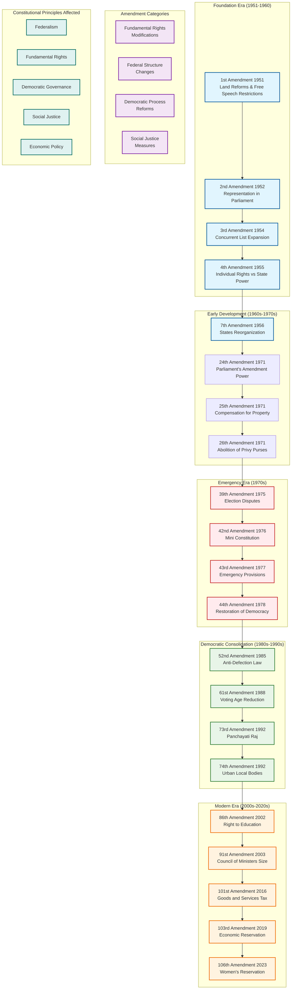

# Constitutional Amendments Timeline

## Overview
This diagram presents the chronological evolution of India's Constitution through major amendments from 1951 to 2023, showing key constitutional changes and their impact on governance structure.

## Constitutional Amendments Timeline Diagram

## Key Articles and Constitutional Significance

### Major Amendment Milestones

**1st Amendment (1951)**: Established the precedent for constitutional modification, addressing land reforms and reasonable restrictions on free speech.

**42nd Amendment (1976)**: Known as the "Mini Constitution," made extensive changes including addition of Directive Principles, Fundamental Duties, and strengthening of Central government.

**44th Amendment (1978)**: Restored democratic balance by reversing many provisions of the 42nd Amendment, particularly regarding emergency powers.

**73rd & 74th Amendments (1992)**: Revolutionary changes establishing constitutional status for local governance through Panchayati Raj institutions and urban local bodies.

**101st Amendment (2016)**: Introduced Goods and Services Tax, fundamentally restructuring India's taxation system and federal financial relations.

**106th Amendment (2023)**: Provided for women's reservation in Parliament and State Legislatures, marking a significant step toward gender equality in political representation.

### Constitutional Evolution Themes

1. **Balancing Individual Rights and State Power**: Early amendments focused on defining the scope of fundamental rights versus state authority.

2. **Federal Structure Refinement**: Multiple amendments have adjusted the balance between Union and State powers.

3. **Democratic Deepening**: Amendments have consistently expanded democratic participation and representation.

4. **Social Justice Integration**: Progressive amendments have incorporated social justice measures and affirmative action provisions.

5. **Economic Policy Integration**: Recent amendments reflect changing economic policies and governance structures.

### Amendment Process and Judicial Review

The Constitution provides for amendment under Article 368, with different procedures for different types of amendments:
- Simple majority for certain provisions
- Special majority (2/3 of present and voting, majority of total membership)
- Special majority plus ratification by half the states for federal provisions

The Supreme Court's role in reviewing amendments has evolved through landmark cases like Kesavananda Bharati (1973), establishing the "basic structure" doctrine that limits Parliament's amendment power.