# Constitution of India: Visual Documentation Project

> **🎯 Core Value Proposition**: Transform India's complex constitutional framework into accessible visual diagrams that anyone can understand - from law students to citizens to policymakers.

**Project Status**: ✅ **COMPLETE** - All 202 constitutional analysis tasks finished, 37 comprehensive diagrams created

## 🏛️ Constitutional Framework at a Glance

```mermaid
graph TD
    %% Foundation
    Constitution[Constitution of India<br/>395 Articles • 22 Parts • 12 Schedules]
    Constitution --> Preamble[Preamble<br/>We, the People of India]
    
    %% Core Structure
    Preamble --> Structure[Constitutional Structure]
    
    subgraph "Foundational Framework"
        direction LR
        Structure --> Territory[Part I: Union & Territory<br/>Art 1-4]
        Structure --> Citizenship[Part II: Citizenship<br/>Art 5-11]
        Structure --> Rights[Part III: Fundamental Rights<br/>Art 12-35]
        Structure --> Principles[Part IV: Directive Principles<br/>Art 36-51]
    end
    
    %% Government Structure
    Principles --> Government[Government Structure]
    
    subgraph "Three Branches of Government"
        direction TB
        Government --> Executive[Union Executive<br/>President • PM • Council]
        Government --> Legislature[Parliament<br/>Lok Sabha • Rajya Sabha]
        Government --> Judiciary[Supreme Court<br/>High Courts • Lower Courts]
    end
    
    %% Federal Structure
    Judiciary --> Federal[Federal Structure]
    
    subgraph "Power Distribution"
        direction LR
        Federal --> Union[Union Government<br/>97 Subjects]
        Federal --> State[State Governments<br/>66 Subjects]
        Federal --> Concurrent[Concurrent Powers<br/>47 Subjects]
        Federal --> Local[Local Governance<br/>Panchayats • Municipalities]
    end
    
    %% Special Provisions
    Local --> Special[Special Provisions]
    
    subgraph "Constitutional Safeguards"
        direction LR
        Special --> Emergency[Emergency Provisions<br/>National • State • Financial]
        Special --> Amendments[Amendment Process<br/>106 Amendments to Date]
        Special --> Schedules[12 Schedules<br/>Lists • Languages • Laws]
    end
    
    %% Styling
    classDef foundation fill:#e1f5fe,stroke:#01579b,stroke-width:3px
    classDef parts fill:#f3e5f5,stroke:#7b1fa2,stroke-width:2px
    classDef government fill:#e8f5e8,stroke:#2e7d32,stroke-width:2px
    classDef federal fill:#fff3e0,stroke:#ef6c00,stroke-width:2px
    classDef special fill:#fce4ec,stroke:#c2185b,stroke-width:2px
    
    class Constitution,Preamble foundation
    class Territory,Citizenship,Rights,Principles parts
    class Executive,Legislature,Judiciary government
    class Union,State,Concurrent,Local federal
    class Emergency,Amendments,Schedules special
```



---

## 🚀 Quick Start: Choose Your Journey

### 👨‍🎓 **For Students & Educators**
**Goal**: Understand constitutional concepts visually

```mermaid
graph TD
    Student[Student Journey] --> Overview[Constitutional Overview<br/>M01 • M10 • M36]
    Overview --> Rights[Fundamental Rights<br/>M02 • M20 • M03]
    Rights --> Government[Government Structure<br/>M04 • M07 • M12]
    Government --> Advanced[Advanced Topics<br/>M32 • M33 • M34]
    
    classDef journey fill:#e3f2fd,stroke:#1565c0,stroke-width:2px
    class Student,Overview,Rights,Government,Advanced journey
```



- Start with [Constitutional Overview](#constitutional-overview-diagrams) 
- Explore [Fundamental Rights](#fundamental-rights--duties) diagrams
- Use [Government Structure](#government-structure) for civics education

### ⚖️ **For Legal Professionals**
**Goal**: Reference constitutional relationships and procedures

```mermaid
graph TD
    Legal[Legal Professional] --> Judicial[Judicial System<br/>M06 • M24 • M31]
    Legal --> Legislative[Legislative Procedures<br/>M05 • M09 • M25]
    Legal --> Amendments[Amendment Processes<br/>M19 • M35 • M39]
    Legal --> Emergency[Emergency Provisions<br/>M18 • M28]
    
    classDef legal fill:#fff3e0,stroke:#ef6c00,stroke-width:2px
    class Legal,Judicial,Legislative,Amendments,Emergency legal
```



- Jump to [Judicial System](#judicial-system) diagrams
- Review [Legislative Procedures](#legislative-procedures) 
- Check [Amendment Processes](#constitutional-amendments) for legal research

### 🏛️ **For Government Officials**
**Goal**: Navigate federal-state relationships and institutional frameworks

```mermaid
graph TD
    Official[Government Official] --> Federal[Federal Structure<br/>M14 • M32 • M33]
    Official --> Administrative[Administrative Framework<br/>M16 • M26 • M27]
    Official --> Emergency[Emergency Provisions<br/>M18 • M28]
    Official --> Local[Local Governance<br/>M11 • M12 • M13]
    
    classDef govt fill:#e8f5e8,stroke:#2e7d32,stroke-width:2px
    class Official,Federal,Administrative,Emergency,Local govt
```



- Focus on [Federal Structure](#federal-structure--union-state-relations)
- Review [Administrative Framework](#administrative-framework)
- Understand [Emergency Provisions](#emergency-provisions)

### 👥 **For Citizens**
**Goal**: Understand your rights and how government works

```mermaid
graph TD
    Citizen[Citizen Journey] --> MyRights[My Rights & Duties<br/>M02 • M03 • M20]
    Citizen --> HowLaws[How Laws Are Made<br/>M05 • M09 • M22]
    Citizen --> LocalGov[Local Governance<br/>M11 • M12 • M13]
    Citizen --> Institutions[Constitutional Institutions<br/>M16 • M26 • M27]
    
    classDef citizen fill:#fce4ec,stroke:#c2185b,stroke-width:2px
    class Citizen,MyRights,HowLaws,LocalGov,Institutions citizen
```



- Begin with [Rights & Duties](#fundamental-rights--duties)
- Explore [How Laws Are Made](#legislative-procedures)
- Learn about [Local Governance](#local-governance)

---

## 📊 Project Achievement Summary


| Metric | Achievement | Details |
|--------|-------------|---------|
| **Constitutional Text Analyzed** | 20,115 lines | Complete Constitution of India (2023 edition) |
| **Analysis Tasks Completed** | 202/202 (100%) | Systematic 100-line chunks |
| **Visual Diagrams Created** | 37 comprehensive diagrams | All major constitutional concepts covered |
| **Constitutional Parts Covered** | All 22 Parts (I-XXII) | From Union & Territory to Amendments |
| **Schedules Documented** | All 12 Schedules | Including 7th Schedule power distribution |
| **Amendment Compliance** | Up to 106th Amendment (2023) | Including women's reservation |

---

## 📋 Table of Contents

### 🎯 **Essence Layer** (Start Here)
- [🏛️ Constitutional Framework at a Glance](#️-constitutional-framework-at-a-glance) - Visual overview of entire Constitution
- [🚀 Quick Start: Choose Your Journey](#-quick-start-choose-your-journey) - User-specific entry points
- [📊 Project Achievement Summary](#-project-achievement-summary) - What we've accomplished

### 🗺️ **Navigation Layer** (Find Your Topic)
- [🗺️ Complete Navigation Map](#️-complete-navigation-map) - All 37 diagrams organized by topic
- [🎯 User Journey Recommendations](#-user-journey-recommendations) - Structured learning paths
- [📚 Academic Learning Path](#-academic-learning-path-recommended-sequence) - Sequential study guide

### 🔧 **Implementation Layer** (Technical Details)
- [🛠️ Technical Implementation Details](#️-technical-implementation-details) - Project methodology
- [⚠️ Important Caveats & Limitations](#️-important-caveats--limitations) - Critical disclaimers
- [🤝 Contributing & Feedback](#-contributing--feedback) - How to help improve

### 📈 **Impact Layer** (Project Value)
- [📈 Project Impact & Future](#-project-impact--future) - Current achievements and roadmap

---

## 🗺️ Complete Navigation Map

### Constitutional Overview Diagrams
**Perfect starting point for understanding India's constitutional framework**


| Diagram | Key Concepts | Best For |
|---------|--------------|----------|
| [M01: Constitutional Structure](Mermaid01/M01_constitutional_structure.md) | Overall framework, Parts I-XXII | First-time learners |
| [M10: Constitutional Overview](Mermaid01/M10_constitutional_overview_structure.md) | High-level organization | Quick reference |
| [M36: Complete Framework](Mermaid01/M36_constitutional_framework_complete.md) | Comprehensive summary | Advanced users |

### Fundamental Rights & Duties
**Essential for understanding citizen rights and responsibilities**


| Diagram | Coverage | Articles |
|---------|----------|----------|
| [M02: Fundamental Rights Structure](Mermaid01/M02_fundamental_rights_structure.md) | Rights framework | Art 12-35 |
| [M20: Citizenship & Rights](Mermaid01/M20_citizenship_fundamental_rights_structure.md) | Citizenship + Rights integration | Art 5-35 |
| [M03: Directive Principles & Duties](Mermaid01/M03_directive_principles_duties.md) | State policy + citizen duties | Art 36-51A |
| [M21: Duties & Union Structure](Mermaid01/M21_directive_principles_duties_union_structure.md) | Duties + government structure | Art 36-80 |

### Government Structure
**How India's government is organized and functions**


| Level | Diagram | Focus Area |
|-------|---------|------------|
| **Union** | [M04: Executive & Parliament](Mermaid01/M04_executive_parliament_structure.md) | President, PM, Parliament |
| **State** | [M07: State Government](Mermaid01/M07_state_government_structure.md) | Governor, CM, State Legislature |
| **State** | [M23: State Government & Legislature](Mermaid01/M23_state_government_legislature_structure.md) | Complete state framework |
| **Local** | [M12: Local Governance](Mermaid01/M12_local_governance_panchayats_municipalities.md) | Panchayats & Municipalities |
| **Local** | [M13: Municipal & Cooperative](Mermaid01/M13_municipal_cooperative_tribal_governance.md) | Urban + cooperative governance |

### Legislative Procedures
**How laws are made in India**


| Diagram | Process Type | Scope |
|---------|--------------|-------|
| [M05: Parliamentary Procedures](Mermaid01/M05_parliamentary_procedures.md) | Union law-making | Parliament procedures |
| [M09: State Legislative Procedures](Mermaid01/M09_state_legislative_procedures.md) | State law-making | State legislature procedures |
| [M22: Parliamentary & Supreme Court](Mermaid01/M22_parliamentary_procedures_supreme_court.md) | Law-making + judicial review | Integrated view |
| [M25: Legislative Powers & Finance](Mermaid01/M25_parliament_legislative_powers_financial_authority.md) | Financial legislation | Money bills, budgets |

### Judicial System
**India's court system and justice delivery**

| Court Level | Diagram | Coverage |
|-------------|---------|----------|
| **Supreme Court** | [M06: Supreme Court Structure](Mermaid01/M06_supreme_court_structure.md) | Apex court organization |
| **High Courts** | [M24: High Court & Judicial Hierarchy](Mermaid01/M24_high_court_judicial_hierarchy.md) | State high courts |
| **Complete System** | [M31: Judicial Hierarchy & UTs](Mermaid01/M31_judicial_hierarchy_union_territories.md) | Full court system |

### Federal Structure & Union-State Relations
**How power is distributed between Union and States**


| Aspect | Diagram | Key Features |
|--------|---------|--------------|
| **Power Distribution** | [M33: Concurrent List & Power Distribution](Mermaid01/M33_concurrent_list_power_distribution.md) | 7th Schedule lists |
| **Federal Relations** | [M14: Union-State Relations](Mermaid01/M14_union_state_relations_federal_structure.md) | Administrative relations |
| **Complete Federal Structure** | [M32: Federal Structure](Mermaid01/M32_union_state_relations_federal_structure.md) | Comprehensive federal framework |
| **States & Territories** | [M30: States & Union Territories](Mermaid01/M30_indian_states_union_territories_structure.md) | Geographic organization |

### Administrative Framework
**Government institutions and commissions**

| Institution Type | Diagram | Institutions Covered |
|------------------|---------|---------------------|
| **Constitutional Bodies** | [M16: Constitutional Institutions](Mermaid01/M16_constitutional_institutions_elections.md) | Election Commission, etc. |
| **Commissions** | [M26: Constitutional Commissions](Mermaid01/M26_constitutional_commissions_gst_council.md) | Finance Commission, GST Council |
| **Elections** | [M27: Constitutional Institutions & Elections](Mermaid01/M27_constitutional_institutions_elections.md) | Electoral framework |

### Emergency Provisions
**Constitutional crisis management**

| Emergency Type | Diagram | Articles |
|----------------|---------|----------|
| **All Emergencies** | [M18: Emergency Provisions](Mermaid01/M18_emergency_provisions_miscellaneous.md) | Art 352-360 |
| **Detailed Structure** | [M28: Emergency Provisions Structure](Mermaid01/M28_emergency_provisions_structure.md) | Complete emergency framework |

### Special Provisions & Amendments
**State-specific provisions and constitutional changes**

| Category | Diagram | Coverage |
|----------|---------|----------|
| **Special State Provisions** | [M29: Special State Provisions](Mermaid01/M29_special_state_provisions_structure.md) | J&K, Northeast states |
| **Amendment Process** | [M19: Constitutional Amendments](Mermaid01/M19_constitutional_amendment_special_provisions.md) | How Constitution is amended |
| **Amendment Timeline** | [M35: Constitutional Amendments Timeline](Mermaid01/M35_constitutional_amendments_timeline.md) | Historical amendments |

### Constitutional Schedules
**Detailed provisions and lists**

| Schedule | Diagram | Content |
|----------|---------|---------|
| **All Schedules** | [M34: Constitutional Schedules Overview](Mermaid01/M34_constitutional_schedules_overview.md) | 1st-12th Schedules |
| **7th Schedule** | [M35: Seventh Schedule Power Distribution](Mermaid01/M35_seventh_schedule_power_distribution.md) | Union, State, Concurrent Lists |

### Specialized Topics
**Advanced constitutional concepts**

| Topic | Diagram | Specialization |
|-------|---------|----------------|
| **Social Justice** | [M17: Social Justice & Language](Mermaid01/M17_social_justice_language_policy.md) | SC/ST/OBC provisions |
| **Trade & Commerce** | [M15: Trade, Commerce & Civil Services](Mermaid01/M15_trade_commerce_civil_services.md) | Economic provisions |

---

## 🎯 User Journey Recommendations

### 📚 **Academic Learning Path** (Recommended sequence)
1. **Foundation**: M01 → M10 → M36 (Constitutional overview)
2. **Rights**: M02 → M20 → M03 (Rights and duties)
3. **Structure**: M04 → M07 → M12 (Government levels)
4. **Processes**: M05 → M09 → M06 (How things work)
5. **Advanced**: M32 → M33 → M34 (Federal structure & schedules)

### ⚡ **Quick Reference Path** (For professionals)
1. **Jump to specific topic** using navigation map above
2. **Cross-reference** related diagrams using the "Key Concepts" column
3. **Deep dive** into schedules (M34, M35) for detailed provisions

### 🔍 **Research Path** (For detailed analysis)
1. **Start with overview** (M01, M10, M36)
2. **Identify specific area** from navigation map
3. **Study related diagrams** in that category
4. **Cross-reference** with constitutional text using article numbers provided

---

## 🛠️ Technical Implementation Details

### Project Methodology


- **Systematic Analysis**: 202 tasks covering 20,115 lines of constitutional text
- **Visual Standards**: All diagrams use mobile-friendly vertical (TD) layouts
- **Accuracy**: Cross-referenced with extracted constitutional text
- **Currency**: Updated to 106th Amendment Act, 2023
- **Source Processing**: PDF-to-text conversion with manual validation

### File Organization
```
📁 Project Structure
├── 📄 README.md (this comprehensive guide)
├── 📄 MermaidTasks.md (detailed task tracking - 202/202 complete)
├── 📁 Mermaid01/ (37 visual diagrams M01-M39)
├── 📁 RAWDATA/ (source constitutional text - 20,115 lines)
├── 📁 .zzRef/ (original PDF source)
└── 📁 .kiro/ (project specifications & steering docs)
    ├── specs/ (project requirements & design)
    └── steering/ (mermaid syntax guides & patterns)
```

### Diagram Standards
- **Format**: Mermaid syntax for universal compatibility
- **Layout**: Vertical (Top-Down) for mobile readability  
- **Naming**: M[number]_[topic].md for easy navigation
- **Content**: Article references, constitutional significance, visual clarity
- **Validation**: All diagrams tested for syntax correctness
- **Styling**: Consistent color schemes and visual patterns

---

## ⚠️ Important Caveats & Limitations

### 📄 **Source Data Disclaimer**
**CRITICAL**: This project is based on a PDF-to-text conversion of the Constitution of India (`.zzRef/EnglishCOI_20240716890312078.pdf` → `RAWDATA/EnglishCOI202407_extracted_text.txt`). 


**⚠️ Parsing Errors May Include:**
- Misinterpreted article numbers or text
- Lost formatting in complex tables or schedules
- OCR errors in legal terminology
- Structural misalignment in constitutional provisions

**🤝 We Welcome Corrections**: If you identify any inaccuracies, please contribute corrections by opening an issue or pull request.

### 🔍 **Accuracy Disclaimers**
- **Visual Simplification**: Complex constitutional provisions are simplified for visual clarity
- **Interpretation**: Diagrams represent structural relationships, not legal interpretations
- **Currency**: Based on 106th Amendment Act, 2023 - check for newer amendments
- **Scope**: Focuses on structural and procedural aspects, not case law or judicial interpretations
- **Text Source**: Derived from PDF conversion - may contain parsing errors

### 📱 **Usage Considerations**
- **Educational Tool**: Designed for learning and reference, not legal advice
- **Complementary Resource**: Use alongside official constitutional text, not as replacement
- **Visual Limitations**: Some nuanced constitutional provisions may not be fully captured visually
- **Update Frequency**: Manual updates required for new constitutional amendments
- **Verification Needed**: Always cross-check with official constitutional sources

### 🎯 **Best Practices for Users**
1. **Start with Overview**: Always begin with M01 or M10 for context
2. **Cross-Reference**: Use article numbers to verify with official constitutional text
3. **Progressive Learning**: Follow recommended learning paths for your user type
4. **Verify Currency**: Check amendment dates for latest constitutional changes
5. **Report Errors**: Help improve accuracy by reporting any identified mistakes

---

## 🤝 Contributing & Feedback

### How to Contribute
- **Report Inaccuracies**: Open issues for constitutional interpretation errors
- **Suggest Improvements**: Recommend additional diagrams or visual enhancements
- **Update Requests**: Flag new constitutional amendments requiring diagram updates

### Contact & Support
- **Educational Use**: Freely available for academic and educational purposes
- **Commercial Use**: Contact for licensing information
- **Technical Issues**: Report rendering or accessibility problems

---

## 📈 Project Impact & Future

### Current Achievement
✅ **Complete constitutional coverage** - All 22 Parts, 12 Schedules, 395+ Articles  
✅ **36 comprehensive diagrams** - Covering every major constitutional concept  
✅ **Mobile-optimized visuals** - Accessible on all devices  
✅ **Educational ready** - Structured for learning and teaching  

### Future Enhancements
- **Interactive Diagrams**: Clickable elements linking to constitutional text
- **Multi-language Support**: Regional language versions of key diagrams
- **Case Law Integration**: Adding landmark Supreme Court cases to relevant diagrams
- **Amendment Tracking**: Automated updates for new constitutional amendments

---

**📊 Repository Stats**: 37 diagrams • 20,115 lines analyzed • 202 tasks completed • 100% constitutional coverage


*Last Updated: Based on Constitution of India as amended by 106th Amendment Act, 2023*